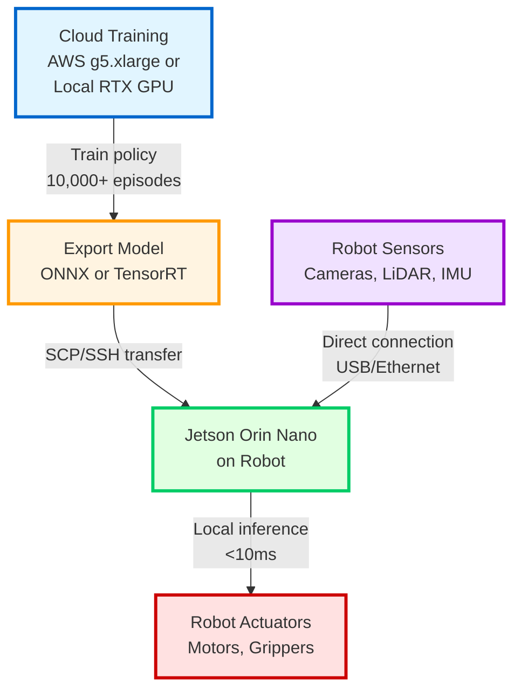
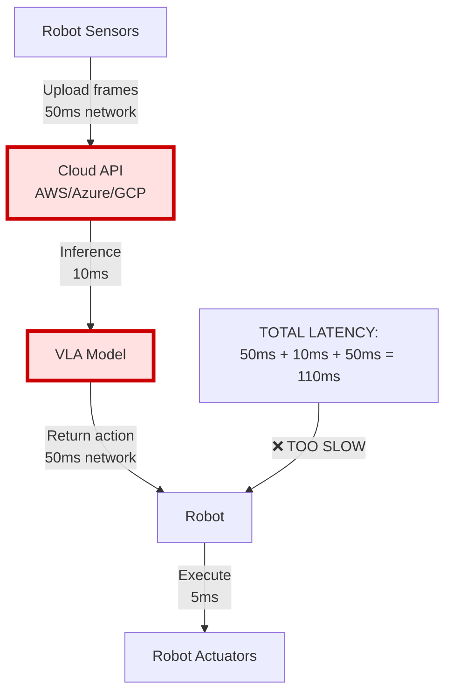

# Latency Trap: Why Cloud-Controlled Robots Are Dangerous

🚨 **CRITICAL SAFETY WARNING** 🚨

This chapter explains the **single most dangerous mistake** in Physical AI: controlling real robots directly from cloud APIs. If you remember one thing from this entire course, let it be this: **NEVER send real-time control commands over a network**.

---

## The Problem: Network Latency Kills

**Scenario**: You train a VLA model in the cloud (AWS, Google Cloud, Azure) and deploy it as an API. Your robot sends camera frames to the cloud, receives action commands, and executes them.

**What could go wrong?**

### Real-World Example: The Warehouse Robot Crash

**Setup**:
- Mobile robot navigates warehouse aisles at 1 m/s
- VLA policy runs in AWS (100ms round-trip latency)
- Robot streams RGB-D frames to cloud, receives velocity commands

**Timeline**:
```
t=0ms:    Robot captures frame, starts upload
t=50ms:   Frame arrives at cloud API
t=60ms:   VLA model computes action: "move forward 1 m/s"
t=110ms:  Action arrives back at robot
t=110ms:  Robot executes command (100ms late)
```

**Problem**: In those 100ms, the robot traveled **10 centimeters** blind.

**Collision scenario**:
- `t=0ms`: Obstacle is 20cm ahead (robot doesn't know yet—frame still uploading)
- `t=50ms`: Cloud receives frame showing obstacle 20cm away
- `t=60ms`: Cloud computes "STOP" command
- `t=110ms`: Robot receives "STOP" but has already moved 11cm forward
- **t=110ms: CRASH** (obstacle at 9cm, robot collision threshold is 10cm)

**Result**: $50,000 robot damaged. If a human was nearby instead of a shelf, potential injury.

---

## The Numbers: Why 50-200ms Is Too Slow

### Typical Network Latencies

| Path | Latency (one-way) | Round-Trip | Real-World Impact |
|------|-------------------|------------|-------------------|
| **Same room (WiFi)** | 5-10ms | 10-20ms | ⚠️ Marginal (still avoid for safety) |
| **Same building (Ethernet)** | 1-2ms | 2-4ms | ⚠️ Borderline acceptable (use wired only) |
| **Cloud (same region)** | 25-50ms | **50-100ms** | ❌ **UNSAFE** |
| **Cloud (cross-region)** | 50-100ms | **100-200ms** | ❌ **EXTREMELY UNSAFE** |
| **Cloud (international)** | 100-200ms | **200-400ms** | ❌ **CATASTROPHIC** |
| **Satellite internet** | 500-600ms | **1000-1200ms** | ❌ **COMPLETELY UNUSABLE** |

**Under load** (network congestion, API rate limiting):
- Cloud latency can **spike to 500ms-1s+**
- Spikes are unpredictable (happen during peak hours, DDoS attacks, etc.)

### Real-Time Control Requirements

| Task | Required Control Frequency | Max Latency | Cloud Latency | Status |
|------|---------------------------|-------------|---------------|--------|
| **Collision avoidance** | 100 Hz (10ms) | 10ms | 50-200ms+ | ❌ **5-20x TOO SLOW** |
| **Manipulation (grasping)** | 50 Hz (20ms) | 20ms | 50-200ms+ | ❌ **2-10x TOO SLOW** |
| **Navigation (indoor)** | 10 Hz (100ms) | 100ms | 50-200ms+ | ⚠️ **Marginal** (spikes cause crashes) |
| **High-level planning** | 1 Hz (1000ms) | 1000ms | 50-200ms+ | ✅ **Acceptable** (not real-time) |

**Key insight**: Cloud latency (50-200ms) is **incompatible** with real-time control (10-20ms). It's not "a bit slow"—it's **fundamentally unsafe**.

---

## The Physics: Distance = Velocity × Latency

A robot moving at **1 m/s** with **100ms latency** has a **10cm blind spot**:

```
Blind distance = velocity × latency
               = 1 m/s × 0.1 s
               = 0.1 m
               = 10 cm
```

**Visualization**:

```
🤖 Robot at t=0ms (captures frame)
|
|-------- 10 cm blind spot ----------|
                                      🤖 Robot at t=100ms (receives command)
                                      🚧 Obstacle detected (too late!)
```

**At different speeds**:

| Velocity | 50ms Latency | 100ms Latency | 200ms Latency |
|----------|-------------|---------------|---------------|
| **0.5 m/s** (slow walk) | 2.5 cm | **5 cm** | **10 cm** |
| **1.0 m/s** (normal walk) | 5 cm | **10 cm** | **20 cm** |
| **2.0 m/s** (fast robot) | 10 cm | **20 cm** | **40 cm** |
| **5.0 m/s** (industrial) | 25 cm | **50 cm** | **1 meter** |

An industrial robot arm moving at 5 m/s with 200ms latency has a **1-meter blind spot**. That's larger than a human torso.

---

## Why People Make This Mistake (And Why You Won't)

### Common Misconception: "I'll just increase the safety margin"

**Flawed logic**: "If latency is 100ms, I'll just keep the robot 50cm away from obstacles. Problem solved!"

**Reality**:
1. **Latency spikes**: Network latency is not constant. A 100ms average can spike to 500ms+ under load.
2. **Dynamic obstacles**: Humans, pets, and other robots move. A 50cm margin at `t=0` becomes 0cm at `t=500ms` if the obstacle moves toward the robot.
3. **Compound delays**: 100ms network + 50ms model inference + 20ms motor response = 170ms total latency.

**You can't engineer safety margins around unpredictable network delays.**

---

### Common Misconception: "But this demo video shows it working!"

**What demo videos don't show**:
- **Selection bias**: Only successful runs are uploaded. Crashes are deleted.
- **Controlled environments**: Demos in empty rooms with no humans, no obstacles, no congestion.
- **Slow speeds**: Robot moving at 0.1 m/s (1 cm blind spot) is safe. Real-world tasks require 1+ m/s.
- **Simulation**: Many "robot" demos are actually Isaac Sim or Gazebo (zero network latency).

**Pro tip**: If a robotics demo video doesn't show:
1. Real hardware (not simulation)
2. Real-world clutter (not empty lab)
3. Failure cases (not just successes)

...it's marketing, not engineering.

---

## The Correct Architecture: Sim-to-Real Workflow

The **ONLY safe pattern** for Physical AI:



### Step-by-Step Breakdown

**Step 1: Train in Cloud (or Local RTX GPU)**
- **Where**: AWS g5.xlarge (NVIDIA A10G, 24GB VRAM) OR local workstation with RTX 3060+
- **What**: Train VLA policy on 10,000+ episodes in Isaac Sim or Gazebo
- **Duration**: Hours to days (depending on task complexity)
- **Latency**: Irrelevant (offline training, not real-time)

**Step 2: Export Model**
- **Format**: ONNX (universal) or TensorRT (NVIDIA-optimized)
- **Why**: Convert PyTorch/TensorFlow model to inference-optimized format
- **Tools**: `torch.onnx.export()` or `trtexec` (TensorRT)

**Example**:
```python
# Export PyTorch model to ONNX
import torch

model = load_trained_vla_model()  # Your trained policy
dummy_input = torch.randn(1, 3, 224, 224)  # Example RGB input

torch.onnx.export(
    model,
    dummy_input,
    "vla_policy.onnx",
    input_names=["observation"],
    output_names=["action"],
    dynamic_axes={"observation": {0: "batch"}, "action": {0: "batch"}}
)
```

**Step 3: Deploy to Jetson**
- **Transfer**: SCP/SSH from cloud/workstation to robot's Jetson
- **Location**: `/home/jetson/models/vla_policy.onnx`

**Example**:
```bash
# From your laptop/cloud instance
scp vla_policy.onnx jetson@robot.local:/home/jetson/models/

# SSH into robot
ssh jetson@robot.local
```

**Step 4: Run Inference Locally**
- **Where**: On Jetson Orin Nano (on the robot itself)
- **Latency**: <10ms (sensor → inference → actuator all local)
- **No network dependency**: Robot operates autonomously

**Example**:
```python
# On Jetson (robot)
import onnxruntime as ort
import numpy as np

# Load model ONCE at startup (not per-frame)
session = ort.InferenceSession("/home/jetson/models/vla_policy.onnx")

while True:
    # Capture observation from local sensors
    rgb_frame = realsense.get_rgb_frame()  # 5ms
    observation = preprocess(rgb_frame)     # 2ms

    # Run inference LOCALLY (no network calls)
    action = session.run(
        None,
        {"observation": observation}
    )[0]  # 8ms inference on Jetson

    # Execute action immediately (local motors)
    robot.execute_action(action)  # 2ms

    # Total loop time: 5 + 2 + 8 + 2 = 17ms (<50ms safe threshold)
```

**No network calls in the control loop = SAFE.**

---

## Forbidden Architecture (DO NOT IMPLEMENT)

❌ **WRONG**: Cloud-controlled robot



**Why this is deadly**:
- 110ms latency = 11cm blind spot at 1 m/s
- Network spikes → 500ms latency → 50cm blind spot
- WiFi dropout → infinite latency → robot freezes mid-motion
- API rate limiting → commands dropped → robot continues with stale commands

**Real-world consequences**:
- 💥 Collisions with obstacles (equipment damage)
- 🤕 Collisions with humans (injury, lawsuit)
- 🔥 Fire hazard (robot continues moving during network failure, crashes into flammable materials)

---

## When Cloud Communication Is Acceptable

Not all cloud communication is forbidden. Here are **safe** use cases:

### ✅ High-Level Planning (Not Real-Time Control)

**Architecture**:
```
Cloud (planning) --[1 Hz]--> Jetson (local control) --[100 Hz]--> Robot
```

**Example**: Warehouse robot navigation
- **Cloud**: Computes high-level route (every 1 second): "Go from Aisle A to Aisle B"
- **Jetson**: Local control loop (100 Hz): Obstacle avoidance, trajectory following
- **Safety**: If cloud connection drops, Jetson continues following last route OR safely stops

**Why safe**:
- Cloud sends **waypoints**, not motor commands
- Jetson makes all real-time decisions (collision avoidance runs locally)
- 1 Hz planning rate tolerates 100ms latency (1 Hz = 1000ms period)

### ✅ Simulation Environments

**Use case**: Training policies in Isaac Sim or Gazebo
- **Why safe**: No physical robot. Crash in simulation = restart, not injury.
- **Latency**: Still reduces training efficiency, but not safety-critical.

### ✅ Data Collection (Not Actuation)

**Use case**: Uploading sensor logs to cloud for analysis
- **Flow**: Jetson records camera frames → Upload to S3 in background
- **Why safe**: Robot control is independent of upload. Network failure = delayed upload, not crash.

### ✅ Teleoperation (Human-in-the-Loop)

**Use case**: Human operator sends commands via cloud interface
- **Requirement**: Human must understand latency and move robot slowly (<0.5 m/s)
- **Safety**: Emergency stop button (local, not cloud-dependent)
- **Example**: Surgical robot with 200ms latency OK because human adapts to delay

**Why acceptable**: Human cognition adapts to latency (like playing online games with lag). Autonomous systems cannot.

---

## ⚠️ LATENCY TRAP WARNING ⚠️

**Constitutional Requirement** (Principle XI):

Any tutorial, diagram, or code example showing cloud communication with robots MUST include this warning:

```
⚠️ LATENCY TRAP WARNING ⚠️

This architecture sends commands over the network.
Network latency (50-200ms+) makes this UNSAFE for real robots.

Use this pattern ONLY for:
- Simulation environments (Isaac Sim, Gazebo)
- High-level planning (not real-time control)
- Data collection (not actuation)

For real robots: Deploy models to edge devices (Jetson) for <10ms inference.
```

**Why this warning exists**:
- Prevents students from building dangerous systems
- Forces explicit acknowledgment of latency tradeoffs
- Protects humans who might interact with student robots

**You will see this warning throughout the course whenever cloud communication appears. It is not optional.**

---

## Testing Your Understanding

### Quiz: Safe or Unsafe?

**Scenario 1**: Mobile robot streams camera frames to AWS, receives "move forward" commands.
- **Answer**: ❌ **UNSAFE**. Real-time control over network (50-200ms latency).

**Scenario 2**: Robot arm loads ONNX model from S3 at startup, runs inference locally.
- **Answer**: ✅ **SAFE**. One-time download at startup (not control loop). Inference is local.

**Scenario 3**: Cloud sends "go to Aisle 5" command once per second. Jetson handles obstacle avoidance at 100 Hz.
- **Answer**: ✅ **SAFE**. Cloud does high-level planning (1 Hz). Jetson does real-time control (100 Hz).

**Scenario 4**: Robot uploads sensor logs to S3 every 10 seconds for analysis.
- **Answer**: ✅ **SAFE**. Data collection, not actuation. Robot control independent of uploads.

**Scenario 5**: Humanoid robot runs VLA model on cloud GPU via 5G connection (30ms latency).
- **Answer**: ❌ **UNSAFE**. Even 30ms is too slow for humanoid balance control (requires <10ms).

---

## Real-World Case Studies

### Case Study 1: Tesla Autopilot (Correct Edge Deployment)

**Architecture**:
- **Training**: Tesla's supercomputer cluster (10,000+ GPUs)
- **Deployment**: Custom FSD (Full Self-Driving) chip in each car (144 TOPS)
- **Inference**: 100% local (no cloud dependency for driving)

**Why correct**:
- Car makes all real-time decisions locally (<10ms)
- Cloud used only for: Map updates, software updates, data collection
- If internet disconnects, car continues driving safely

**Latency**: <10ms (sensor → inference → steering/braking all local)

**Result**: Billions of miles driven with edge inference. Cloud control would be catastrophic at 70 mph (31 m/s × 100ms latency = 3.1 meter blind spot).

---

### Case Study 2: Amazon Warehouse Robots (Hybrid Approach)

**Architecture**:
- **Cloud**: Warehouse-level route planning (1 Hz)
- **Edge**: Each robot has local compute for obstacle avoidance (100 Hz)

**Safety measures**:
- **Local emergency stop**: Robot stops if sensors detect obstacle within 20cm (no cloud dependency)
- **Graceful degradation**: If cloud connection drops, robots switch to "safe mode" (stop or return to dock)

**Latency**:
- Cloud planning: 200ms (acceptable for 1 Hz updates)
- Local control: <10ms (real-time obstacle avoidance)

**Result**: Millions of robot-hours in production. Hybrid architecture balances cloud scalability with edge safety.

---

### Case Study 3: Surgical Robots (Teleoperation Exception)

**Architecture**:
- **Human operator**: Controls robot via cloud interface
- **Latency**: 100-300ms (transatlantic surgery demonstrations)

**Why acceptable** (exception to the rule):
- **Human-in-the-loop**: Surgeon adapts to latency (moves slowly, compensates mentally)
- **Non-autonomous**: Not a control algorithm (human judgment at each step)
- **Emergency local stop**: Physical button at robot site (nurse can stop immediately)

**Important**: This exception does NOT apply to autonomous robots. Humans adapt to latency; algorithms do not.

---

## Summary: The Golden Rule

**NEVER send real-time control commands over a network.**

**Correct pattern**:
1. ✅ Train in cloud (latency irrelevant)
2. ✅ Export model (ONNX, TensorRT)
3. ✅ Deploy to edge device (Jetson on robot)
4. ✅ Run inference locally (<10ms)

**Forbidden pattern**:
1. ❌ Train in cloud
2. ❌ Keep model in cloud
3. ❌ Stream sensor data to cloud
4. ❌ Receive actions from cloud
5. ❌ Execute actions (with 50-200ms delay)

**Why this matters**:
- **Safety**: Prevents collisions, injuries, equipment damage
- **Reliability**: No network dependency (robots work offline)
- **Performance**: <10ms latency enables real-time control
- **Ethics**: Engineers have a duty not to build dangerous systems

---

## Next Steps

1. **Review Sim-to-Real Workflow**: [Module 3 - Isaac Sim](/docs/03-isaac/sim-to-real)
2. **Learn Edge Deployment**: [Module 4 - VLA Models](/docs/04-vla/jetson-deployment)
3. **Practice ONNX Export**: [ONNX Tutorial](/docs/04-vla/onnx-export)

**Remember**: Every time you see a network call in robot control code, ask: "Is this safe?" If it's in the control loop, the answer is almost always **NO**.

---

<!-- Generated by @sim2real-priest on 2025-12-06 -->
