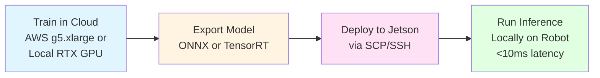

# Introduction to Physical AI & Humanoid Robotics

Welcome to the most exciting frontier in artificial intelligence: **Physical AI**—where software intelligence meets the real world through sensors, actuators, and robotic hardware.

## What is Physical AI?

**Physical AI** (also called **Embodied AI**) refers to artificial intelligence systems that perceive and interact with the physical world. Unlike pure software AI systems like ChatGPT or DALL-E that operate entirely in the digital realm, Physical AI systems must:

1. **Perceive**: Gather sensory data from the real world (cameras, LiDAR, IMUs, touch sensors)
2. **Decide**: Process observations and make decisions in real-time (&lt;10ms for safety-critical control)
3. **Act**: Control physical actuators (motors, grippers, wheels) to accomplish tasks

**Example**: A humanoid robot folding laundry uses Physical AI:
- **Perceives**: RGB-D camera detects shirt on table
- **Decides**: Vision-Language-Action model plans grasp and fold sequence
- **Acts**: 7-DOF robot arms execute motions to pick, fold, and place shirt

**Contrast with Software AI**:
| Feature | Software AI (ChatGPT) | Physical AI (Humanoid Robot) |
|---------|----------------------|------------------------------|
| **Environment** | Digital text/images | Physical world (3D, dynamic, unpredictable) |
| **Latency Tolerance** | Seconds OK | &lt;10ms for control (collision avoidance) |
| **Error Cost** | Bad answer | Physical damage, injury |
| **Sensors** | None (text input only) | Cameras, LiDAR, IMU, force sensors |
| **Actuators** | None (text output only) | Motors, grippers, wheels |
| **Deployment** | Cloud servers | Edge devices (Jetson Orin Nano) |

**Why Physical AI is Harder**:
- **Real-time constraints**: Software AI can "think" for 10 seconds; robots must react in 10 milliseconds to avoid collisions.
- **Sim-to-real gap**: Training in simulation (Isaac Sim, Gazebo) doesn't perfectly transfer to real hardware due to physics differences.
- **Safety-critical**: Wrong answer in ChatGPT is annoying; wrong motion in robot can cause injury.
- **Embodiment matters**: Each robot has different morphology (humanoid vs. quadruped vs. industrial arm), requiring model adaptation.

---

## Why Now? The Perfect Storm for Physical AI

Three simultaneous breakthroughs make 2025 the **golden age** for building Physical AI systems:

### 1. Vision-Language-Action (VLA) Models

**What changed**: In 2022-2024, Google DeepMind, UC Berkeley, and Stanford released open VLA models that combine:
- **Vision**: RGB-D camera images
- **Language**: Natural language instructions ("pick up the cup")
- **Action**: Direct robot motor commands

**Examples**:
- **RT-1** (Google, 2022): 130,000+ robot demonstrations, 62% success on novel tasks
- **RT-2** (Google DeepMind, 2023): Transfers web-scale vision-language knowledge to robotics
- **Octo** (UC Berkeley, 2024): Open-source generalist policy, fine-tunable with minimal data
- **OpenVLA** (Stanford, 2024): 7B parameter model trained on 970k robot trajectories

**Why this matters**: Before VLA models, programming robots required manual trajectory planning, inverse kinematics, and task-specific controllers. Now, you can train a single model on diverse tasks and generalize to new objects/instructions.

### 2. Affordable Edge AI Hardware

**What changed**: NVIDIA Jetson family brings datacenter AI performance to $249 devices.

**Economy Jetson Kit (This Course)**:
| Component | Price | Specs | Purpose |
|-----------|-------|-------|---------|
| **Jetson Orin Nano** | **$249** | 10 TOPS INT8, 8GB RAM | Run VLA model inference (&lt;10ms) |
| **RealSense D435i** | **$349** | RGB-D camera, IMU | Perception (depth + color at 30 FPS) |
| Power + Cables + SD | $100 | 65W USB-C, 128GB storage | Power and storage |
| **Total** | **$700** | - | Complete edge AI robot brain |

**Why this matters**: In 2020, equivalent performance required $5,000+ GPUs and desktop PCs. In 2025, a $249 Jetson runs the same models with 7-15W power (battery-powered robots possible).

**Cloud Alternative**: AWS g5.xlarge ($1.006/hr) = $205/quarter for 5 hrs/week. Jetson cheaper after ~3.5 quarters (and you own the hardware).

### 3. Mature Sim-to-Real Workflows

**What changed**: Simulation platforms (Isaac Sim, Gazebo, MuJoCo) now accurately model physics, sensors, and lighting for effective sim-to-real transfer.

**The Correct Workflow** (Enforced Throughout This Course):


**Why this matters**:
- **Training in cloud**: Leverage A10G/A100 GPUs for 10,000+ episodes of training in parallel
- **Deploy to edge**: Avoid 50-200ms+ network latency (would make real-time control unsafe)
- **Isaac Sim**: NVIDIA's photorealistic simulator with RTX raytracing for accurate RGB/depth
- **Domain randomization**: Vary lighting, textures, object sizes in sim → models generalize to real world

⚠️ **LATENCY TRAP WARNING** ⚠️
Never control a real robot directly from the cloud. Network latency (50-200ms+) makes real-time control unsafe. Always deploy models to edge devices (Jetson) for &lt;10ms inference.

---

## Course Overview: 4 Modules → 1 Capstone

This course teaches you to build Physical AI systems using the **industry-standard robotics stack**:

### Module 1: Robotic Nervous System (ROS 2)
**Duration**: 4 weeks | **Hardware**: Any Linux machine (VM OK)

Learn ROS 2 (Robot Operating System 2), the middleware that connects robot components:
- **Week 1**: Nodes, topics (publish-subscribe for sensor data streaming)
- **Week 2**: Services (request-response for calculations), actions (long-running tasks with feedback)
- **Week 3**: URDF (robot descriptions), TF2 (coordinate transforms)
- **Week 4**: Package creation, launch files, parameters

**By the end**: You'll implement a multi-node ROS 2 system with simulated sensors and controllers.

### Module 2: Simulation Environments (Gazebo & Unity)
**Duration**: 3 weeks | **Hardware**: RTX GPU recommended (cloud alternative: AWS)

Master simulation for training robot policies before hardware deployment:
- **Week 1**: Gazebo setup, URDF/SDF models, physics configuration
- **Week 2**: Sensors (cameras, LiDAR, IMU) and environment design
- **Week 3**: Unity ML-Agents integration (optional: for game engine physics)

**By the end**: You'll build custom simulation environments and collect synthetic training data.

### Module 3: Industrial-Grade Simulation (NVIDIA Isaac Sim)
**Duration**: 4 weeks | **Hardware**: RTX GPU required

Level up to NVIDIA's photorealistic simulator with RTX raytracing:
- **Week 1**: Isaac Sim setup, USD (Universal Scene Description) workflows
- **Week 2**: Importing robots (URDF → USD), sensor configuration
- **Week 3**: Synthetic data generation (domain randomization for sim-to-real)
- **Week 4**: Sim-to-real transfer, deploying trained policies to Jetson

**By the end**: You'll train a navigation policy in Isaac Sim and deploy to a real/simulated robot.

### Module 4: Vision-Language-Action Models
**Duration**: 4 weeks | **Hardware**: Jetson Orin Nano (Economy Kit)

Train and deploy state-of-the-art VLA models:
- **Week 1**: RT-1 architecture, imitation learning from demonstrations
- **Week 2**: RT-2 (multimodal transformers), language-conditioned policies
- **Week 3**: Octo (open-source), fine-tuning on custom tasks
- **Week 4**: ONNX export, TensorRT optimization, Jetson deployment

**By the end**: You'll fine-tune a VLA model and deploy to Jetson for &lt;50ms inference on robot manipulation tasks.

### Capstone Project: Your Choice
**Duration**: 4 weeks | **Hardware**: Jetson + RealSense (or cloud alternative)

Build one of three Physical AI systems:
1. **Autonomous Navigation**: Mobile robot navigates indoor environments using VLA + LiDAR
2. **Object Manipulation**: Robot arm picks and places objects using language commands
3. **Humanoid Behavior**: Simulated humanoid performs full-body motions (walking, reaching)

**Deliverables**:
- Trained VLA model (with training logs, validation metrics)
- Sim-to-real deployment (video of real robot or high-fidelity sim)
- Technical report (architecture, training details, challenges overcome)

---

## Prerequisites: What You Need to Know

### Required Knowledge
- **Programming**: Python 3.10+ (comfortable with classes, async, decorators)
- **Linux**: Basic command line (cd, ls, mkdir, ssh, scp)
- **Math**: High school algebra (vectors, matrices)—no calculus required

### Optional But Helpful
- **Robotics**: Familiarity with coordinate frames, kinematics (we'll teach from scratch)
- **Machine Learning**: PyTorch basics (we cover VLA training step-by-step)
- **Computer Vision**: OpenCV experience helps but not required

### System Requirements

**Option 1: Economy Jetson Kit ($700 one-time)** ⭐ Recommended
- Jetson Orin Nano Developer Kit ($249)
- RealSense D435i camera ($349)
- Power supply + cables + 128GB SD card ($100)
- **Pros**: Own hardware forever, &lt;10ms inference, battery-powered possible
- **Cons**: Upfront cost, limited to 10 TOPS INT8 (fine for VLA inference)

**Option 2: Cloud GPUs ($205/quarter for 5 hrs/week)**
- AWS g5.xlarge: NVIDIA A10G (24GB VRAM), $1.006/hr
- Use for: Training VLA models, Isaac Sim (requires RTX)
- **Pros**: No upfront cost, more VRAM for training
- **Cons**: Recurring cost, 50-200ms+ latency (simulation only, not real robots)

**Option 3: Local RTX Workstation** (if you already own)
- RTX 3060+ (12GB+ VRAM recommended)
- Ubuntu 22.04 LTS (native or dual-boot)
- **Pros**: Zero ongoing cost, full control
- **Cons**: High upfront cost if purchasing new

**Minimum** (Modules 1-2 only):
- Any laptop with Ubuntu 22.04 (VM or WSL2 OK)
- 8GB RAM, 20GB disk space
- Can complete ROS 2 and Gazebo modules without GPUs

---

## What Makes This Course Different

### 1. Sim-to-Real First (Not Cloud-Robot Mistakes)
We enforce **Principle IV** rigorously:
- ✅ **Correct**: Train in cloud → Export model → Deploy to Jetson → Run locally
- ❌ **Wrong**: Control real robot directly from cloud API (50-200ms latency = unsafe)

Every tutorial explicitly shows the export and deployment steps. No cloud-controlled robot examples (those cause crashes).

### 2. Cost Transparency (No Hidden Surprises)
We enforce **Principle V**:
- All hardware prices verified (Jetson $249, RealSense $349)
- Cloud costs calculated quarterly (AWS g5.xlarge = $205/quarter at 5 hrs/week)
- Break-even analysis (Jetson cheaper after 3.5 quarters)

You'll know exactly what you're paying for, with no "oh by the way" costs later.

### 3. Open Source & Accessible Forever
- License: CC-BY-SA 4.0 (content) + MIT (code)
- No paywalls, no subscriptions, no gated content
- Deployed on GitHub Pages permanently
- Community contributions welcome (PRs accepted)

### 4. Real Robot Intelligence, Not Toy Demos
We use:
- **ROS 2 Humble** (industry LTS release, not outdated ROS 1)
- **Isaac Sim 4.0** (NVIDIA's professional simulator, not amateur tools)
- **Open VLA models** (Octo, RT-2 architectures—not custom toy examples)
- **Jetson deployment** (real edge inference, not "it works on my laptop")

You'll build systems that translate to actual robotics jobs, not just coursework.

---

## Your First ROS 2 Program (5 Minutes)

Let's verify your ROS 2 installation and run a minimal node:

### Step 1: Install ROS 2 Humble

```bash
# Update package list
sudo apt update && sudo apt upgrade -y

# Add ROS 2 repository
sudo apt install software-properties-common
sudo add-apt-repository universe
sudo apt install curl -y
curl -sSL https://raw.githubusercontent.com/ros/rosdistro/master/ros.asc | sudo gpg --dearmor -o /usr/share/keyrings/ros-archive-keyring.gpg
echo "deb [signed-by=/usr/share/keyrings/ros-archive-keyring.gpg] http://packages.ros.org/ros2/ubuntu $(lsb_release -cs) main" | sudo tee /etc/apt/sources.list.d/ros2.list

# Install ROS 2 Humble Desktop
sudo apt update
sudo apt install ros-humble-desktop -y

# Source ROS 2 environment
echo "source /opt/ros/humble/setup.bash" >> ~/.bashrc
source ~/.bashrc
```

### Step 2: Create and Run Your First Node

```python
# hello_physical_ai.py
import rclpy
from rclpy.node import Node

class HelloPhysicalAI(Node):
    def __init__(self):
        super().__init__('hello_physical_ai')
        self.get_logger().info('🤖 Hello from Physical AI!')
        self.get_logger().info('Ready to build embodied intelligence systems!')

def main():
    rclpy.init()
    node = HelloPhysicalAI()
    rclpy.spin(node)
    rclpy.shutdown()

if __name__ == '__main__':
    main()
```

**Run it**:
```bash
python3 hello_physical_ai.py
```

**Expected output**:
```
[INFO] [hello_physical_ai]: 🤖 Hello from Physical AI!
[INFO] [hello_physical_ai]: Ready to build embodied intelligence systems!
```

Congratulations! You've just run your first ROS 2 node. This simple program demonstrates:
- **rclpy**: ROS 2 Python client library
- **Node**: The building block of ROS 2 systems (every robot component is a node)
- **Logger**: Built-in logging for debugging

---

## Next Steps

Ready to build Physical AI systems? Here's your learning path:

1. **Start Module 1**: [ROS 2 Fundamentals](/docs/01-ros2/index) (4 weeks)
2. **Join Community**: [GitHub Discussions](https://github.com/your-repo/discussions) for questions
3. **Prepare Hardware**: Order Jetson Orin Nano ($249) if targeting Modules 3-4
4. **Set Up Dev Environment**: Install ROS 2 Humble, VS Code, Git

**Study Tips**:
- Allocate 10-15 hours/week (2 hours reading + 8 hours hands-on labs + 5 hours projects)
- Complete labs immediately after reading chapters (don't let theory accumulate)
- Use ROS 2 documentation frequently ([docs.ros.org](https://docs.ros.org/en/humble/))
- Debug actively (read error messages, search GitHub issues)

---

## Resources

- **ROS 2 Humble Docs**: https://docs.ros.org/en/humble/
- **NVIDIA Jetson**: https://developer.nvidia.com/embedded/jetson-orin-nano-developer-kit
- **Isaac Sim**: https://developer.nvidia.com/isaac-sim
- **OpenVLA**: https://github.com/openvla/openvla
- **Octo**: https://github.com/octo-models/octo

---

<div style={{textAlign: 'center', marginTop: '3rem', padding: '2rem', backgroundColor: 'var(--ifm-color-emphasis-100)', borderRadius: '8px'}}>
  <h2>🚀 Welcome to Physical AI</h2>
  <p style={{fontSize: '1.1rem', marginTop: '1rem'}}>
    You're about to learn the most transformative AI skill: teaching software to interact with the real world through robotic hardware.
  </p>
  <div style={{marginTop: '2rem'}}>
    <a
      className="button button--primary button--lg"
      href="/docs/01-ros2/index"
    >
      Start Module 1: ROS 2 Fundamentals →
    </a>
  </div>
</div>

---

<!-- Generated by @content-generator on December 6, 2025 -->
