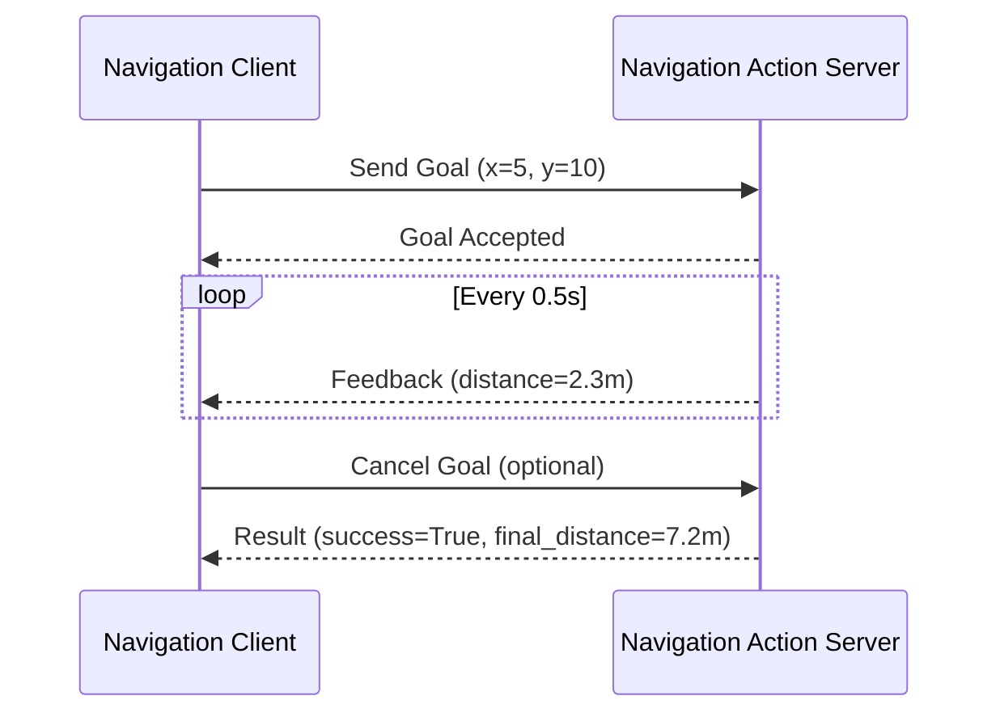

# ROS 2 Actions

## What Are Actions?

**Actions** are designed for **long-running tasks** that need progress feedback and the ability to cancel. Think of navigation (moving 10m forward), manipulation (picking an object), or any task that takes seconds/minutes.

### When to Use Actions

| Communication Pattern | Use Case | Example |
|----------------------|----------|---------|
| **Topics** | Continuous data streams | Camera images, LiDAR scans |
| **Services** | Quick request/response | "What's the battery level?" |
| **Actions** | Long-running tasks | "Navigate to (5, 10)" (takes 30 seconds) |

### Action Structure

Actions have **3 parts**:

1. **Goal**: What you want to achieve (e.g., "Move 5m forward")
2. **Feedback**: Progress updates (e.g., "Moved 2.3m so far...")
3. **Result**: Final outcome (e.g., "Success! Total distance: 5.01m")



---

## Action Definition

Actions are defined in `.action` files with 3 sections separated by `---`.

### Example: Countdown.action

```
# Goal: How long to count down
int32 duration
---
# Result: Whether countdown completed
bool success
string message
---
# Feedback: Current remaining time
int32 remaining
```

### Standard Action Types

```bash
# List action types
ros2 interface list | grep action

# Examples:
# example_interfaces/action/Fibonacci
# nav2_msgs/action/NavigateToPose
# control_msgs/action/FollowJointTrajectory
```

---

## Action Server (Provider)

Let's create a countdown action server:

```python
import rclpy
from rclpy.node import Node
from rclpy.action import ActionServer
from example_interfaces.action import Fibonacci
import time

class CountdownActionServer(Node):
    def __init__(self):
        super().__init__('countdown_action_server')

        # Create action server: name, type, callback
        self._action_server = ActionServer(
            self,
            Fibonacci,  # Using Fibonacci as example (will adapt)
            'countdown',
            self.execute_callback
        )

        self.get_logger().info('Countdown action server ready')

    def execute_callback(self, goal_handle):
        self.get_logger().info(f'Executing countdown for {goal_handle.request.order} seconds')

        # Feedback message
        feedback_msg = Fibonacci.Feedback()

        # Main execution loop
        for i in range(goal_handle.request.order, 0, -1):
            # Check if goal was canceled
            if goal_handle.is_cancel_requested:
                goal_handle.canceled()
                self.get_logger().info('Goal canceled')
                return Fibonacci.Result()

            # Send feedback
            feedback_msg.sequence = [i]
            goal_handle.publish_feedback(feedback_msg)
            self.get_logger().info(f'Countdown: {i}')

            time.sleep(1.0)

        # Mark goal as succeeded
        goal_handle.succeed()

        # Return result
        result = Fibonacci.Result()
        result.sequence = [0]  # Countdown complete
        self.get_logger().info('Countdown complete!')

        return result

def main():
    rclpy.init()
    node = CountdownActionServer()
    rclpy.spin(node)
    node.destroy_node()
    rclpy.shutdown()

if __name__ == '__main__':
    main()
```

---

## Action Client (Requester)

Now create a client that sends goals:

```python
import rclpy
from rclpy.node import Node
from rclpy.action import ActionClient
from example_interfaces.action import Fibonacci

class CountdownActionClient(Node):
    def __init__(self):
        super().__init__('countdown_action_client')

        # Create action client
        self._action_client = ActionClient(
            self,
            Fibonacci,
            'countdown'
        )

    def send_goal(self, duration):
        self.get_logger().info(f'Sending goal: countdown {duration} seconds')

        # Wait for action server
        self._action_client.wait_for_server()

        # Create goal message
        goal_msg = Fibonacci.Goal()
        goal_msg.order = duration

        # Send goal asynchronously
        send_goal_future = self._action_client.send_goal_async(
            goal_msg,
            feedback_callback=self.feedback_callback
        )

        # Register callback for goal response
        send_goal_future.add_done_callback(self.goal_response_callback)

    def goal_response_callback(self, future):
        goal_handle = future.result()

        if not goal_handle.accepted:
            self.get_logger().info('Goal rejected')
            return

        self.get_logger().info('Goal accepted')

        # Get result asynchronously
        get_result_future = goal_handle.get_result_async()
        get_result_future.add_done_callback(self.get_result_callback)

    def feedback_callback(self, feedback_msg):
        feedback = feedback_msg.feedback
        self.get_logger().info(f'Feedback: {feedback.sequence[0]} seconds remaining')

    def get_result_callback(self, future):
        result = future.result().result
        self.get_logger().info('Countdown complete!')

def main():
    rclpy.init()
    node = CountdownActionClient()

    # Send goal: countdown 10 seconds
    node.send_goal(10)

    # Keep node alive to receive feedback and result
    rclpy.spin(node)

    node.destroy_node()
    rclpy.shutdown()

if __name__ == '__main__':
    main()
```

### Running Server & Client

**Terminal 1** (server):
```bash
python3 countdown_server.py
```

**Terminal 2** (client):
```bash
python3 countdown_client.py
```

**Output (Terminal 2)**:
```
[INFO] Sending goal: countdown 10 seconds
[INFO] Goal accepted
[INFO] Feedback: 10 seconds remaining
[INFO] Feedback: 9 seconds remaining
[INFO] Feedback: 8 seconds remaining
...
[INFO] Countdown complete!
```

---

## Custom Action Types

Let's create a navigation action:

### Step 1: Define Action

Create `action/NavigateTo.action`:

```
# Goal: target pose
float32 x
float32 y
float32 theta
---
# Result: success and final pose
bool success
float32 final_x
float32 final_y
string message
---
# Feedback: current pose and distance remaining
float32 current_x
float32 current_y
float32 distance_remaining
```

### Step 2: Update CMakeLists.txt

```cmake
find_package(action_msgs REQUIRED)

rosidl_generate_interfaces(${PROJECT_NAME}
  "action/NavigateTo.action"
  DEPENDENCIES action_msgs
)
```

### Step 3: Update package.xml

```xml
<depend>action_msgs</depend>
```

### Step 4: Build Package

```bash
cd ~/ros2_ws
colcon build --packages-select my_robot_interfaces
source install/setup.bash
```

---

## Using Custom Actions

### Navigation Action Server

```python
import rclpy
from rclpy.node import Node
from rclpy.action import ActionServer
from my_robot_interfaces.action import NavigateTo
import math
import time

class NavigationActionServer(Node):
    def __init__(self):
        super().__init__('navigation_action_server')

        self._action_server = ActionServer(
            self,
            NavigateTo,
            'navigate_to',
            self.execute_callback
        )

        self.current_x = 0.0
        self.current_y = 0.0

        self.get_logger().info('Navigation action server ready')

    def execute_callback(self, goal_handle):
        target_x = goal_handle.request.x
        target_y = goal_handle.request.y

        self.get_logger().info(f'Navigating to ({target_x}, {target_y})')

        feedback_msg = NavigateTo.Feedback()

        # Simulate navigation (in reality, use Nav2)
        total_distance = math.sqrt(
            (target_x - self.current_x)**2 +
            (target_y - self.current_y)**2
        )

        steps = 20
        for i in range(steps + 1):
            if goal_handle.is_cancel_requested:
                goal_handle.canceled()
                self.get_logger().info('Navigation canceled')
                return NavigateTo.Result()

            # Update current position (linear interpolation)
            progress = i / steps
            self.current_x = self.current_x + (target_x - self.current_x) * progress
            self.current_y = self.current_y + (target_y - self.current_y) * progress

            # Calculate remaining distance
            remaining = math.sqrt(
                (target_x - self.current_x)**2 +
                (target_y - self.current_y)**2
            )

            # Publish feedback
            feedback_msg.current_x = self.current_x
            feedback_msg.current_y = self.current_y
            feedback_msg.distance_remaining = remaining

            goal_handle.publish_feedback(feedback_msg)

            self.get_logger().info(
                f'Position: ({self.current_x:.2f}, {self.current_y:.2f}), '
                f'Remaining: {remaining:.2f}m'
            )

            time.sleep(0.5)

        # Mark as succeeded
        goal_handle.succeed()

        # Return result
        result = NavigateTo.Result()
        result.success = True
        result.final_x = self.current_x
        result.final_y = self.current_y
        result.message = f'Reached ({self.current_x:.2f}, {self.current_y:.2f})'

        return result

def main():
    rclpy.init()
    node = NavigationActionServer()
    rclpy.spin(node)
    node.destroy_node()
    rclpy.shutdown()

if __name__ == '__main__':
    main()
```

---

## Canceling Goals

Action clients can cancel goals mid-execution:

```python
class CancelableClient(Node):
    def __init__(self):
        super().__init__('cancelable_client')
        self._action_client = ActionClient(self, NavigateTo, 'navigate_to')
        self._goal_handle = None

    def send_goal(self, x, y):
        self._action_client.wait_for_server()

        goal_msg = NavigateTo.Goal()
        goal_msg.x = x
        goal_msg.y = y

        send_goal_future = self._action_client.send_goal_async(
            goal_msg,
            feedback_callback=self.feedback_callback
        )

        send_goal_future.add_done_callback(self.goal_response_callback)

    def goal_response_callback(self, future):
        self._goal_handle = future.result()

        if not self._goal_handle.accepted:
            self.get_logger().info('Goal rejected')
            return

        self.get_logger().info('Goal accepted')

        # Schedule cancellation after 3 seconds
        self.create_timer(3.0, self.cancel_goal)

        get_result_future = self._goal_handle.get_result_async()
        get_result_future.add_done_callback(self.get_result_callback)

    def cancel_goal(self):
        self.get_logger().info('Canceling goal...')
        cancel_future = self._goal_handle.cancel_goal_async()
        cancel_future.add_done_callback(self.cancel_done)

    def cancel_done(self, future):
        cancel_response = future.result()
        if len(cancel_response.goals_canceling) > 0:
            self.get_logger().info('Goal successfully canceled')
        else:
            self.get_logger().info('Goal failed to cancel')

    def feedback_callback(self, feedback_msg):
        feedback = feedback_msg.feedback
        self.get_logger().info(f'Remaining: {feedback.distance_remaining:.2f}m')

    def get_result_callback(self, future):
        status = future.result().status
        if status == 4:  # ABORTED
            self.get_logger().info('Goal aborted')
        elif status == 5:  # CANCELED
            self.get_logger().info('Goal canceled')
        elif status == 6:  # SUCCEEDED
            result = future.result().result
            self.get_logger().info(f'Goal succeeded: {result.message}')
```

---

## Action Introspection

### List Actions

```bash
ros2 action list
```

**Output**:
```
/navigate_to
/countdown
```

### Action Information

```bash
ros2 action info /navigate_to
```

**Output**:
```
Action: /navigate_to
Action clients: 1
    /navigation_action_client
Action servers: 1
    /navigation_action_server
```

### Send Goal from CLI

```bash
ros2 action send_goal /navigate_to my_robot_interfaces/action/NavigateTo "{x: 5.0, y: 10.0, theta: 0.0}" --feedback
```

---

## Real-World Example: Pick and Place

```python
from my_robot_interfaces.action import PickAndPlace

class PickAndPlaceServer(Node):
    def __init__(self):
        super().__init__('pick_and_place_server')

        self._action_server = ActionServer(
            self,
            PickAndPlace,
            'pick_and_place',
            self.execute_callback
        )

    def execute_callback(self, goal_handle):
        object_id = goal_handle.request.object_id
        target_pose = goal_handle.request.target_pose

        self.get_logger().info(f'Picking object {object_id}')

        feedback_msg = PickAndPlace.Feedback()

        # Phase 1: Move to object
        feedback_msg.phase = 'approaching'
        goal_handle.publish_feedback(feedback_msg)
        time.sleep(2.0)

        # Phase 2: Grasp
        feedback_msg.phase = 'grasping'
        goal_handle.publish_feedback(feedback_msg)
        time.sleep(1.5)

        # Phase 3: Move to target
        feedback_msg.phase = 'moving_to_target'
        goal_handle.publish_feedback(feedback_msg)
        time.sleep(2.0)

        # Phase 4: Release
        feedback_msg.phase = 'releasing'
        goal_handle.publish_feedback(feedback_msg)
        time.sleep(1.0)

        goal_handle.succeed()

        result = PickAndPlace.Result()
        result.success = True
        result.message = f'Successfully placed object {object_id}'

        return result
```

---

## Hands-On Lab: Fibonacci Action

**Goal**: Implement a Fibonacci sequence generator as an action.

### Requirements

1. **Goal**: Number of Fibonacci numbers to generate
2. **Feedback**: Each new number as it's computed
3. **Result**: Complete sequence

### Action Definition

```
# Goal
int32 order
---
# Result
int32[] sequence
---
# Feedback
int32[] partial_sequence
```

### Starter Code

```python
# server.py
class FibonacciServer(Node):
    def execute_callback(self, goal_handle):
        # TODO: Generate Fibonacci sequence
        # TODO: Publish feedback after each number
        # TODO: Return final sequence
        pass
```

### Expected Behavior

```bash
ros2 action send_goal /fibonacci my_robot_interfaces/action/Fibonacci "{order: 10}" --feedback
```

**Output**:
```
Feedback: [0, 1]
Feedback: [0, 1, 1]
Feedback: [0, 1, 1, 2]
...
Result: [0, 1, 1, 2, 3, 5, 8, 13, 21, 34]
```

---

## Key Takeaways

✅ **Actions are for long-running tasks** (seconds to minutes)
✅ **3 components**: Goal, Feedback, Result
✅ **Supports cancellation** mid-execution
✅ **Asynchronous by design** (non-blocking)
✅ **Use for navigation, manipulation, autonomous behaviors**

---

## Next Steps

Learn the Python client library in depth with **[rclpy](/docs/ros2/rclpy)**.

---

<div style={{textAlign: 'center', marginTop: '3rem', padding: '2rem', backgroundColor: 'var(--ifm-color-emphasis-100)', borderRadius: '8px'}}>
  <h2>📚 Continue Learning</h2>
  <p style={{fontSize: '1.1rem', marginTop: '1rem'}}>
    Deep dive into the Python client library for ROS 2.
  </p>
  <div style={{marginTop: '2rem'}}>
    <a
      className="button button--primary button--lg"
      href="/docs/ros2/rclpy"
    >
      Next: rclpy →
    </a>
  </div>
</div>
