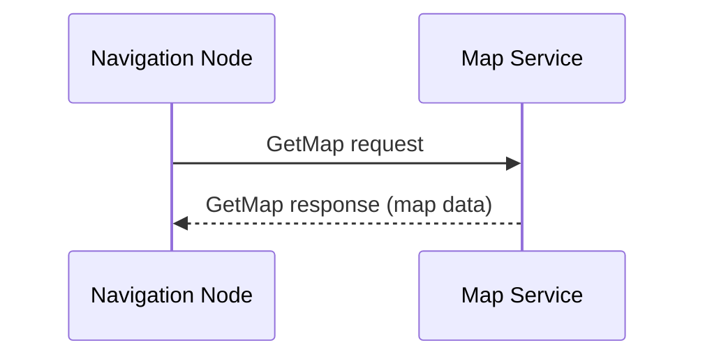

# ROS 2 Services

## What Are Services?

**Services** implement the **request/response pattern** for synchronous communication—like HTTP APIs or Remote Procedure Calls (RPC).

### Topics vs Services

| Feature | Topics | Services |
|---------|--------|----------|
| **Pattern** | Publish-subscribe | Request/response |
| **Communication** | Asynchronous (fire-and-forget) | Synchronous (wait for reply) |
| **Directionality** | One-to-many (broadcast) | One-to-one (client → server) |
| **Use Case** | Sensor data, continuous streams | One-off queries, commands |

### Analogy: Restaurant Ordering

- **Topics**: Chef announces "Order 42 is ready!" (anyone listening can hear)
- **Services**: Customer asks "Is the soup vegan?" and waits for waiter's answer



---

## Service Definition

Services are defined in `.srv` files with two parts: **request** and **response**, separated by `---`.

### Example: AddTwoInts.srv

```
# Request
int64 a
int64 b
---
# Response
int64 sum
```

### Standard Service Types

ROS 2 provides built-in services:

```bash
# List all service types
ros2 interface list | grep srv

# Examples:
# std_srvs/srv/SetBool
# std_srvs/srv/Trigger
# example_interfaces/srv/AddTwoInts
```

---

## Service Server (Provider)

Let's create a calculator service:

```python
import rclpy
from rclpy.node import Node
from example_interfaces.srv import AddTwoInts

class CalculatorServer(Node):
    def __init__(self):
        super().__init__('calculator_server')

        # Create service: name, type, callback
        self.service = self.create_service(
            AddTwoInts,
            'add_two_ints',
            self.add_callback
        )

        self.get_logger().info('Calculator service ready')

    def add_callback(self, request, response):
        response.sum = request.a + request.b
        self.get_logger().info(f'Request: {request.a} + {request.b} = {response.sum}')
        return response

def main():
    rclpy.init()
    node = CalculatorServer()
    rclpy.spin(node)
    node.destroy_node()
    rclpy.shutdown()

if __name__ == '__main__':
    main()
```

**Key points**:
- Callback receives `request`, returns `response`
- Service automatically handles serialization/deserialization
- Server blocks other callbacks until this one completes

---

## Service Client (Requester)

Now create a client that calls the service:

```python
import rclpy
from rclpy.node import Node
from example_interfaces.srv import AddTwoInts
import sys

class CalculatorClient(Node):
    def __init__(self):
        super().__init__('calculator_client')

        # Create client: name, type
        self.client = self.create_client(AddTwoInts, 'add_two_ints')

        # Wait for service to be available
        while not self.client.wait_for_service(timeout_sec=1.0):
            self.get_logger().info('Service not available, waiting...')

    def send_request(self, a, b):
        request = AddTwoInts.Request()
        request.a = a
        request.b = b

        # Send request asynchronously
        future = self.client.call_async(request)

        # Wait for response
        rclpy.spin_until_future_complete(self, future)

        if future.result() is not None:
            response = future.result()
            self.get_logger().info(f'Result: {a} + {b} = {response.sum}')
            return response.sum
        else:
            self.get_logger().error('Service call failed')
            return None

def main():
    rclpy.init()

    if len(sys.argv) != 3:
        print('Usage: python3 calculator_client.py <a> <b>')
        return

    node = CalculatorClient()

    a = int(sys.argv[1])
    b = int(sys.argv[2])

    result = node.send_request(a, b)

    node.destroy_node()
    rclpy.shutdown()

if __name__ == '__main__':
    main()
```

### Running Server & Client

**Terminal 1** (server):
```bash
python3 calculator_server.py
```

**Terminal 2** (client):
```bash
python3 calculator_client.py 10 25
```

**Output (Terminal 2)**:
```
[INFO] [timestamp] [calculator_client]: Result: 10 + 25 = 35
```

---

## Service Introspection

### List All Services

```bash
ros2 service list
```

**Output**:
```
/add_two_ints
/calculator_server/describe_parameters
/calculator_server/get_parameters
...
```

### Service Type

```bash
ros2 service type /add_two_ints
```

**Output**:
```
example_interfaces/srv/AddTwoInts
```

### Call Service from CLI

```bash
ros2 service call /add_two_ints example_interfaces/srv/AddTwoInts "{a: 5, b: 10}"
```

**Output**:
```
requester: making request: example_interfaces.srv.AddTwoInts_Request(a=5, b=10)

response:
example_interfaces.srv.AddTwoInts_Response(sum=15)
```

---

## Custom Service Types

Let's create a service for robot navigation:

### Step 1: Define Service

Create `srv/NavigateTo.srv` in your package:

```
# Request: target position
float32 x
float32 y
float32 theta
---
# Response: success and distance traveled
bool success
float32 distance
string message
```

### Step 2: Update CMakeLists.txt

```cmake
rosidl_generate_interfaces(${PROJECT_NAME}
  "srv/NavigateTo.srv"
  "msg/SensorData.msg"  # If you have custom messages
)
```

### Step 3: Build Package

```bash
cd ~/ros2_ws
colcon build --packages-select my_robot_interfaces
source install/setup.bash
```

### Step 4: Verify Service

```bash
ros2 interface show my_robot_interfaces/srv/NavigateTo
```

---

## Using Custom Services

### Navigation Server

```python
import rclpy
from rclpy.node import Node
from my_robot_interfaces.srv import NavigateTo
import math
import time

class NavigationServer(Node):
    def __init__(self):
        super().__init__('navigation_server')

        self.service = self.create_service(
            NavigateTo,
            'navigate_to',
            self.navigate_callback
        )

        self.current_x = 0.0
        self.current_y = 0.0

        self.get_logger().info('Navigation service ready')

    def navigate_callback(self, request, response):
        target_x = request.x
        target_y = request.y

        # Calculate distance
        dx = target_x - self.current_x
        dy = target_y - self.current_y
        distance = math.sqrt(dx**2 + dy**2)

        self.get_logger().info(f'Navigating to ({target_x}, {target_y})')

        # Simulate navigation (in reality, this would call Nav2)
        time.sleep(2.0)

        # Update position
        self.current_x = target_x
        self.current_y = target_y

        response.success = True
        response.distance = distance
        response.message = f'Reached ({target_x}, {target_y})'

        return response

def main():
    rclpy.init()
    node = NavigationServer()
    rclpy.spin(node)
    node.destroy_node()
    rclpy.shutdown()

if __name__ == '__main__':
    main()
```

### Navigation Client

```python
import rclpy
from rclpy.node import Node
from my_robot_interfaces.srv import NavigateTo
import sys

class NavigationClient(Node):
    def __init__(self):
        super().__init__('navigation_client')

        self.client = self.create_client(NavigateTo, 'navigate_to')

        while not self.client.wait_for_service(timeout_sec=1.0):
            self.get_logger().info('Navigation service not available, waiting...')

    def navigate(self, x, y, theta=0.0):
        request = NavigateTo.Request()
        request.x = x
        request.y = y
        request.theta = theta

        future = self.client.call_async(request)
        rclpy.spin_until_future_complete(self, future)

        if future.result() is not None:
            response = future.result()
            if response.success:
                self.get_logger().info(
                    f'Navigation successful! Distance: {response.distance:.2f}m'
                )
            else:
                self.get_logger().error('Navigation failed')
        else:
            self.get_logger().error('Service call failed')

def main():
    rclpy.init()

    if len(sys.argv) != 3:
        print('Usage: python3 navigation_client.py <x> <y>')
        return

    node = NavigationClient()

    x = float(sys.argv[1])
    y = float(sys.argv[2])

    node.navigate(x, y)

    node.destroy_node()
    rclpy.shutdown()

if __name__ == '__main__':
    main()
```

---

## Asynchronous Service Calls

For non-blocking calls (recommended for real systems):

```python
import rclpy
from rclpy.node import Node
from example_interfaces.srv import AddTwoInts

class AsyncCalculatorClient(Node):
    def __init__(self):
        super().__init__('async_calculator_client')
        self.client = self.create_client(AddTwoInts, 'add_two_ints')

        while not self.client.wait_for_service(timeout_sec=1.0):
            self.get_logger().info('Waiting for service...')

    def send_request(self, a, b):
        request = AddTwoInts.Request()
        request.a = a
        request.b = b

        # Send request asynchronously
        future = self.client.call_async(request)

        # Register callback for when response arrives
        future.add_done_callback(self.response_callback)

    def response_callback(self, future):
        try:
            response = future.result()
            self.get_logger().info(f'Result: {response.sum}')
        except Exception as e:
            self.get_logger().error(f'Service call failed: {e}')

def main():
    rclpy.init()
    node = AsyncCalculatorClient()

    # Send request
    node.send_request(10, 25)

    # Keep node alive to receive response
    rclpy.spin(node)

    node.destroy_node()
    rclpy.shutdown()

if __name__ == '__main__':
    main()
```

---

## Error Handling

### Timeout Handling

```python
def send_request_with_timeout(self, a, b, timeout=5.0):
    request = AddTwoInts.Request()
    request.a = a
    request.b = b

    future = self.client.call_async(request)

    # Wait with timeout
    rclpy.spin_until_future_complete(self, future, timeout_sec=timeout)

    if future.done():
        if future.result() is not None:
            return future.result().sum
        else:
            self.get_logger().error('Service returned error')
    else:
        self.get_logger().error(f'Service call timed out after {timeout}s')
        future.cancel()

    return None
```

---

## Hands-On Lab: String Reversal Service

**Goal**: Create a service that reverses strings.

### Requirements

1. **Service Definition**: `srv/ReverseString.srv`
   ```
   string input
   ---
   string output
   int32 length
   ```

2. **Server Node**: Reverses input string
3. **Client Node**: Sends string from command line

### Starter Code

```python
# server.py
import rclpy
from rclpy.node import Node
from my_robot_interfaces.srv import ReverseString

class StringReverserServer(Node):
    def __init__(self):
        super().__init__('string_reverser_server')
        # TODO: Create service
        self.get_logger().info('String reverser service ready')

    def reverse_callback(self, request, response):
        # TODO: Reverse request.input
        # TODO: Set response.output and response.length
        return response
```

```python
# client.py
import rclpy
from rclpy.node import Node
from my_robot_interfaces.srv import ReverseString
import sys

class StringReverserClient(Node):
    def __init__(self):
        super().__init__('string_reverser_client')
        # TODO: Create client and wait for service

    def send_request(self, text):
        # TODO: Create request with text
        # TODO: Call service and print response
        pass
```

### Expected Behavior

```bash
# Terminal 1
python3 server.py

# Terminal 2
python3 client.py "Hello ROS 2"
```

**Output**:
```
[INFO] Reversed: "2 SOR olleH", length: 10
```

---

## Key Takeaways

✅ **Services are synchronous request/response** (like HTTP APIs)
✅ **Use for one-off queries/commands** (not continuous data streams)
✅ **Server blocks until callback completes** (keep callbacks fast!)
✅ **Use `call_async()` for non-blocking calls** in production systems
✅ **Always check service availability** with `wait_for_service()`

---

## Next Steps

Learn about long-running tasks with **[Actions](/docs/ros2/actions)**.

---

<div style={{textAlign: 'center', marginTop: '3rem', padding: '2rem', backgroundColor: 'var(--ifm-color-emphasis-100)', borderRadius: '8px'}}>
  <h2>📚 Continue Learning</h2>
  <p style={{fontSize: '1.1rem', marginTop: '1rem'}}>
    Master long-running tasks with feedback using ROS 2 actions.
  </p>
  <div style={{marginTop: '2rem'}}>
    <a
      className="button button--primary button--lg"
      href="/docs/ros2/actions"
    >
      Next: Actions →
    </a>
  </div>
</div>
