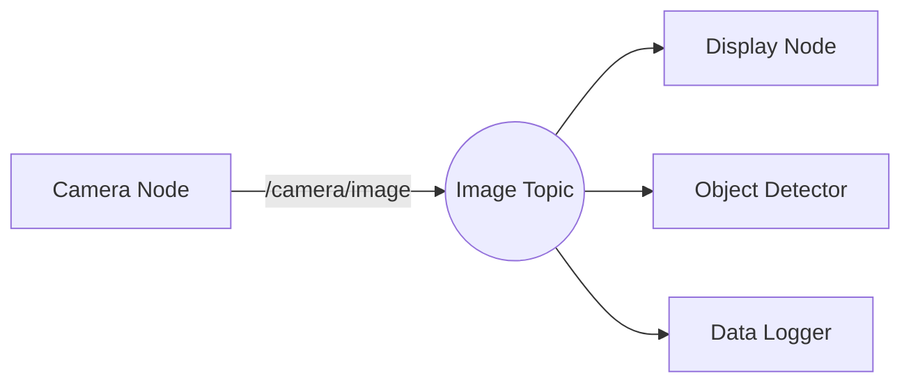

# ROS 2 Topics

## What Are Topics?

**Topics** are named channels for asynchronous communication between nodes using the **publisher-subscriber pattern**. This is the most common communication pattern in ROS 2.

### Analogy: Radio Broadcasting

- **Publishers** are like radio stations broadcasting on a frequency (topic)
- **Subscribers** are like radios tuned to that frequency
- Multiple publishers can broadcast to the same topic
- Multiple subscribers can listen to the same topic
- Publishers and subscribers don't need to know about each other (**decoupled**)



---

## Publisher Example

Let's create a node that publishes random sensor data:

```python
import rclpy
from rclpy.node import Node
from std_msgs.msg import String
import random

class DataPublisher(Node):
    def __init__(self):
        super().__init__('data_publisher')

        # Create publisher: topic name, message type, queue size
        self.publisher = self.create_publisher(String, 'sensor_data', 10)

        # Publish at 2 Hz (every 0.5 seconds)
        self.timer = self.create_timer(0.5, self.publish_data)
        self.count = 0

    def publish_data(self):
        msg = String()
        msg.data = f'Sensor reading #{self.count}: {random.randint(0, 100)}'

        self.publisher.publish(msg)
        self.get_logger().info(f'Published: {msg.data}')

        self.count += 1

def main():
    rclpy.init()
    node = DataPublisher()
    rclpy.spin(node)
    node.destroy_node()
    rclpy.shutdown()

if __name__ == '__main__':
    main()
```

### Key Parameters

- **Topic name**: `'sensor_data'` (must start with `/` or be relative to node namespace)
- **Message type**: `String` (from `std_msgs.msg`)
- **Queue size**: `10` (buffer last 10 messages if subscriber is slow)

---

## Subscriber Example

Now create a node that subscribes to the data:

```python
import rclpy
from rclpy.node import Node
from std_msgs.msg import String

class DataSubscriber(Node):
    def __init__(self):
        super().__init__('data_subscriber')

        # Create subscriber: topic name, message type, callback, queue size
        self.subscription = self.create_subscription(
            String,
            'sensor_data',
            self.listener_callback,
            10
        )

    def listener_callback(self, msg):
        self.get_logger().info(f'Received: {msg.data}')

def main():
    rclpy.init()
    node = DataSubscriber()
    rclpy.spin(node)
    node.destroy_node()
    rclpy.shutdown()

if __name__ == '__main__':
    main()
```

### Running Publisher & Subscriber

**Terminal 1** (publisher):
```bash
python3 data_publisher.py
```

**Terminal 2** (subscriber):
```bash
python3 data_subscriber.py
```

**Output (Terminal 2)**:
```
[INFO] [timestamp] [data_subscriber]: Received: Sensor reading #0: 42
[INFO] [timestamp] [data_subscriber]: Received: Sensor reading #1: 87
[INFO] [timestamp] [data_subscriber]: Received: Sensor reading #2: 15
```

---

## Topic Introspection

While nodes are running, inspect topics with CLI tools:

### List All Topics

```bash
ros2 topic list
```

**Output**:
```
/sensor_data
/rosout
/parameter_events
```

### Topic Information

```bash
ros2 topic info /sensor_data
```

**Output**:
```
Type: std_msgs/msg/String
Publisher count: 1
Subscription count: 1
```

### Echo Topic (Live Data)

```bash
ros2 topic echo /sensor_data
```

**Output**:
```
data: 'Sensor reading #42: 67'
---
data: 'Sensor reading #43: 91'
---
```

### Topic Rate

```bash
ros2 topic hz /sensor_data
```

**Output**:
```
average rate: 2.001
        min: 0.499s max: 0.501s std dev: 0.001s window: 10
```

---

## Custom Message Types

Standard messages (`std_msgs`) are limited. Let's create a custom message for sensor data:

### Step 1: Create Package

```bash
cd ~/ros2_ws/src
ros2 pkg create my_robot_interfaces --build-type ament_cmake
cd my_robot_interfaces
mkdir msg
```

### Step 2: Define Message

Create `msg/SensorData.msg`:

```
# SensorData.msg - Custom sensor message
float32 temperature    # Temperature in Celsius
float32 humidity       # Humidity in percentage
int64 timestamp        # Unix timestamp in nanoseconds
```

### Step 3: Update CMakeLists.txt

Add to `CMakeLists.txt`:

```cmake
find_package(rosidl_default_generators REQUIRED)

rosidl_generate_interfaces(${PROJECT_NAME}
  "msg/SensorData.msg"
)
```

### Step 4: Update package.xml

Add to `package.xml`:

```xml
<build_depend>rosidl_default_generators</build_depend>
<exec_depend>rosidl_default_runtime</exec_depend>
<member_of_group>rosidl_interface_packages</member_of_group>
```

### Step 5: Build Package

```bash
cd ~/ros2_ws
colcon build --packages-select my_robot_interfaces
source install/setup.bash
```

### Step 6: Verify Message

```bash
ros2 interface show my_robot_interfaces/msg/SensorData
```

**Output**:
```
float32 temperature
float32 humidity
int64 timestamp
```

---

## Using Custom Messages

### Publisher with Custom Message

```python
import rclpy
from rclpy.node import Node
from my_robot_interfaces.msg import SensorData
import random
import time

class CustomPublisher(Node):
    def __init__(self):
        super().__init__('custom_publisher')

        self.publisher = self.create_publisher(SensorData, 'sensor_data', 10)
        self.timer = self.create_timer(1.0, self.publish_data)

    def publish_data(self):
        msg = SensorData()
        msg.temperature = 20.0 + random.uniform(-5.0, 5.0)
        msg.humidity = 50.0 + random.uniform(-10.0, 10.0)
        msg.timestamp = time.time_ns()

        self.publisher.publish(msg)
        self.get_logger().info(f'Published: T={msg.temperature:.2f}°C, H={msg.humidity:.2f}%')

def main():
    rclpy.init()
    node = CustomPublisher()
    rclpy.spin(node)
    node.destroy_node()
    rclpy.shutdown()

if __name__ == '__main__':
    main()
```

### Subscriber with Custom Message

```python
import rclpy
from rclpy.node import Node
from my_robot_interfaces.msg import SensorData

class CustomSubscriber(Node):
    def __init__(self):
        super().__init__('custom_subscriber')

        self.subscription = self.create_subscription(
            SensorData,
            'sensor_data',
            self.listener_callback,
            10
        )

    def listener_callback(self, msg):
        self.get_logger().info(
            f'Received: T={msg.temperature:.2f}°C, H={msg.humidity:.2f}%, '
            f'Time={msg.timestamp}'
        )

def main():
    rclpy.init()
    node = CustomSubscriber()
    rclpy.spin(node)
    node.destroy_node()
    rclpy.shutdown()

if __name__ == '__main__':
    main()
```

---

## Quality of Service (QoS)

**QoS** policies control message delivery behavior (reliability, durability, latency).

### Common QoS Profiles

```python
from rclpy.qos import QoSProfile, ReliabilityPolicy, HistoryPolicy, DurabilityPolicy

# Sensor data (lossy, real-time)
sensor_qos = QoSProfile(
    reliability=ReliabilityPolicy.BEST_EFFORT,  # Drop old messages if late
    history=HistoryPolicy.KEEP_LAST,
    depth=10
)

# Commands (reliable, important)
command_qos = QoSProfile(
    reliability=ReliabilityPolicy.RELIABLE,  # Retry until delivered
    history=HistoryPolicy.KEEP_LAST,
    depth=10
)

# Persistent data (survive node restarts)
persistent_qos = QoSProfile(
    reliability=ReliabilityPolicy.RELIABLE,
    durability=DurabilityPolicy.TRANSIENT_LOCAL,  # Late subscribers get last message
    history=HistoryPolicy.KEEP_LAST,
    depth=1
)
```

### Example: Sensor with QoS

```python
from rclpy.qos import QoSProfile, ReliabilityPolicy

sensor_qos = QoSProfile(
    reliability=ReliabilityPolicy.BEST_EFFORT,
    depth=10
)

self.publisher = self.create_publisher(SensorData, 'sensor_data', sensor_qos)
```

**Use cases**:
- **BEST_EFFORT**: LiDAR, camera feeds (real-time, tolerate drops)
- **RELIABLE**: Motor commands, safety messages (must arrive)
- **TRANSIENT_LOCAL**: Map data, configuration (persistent)

---

## Real-World Example: Multi-Sensor System

Let's build a system with multiple publishers:

```python
import rclpy
from rclpy.node import Node
from sensor_msgs.msg import LaserScan, Image, Imu
from std_msgs.msg import Header

class RobotSensorHub(Node):
    def __init__(self):
        super().__init__('sensor_hub')

        # Publishers for different sensors
        self.lidar_pub = self.create_publisher(LaserScan, '/scan', 10)
        self.camera_pub = self.create_publisher(Image, '/camera/image', 10)
        self.imu_pub = self.create_publisher(Imu, '/imu', 10)

        # Timers at different rates
        self.create_timer(0.1, self.publish_lidar)    # 10 Hz
        self.create_timer(0.033, self.publish_camera)  # 30 Hz
        self.create_timer(0.01, self.publish_imu)      # 100 Hz

    def publish_lidar(self):
        msg = LaserScan()
        msg.header = Header()
        msg.header.stamp = self.get_clock().now().to_msg()
        msg.header.frame_id = 'laser_frame'
        # ... populate scan data ...
        self.lidar_pub.publish(msg)

    def publish_camera(self):
        # Similar for camera
        pass

    def publish_imu(self):
        # Similar for IMU
        pass
```

---

## Hands-On Lab: Temperature Monitor

**Goal**: Build a temperature monitoring system with alerts.

### Requirements

1. **Publisher Node**: Publishes temperature readings (15-35°C) at 1 Hz
2. **Monitor Node**: Subscribes and logs alerts if T > 30°C or T < 18°C
3. **Custom Message**: `TemperatureReading.msg` with fields `temperature`, `unit`, `timestamp`

### Starter Code

```python
# Define msg/TemperatureReading.msg
float32 temperature
string unit
int64 timestamp
```

```python
# publisher_node.py
import rclpy
from rclpy.node import Node
from my_robot_interfaces.msg import TemperatureReading
import random
import time

class TemperaturePublisher(Node):
    def __init__(self):
        super().__init__('temperature_publisher')
        # TODO: Create publisher
        # TODO: Create timer (1 Hz)

    def publish_temperature(self):
        # TODO: Generate random temp (15-35°C)
        # TODO: Create message
        # TODO: Publish
        pass
```

```python
# monitor_node.py
import rclpy
from rclpy.node import Node
from my_robot_interfaces.msg import TemperatureReading

class TemperatureMonitor(Node):
    def __init__(self):
        super().__init__('temperature_monitor')
        # TODO: Create subscriber

    def temperature_callback(self, msg):
        # TODO: Check if T > 30 or T < 18
        # TODO: Log warning if outside range
        pass
```

### Expected Behavior

**Monitor output**:
```
[INFO] Temperature: 22.5°C (OK)
[INFO] Temperature: 28.3°C (OK)
[WARN] Temperature: 31.2°C (TOO HIGH!)
[WARN] Temperature: 16.8°C (TOO LOW!)
```

---

## Key Takeaways

✅ **Topics enable asynchronous communication** (decoupled nodes)
✅ **Multiple publishers/subscribers** can share a topic
✅ **Custom messages** for structured data (use `msg/` directory)
✅ **QoS policies** control reliability, durability, latency
✅ **Introspect with CLI**: `ros2 topic echo`, `ros2 topic hz`, `ros2 topic info`

---

## Next Steps

Learn synchronous request/response patterns with **[Services](/docs/ros2/services)**.

---

<div style={{textAlign: 'center', marginTop: '3rem', padding: '2rem', backgroundColor: 'var(--ifm-color-emphasis-100)', borderRadius: '8px'}}>
  <h2>📚 Continue Learning</h2>
  <p style={{fontSize: '1.1rem', marginTop: '1rem'}}>
    Master request/response communication with ROS 2 services.
  </p>
  <div style={{marginTop: '2rem'}}>
    <a
      className="button button--primary button--lg"
      href="/docs/ros2/services"
    >
      Next: Services →
    </a>
  </div>
</div>
