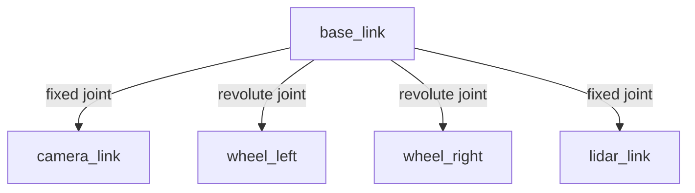

# URDF - Robot Descriptions

## What is URDF?

**URDF** (Unified Robot Description Format) is an XML format for describing robots—their geometry, kinematics, dynamics, sensors, and visual appearance.

Think of URDF as a **blueprint** for your robot that both simulation (Gazebo) and real hardware (ROS 2 control) can understand.

### Why URDF?

- **Standardized**: One description works across Gazebo, RViz, Nav2, and MoveIt
- **Coordinate Transforms**: Automatically publishes TF2 transforms
- **Simulation**: Gazebo uses URDF for physics simulation
- **Visualization**: RViz uses URDF for rendering 3D models
- **Motion Planning**: MoveIt uses URDF for collision checking and IK

---

## URDF Structure

A robot is defined as a tree of **links** (rigid bodies) connected by **joints** (movable connections).



### Basic URDF Example

```xml
<?xml version="1.0"?>
<robot name="simple_robot">

  <!-- Base link (robot body) -->
  <link name="base_link">
    <visual>
      <geometry>
        <box size="0.6 0.4 0.2"/>
      </geometry>
      <material name="blue">
        <color rgba="0 0 1 1"/>
      </material>
    </visual>

    <collision>
      <geometry>
        <box size="0.6 0.4 0.2"/>
      </geometry>
    </collision>

    <inertial>
      <mass value="10.0"/>
      <inertia ixx="0.1" ixy="0.0" ixz="0.0"
               iyy="0.1" iyz="0.0" izz="0.1"/>
    </inertial>
  </link>

  <!-- Wheel link -->
  <link name="wheel_left">
    <visual>
      <geometry>
        <cylinder radius="0.1" length="0.05"/>
      </geometry>
      <material name="black">
        <color rgba="0 0 0 1"/>
      </material>
    </visual>

    <collision>
      <geometry>
        <cylinder radius="0.1" length="0.05"/>
      </geometry>
    </collision>

    <inertial>
      <mass value="0.5"/>
      <inertia ixx="0.01" ixy="0.0" ixz="0.0"
               iyy="0.01" iyz="0.0" izz="0.01"/>
    </inertial>
  </link>

  <!-- Joint connecting base to wheel -->
  <joint name="base_to_wheel_left" type="continuous">
    <parent link="base_link"/>
    <child link="wheel_left"/>
    <origin xyz="0.2 0.25 -0.1" rpy="0 0 0"/>
    <axis xyz="0 1 0"/>
  </joint>

</robot>
```

---

## Link Elements

### Visual (What you see)

```xml
<visual>
  <geometry>
    <!-- Primitive shapes -->
    <box size="1.0 0.5 0.2"/>           <!-- width depth height -->
    <cylinder radius="0.1" length="0.5"/> <!-- radius length -->
    <sphere radius="0.1"/>               <!-- radius -->

    <!-- Mesh files (STL, DAE, OBJ) -->
    <mesh filename="package://my_robot/meshes/body.stl" scale="1 1 1"/>
  </geometry>

  <material name="red">
    <color rgba="1 0 0 1"/>  <!-- Red, Green, Blue, Alpha -->
  </material>

  <!-- Optional: offset from link origin -->
  <origin xyz="0 0 0.1" rpy="0 0 0"/>  <!-- x y z  roll pitch yaw -->
</visual>
```

### Collision (For physics)

```xml
<collision>
  <geometry>
    <!-- Usually simplified (box/cylinder instead of complex mesh) -->
    <box size="1.0 0.5 0.2"/>
  </geometry>
</collision>
```

**Best practice**: Keep collision geometry simple for performance (use box/cylinder instead of complex meshes).

### Inertial (For dynamics)

```xml
<inertial>
  <mass value="10.0"/>  <!-- kg -->
  <origin xyz="0 0 0" rpy="0 0 0"/>  <!-- Center of mass -->
  <inertia ixx="0.1" ixy="0.0" ixz="0.0"
           iyy="0.1" iyz="0.0" izz="0.1"/>
</inertial>
```

**Calculate inertia**: Use tools like MeshLab or online calculators for complex geometries.

---

## Joint Types

### 1. Fixed Joint (No movement)

```xml
<joint name="base_to_camera" type="fixed">
  <parent link="base_link"/>
  <child link="camera_link"/>
  <origin xyz="0.3 0 0.2" rpy="0 0 0"/>
</joint>
```

**Use case**: Attach sensors (cameras, LiDAR) to robot body.

---

### 2. Revolute Joint (Rotational, limited)

```xml
<joint name="shoulder_joint" type="revolute">
  <parent link="base_link"/>
  <child link="upper_arm"/>
  <origin xyz="0 0 0.5" rpy="0 0 0"/>
  <axis xyz="0 1 0"/>  <!-- Rotate around Y-axis -->
  <limit lower="-1.57" upper="1.57" effort="10" velocity="1.0"/>
</joint>
```

**Use case**: Robot arms (with angle limits).

---

### 3. Continuous Joint (Rotational, unlimited)

```xml
<joint name="wheel_joint" type="continuous">
  <parent link="base_link"/>
  <child link="wheel"/>
  <origin xyz="0 0.3 -0.1" rpy="0 0 0"/>
  <axis xyz="0 1 0"/>  <!-- Rotate around Y-axis -->
</joint>
```

**Use case**: Wheels (can spin indefinitely).

---

### 4. Prismatic Joint (Linear)

```xml
<joint name="elevator_joint" type="prismatic">
  <parent link="base_link"/>
  <child link="platform"/>
  <origin xyz="0 0 0" rpy="0 0 0"/>
  <axis xyz="0 0 1"/>  <!-- Move along Z-axis -->
  <limit lower="0" upper="1.0" effort="100" velocity="0.5"/>
</joint>
```

**Use case**: Elevators, linear actuators.

---

## Coordinate Frames (TF2)

URDF automatically generates **TF2 transforms** between links.

```python
import rclpy
from rclpy.node import Node
from tf2_ros import TransformBroadcaster
from geometry_msgs.msg import TransformStamped

class TFPublisher(Node):
    def __init__(self):
        super().__init__('tf_publisher')

        self.tf_broadcaster = TransformBroadcaster(self)

        # Publish transform at 10 Hz
        self.create_timer(0.1, self.publish_transform)

    def publish_transform(self):
        t = TransformStamped()

        t.header.stamp = self.get_clock().now().to_msg()
        t.header.frame_id = 'base_link'
        t.child_frame_id = 'camera_link'

        # Translation
        t.transform.translation.x = 0.3
        t.transform.translation.y = 0.0
        t.transform.translation.z = 0.2

        # Rotation (quaternion)
        t.transform.rotation.x = 0.0
        t.transform.rotation.y = 0.0
        t.transform.rotation.z = 0.0
        t.transform.rotation.w = 1.0

        self.tf_broadcaster.sendTransform(t)
```

### View TF Tree

```bash
# Install tf2_tools
sudo apt install ros-humble-tf2-tools

# Generate PDF of transform tree
ros2 run tf2_tools view_frames
```

---

## Visualizing in RViz

### Step 1: Create URDF File

Save as `robot.urdf`:

```xml
<?xml version="1.0"?>
<robot name="my_robot">

  <link name="base_link">
    <visual>
      <geometry>
        <box size="0.6 0.4 0.2"/>
      </geometry>
      <material name="blue">
        <color rgba="0 0 1 1"/>
      </material>
    </visual>
  </link>

  <link name="camera_link">
    <visual>
      <geometry>
        <box size="0.05 0.1 0.05"/>
      </geometry>
      <material name="red">
        <color rgba="1 0 0 1"/>
      </material>
    </visual>
  </link>

  <joint name="base_to_camera" type="fixed">
    <parent link="base_link"/>
    <child link="camera_link"/>
    <origin xyz="0.3 0 0.1" rpy="0 0 0"/>
  </joint>

</robot>
```

### Step 2: Launch Robot State Publisher

```python
# robot_state_publisher.launch.py
from launch import LaunchDescription
from launch_ros.actions import Node
import os
from ament_index_python.packages import get_package_share_directory

def generate_launch_description():
    urdf_file = os.path.join(
        get_package_share_directory('my_robot_description'),
        'urdf',
        'robot.urdf'
    )

    with open(urdf_file, 'r') as file:
        robot_description = file.read()

    return LaunchDescription([
        Node(
            package='robot_state_publisher',
            executable='robot_state_publisher',
            output='screen',
            parameters=[{'robot_description': robot_description}]
        ),

        Node(
            package='joint_state_publisher',
            executable='joint_state_publisher',
            output='screen'
        )
    ])
```

### Step 3: Launch RViz

```bash
ros2 launch my_robot_description robot_state_publisher.launch.py &
rviz2
```

**In RViz**:
1. Set **Fixed Frame** to `base_link`
2. Add **RobotModel** display
3. Add **TF** display to see coordinate frames

---

## Real-World Example: Mobile Robot

```xml
<?xml version="1.0"?>
<robot name="mobile_robot">

  <!-- Base link -->
  <link name="base_link">
    <visual>
      <geometry>
        <box size="0.6 0.4 0.2"/>
      </geometry>
      <material name="blue">
        <color rgba="0 0 1 1"/>
      </material>
    </visual>
    <collision>
      <geometry>
        <box size="0.6 0.4 0.2"/>
      </geometry>
    </collision>
    <inertial>
      <mass value="10.0"/>
      <inertia ixx="0.18" ixy="0" ixz="0" iyy="0.38" iyz="0" izz="0.50"/>
    </inertial>
  </link>

  <!-- Left wheel -->
  <link name="wheel_left">
    <visual>
      <geometry>
        <cylinder radius="0.1" length="0.05"/>
      </geometry>
      <origin xyz="0 0 0" rpy="1.5708 0 0"/>
      <material name="black">
        <color rgba="0 0 0 1"/>
      </material>
    </visual>
    <collision>
      <geometry>
        <cylinder radius="0.1" length="0.05"/>
      </geometry>
      <origin xyz="0 0 0" rpy="1.5708 0 0"/>
    </collision>
    <inertial>
      <mass value="0.5"/>
      <inertia ixx="0.001" ixy="0" ixz="0" iyy="0.001" iyz="0" izz="0.001"/>
    </inertial>
  </link>

  <joint name="base_to_wheel_left" type="continuous">
    <parent link="base_link"/>
    <child link="wheel_left"/>
    <origin xyz="0.15 0.25 -0.1" rpy="0 0 0"/>
    <axis xyz="0 1 0"/>
  </joint>

  <!-- Right wheel (symmetric) -->
  <link name="wheel_right">
    <visual>
      <geometry>
        <cylinder radius="0.1" length="0.05"/>
      </geometry>
      <origin xyz="0 0 0" rpy="1.5708 0 0"/>
      <material name="black">
        <color rgba="0 0 0 1"/>
      </material>
    </visual>
    <collision>
      <geometry>
        <cylinder radius="0.1" length="0.05"/>
      </geometry>
      <origin xyz="0 0 0" rpy="1.5708 0 0"/>
    </collision>
    <inertial>
      <mass value="0.5"/>
      <inertia ixx="0.001" ixy="0" ixz="0" iyy="0.001" iyz="0" izz="0.001"/>
    </inertial>
  </link>

  <joint name="base_to_wheel_right" type="continuous">
    <parent link="base_link"/>
    <child link="wheel_right"/>
    <origin xyz="0.15 -0.25 -0.1" rpy="0 0 0"/>
    <axis xyz="0 1 0"/>
  </joint>

  <!-- LiDAR sensor -->
  <link name="lidar_link">
    <visual>
      <geometry>
        <cylinder radius="0.05" length="0.07"/>
      </geometry>
      <material name="gray">
        <color rgba="0.5 0.5 0.5 1"/>
      </material>
    </visual>
  </link>

  <joint name="base_to_lidar" type="fixed">
    <parent link="base_link"/>
    <child link="lidar_link"/>
    <origin xyz="0 0 0.15" rpy="0 0 0"/>
  </joint>

  <!-- Camera -->
  <link name="camera_link">
    <visual>
      <geometry>
        <box size="0.05 0.1 0.05"/>
      </geometry>
      <material name="red">
        <color rgba="1 0 0 1"/>
      </material>
    </visual>
  </link>

  <joint name="base_to_camera" type="fixed">
    <parent link="base_link"/>
    <child link="camera_link"/>
    <origin xyz="0.3 0 0.1" rpy="0 0 0"/>
  </joint>

</robot>
```

---

## Hands-On Lab: 2-Link Robot Arm

**Goal**: Create a simple 2-link robot arm URDF and visualize in RViz.

### Requirements

1. **base_link**: Fixed to ground (box: 0.1×0.1×0.2)
2. **link1**: First arm segment (cylinder: radius=0.05, length=0.5)
3. **link2**: Second arm segment (cylinder: radius=0.05, length=0.4)
4. **joint1**: Revolute (limits: -π/2 to π/2)
5. **joint2**: Revolute (limits: -π to π)

### Starter Code

```xml
<?xml version="1.0"?>
<robot name="robot_arm">

  <!-- TODO: Define base_link -->

  <!-- TODO: Define link1 -->

  <!-- TODO: Define link2 -->

  <!-- TODO: Define joint1 (base_link to link1) -->

  <!-- TODO: Define joint2 (link1 to link2) -->

</robot>
```

### Expected Behavior

Launch in RViz and use `joint_state_publisher_gui` to move joints:

```bash
ros2 launch my_robot_description arm.launch.py
```

You should see a 2-link arm that you can control with sliders.

---

## Key Takeaways

✅ **URDF describes robots** (geometry, kinematics, dynamics)
✅ **Links** are rigid bodies, **joints** connect links
✅ **TF2 transforms** automatically generated from URDF
✅ **Visualize in RViz** with `robot_state_publisher`
✅ **Simulate in Gazebo** (next module!)

---

## Next Steps

You've completed Module 1! Move on to **[Module 2: Gazebo & Unity](/docs/gazebo-unity)** to simulate your robots.

---

<div style={{textAlign: 'center', marginTop: '3rem', padding: '2rem', backgroundColor: 'var(--ifm-color-emphasis-100)', borderRadius: '8px'}}>
  <h2>🎉 Module 1 Complete!</h2>
  <p style={{fontSize: '1.1rem', marginTop: '1rem'}}>
    You've mastered ROS 2 fundamentals. Ready to simulate robots?
  </p>
  <div style={{marginTop: '2rem'}}>
    <a
      className="button button--primary button--lg"
      href="/docs/gazebo-unity"
    >
      Start Module 2: Gazebo & Unity →
    </a>
  </div>
</div>
