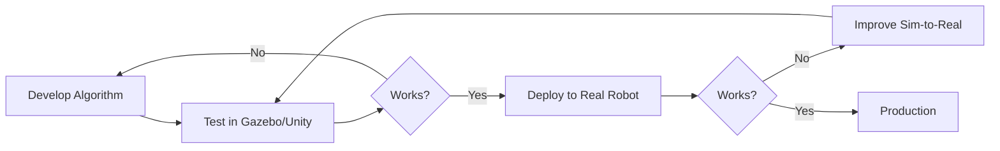

# Module 2: Digital Twin (Gazebo & Unity)

## Introduction

**Digital twins** are virtual replicas of physical robots that enable safe, cost-effective development. Train algorithms in simulation, test edge cases (fire, floods, collisions), and transfer to real hardware only when ready.

In this module, you'll master **Gazebo** (the industry-standard robot simulator) and **Unity** (for photorealistic environments), learning to simulate sensors (LiDAR, cameras, IMUs) with realistic noise models.

---

## Why Digital Twins?

### The Problem: Real Robot Development is Risky

- **Cost**: Breaking a $16,000 humanoid is expensive
- **Safety**: Testing autonomous navigation indoors risks collisions
- **Speed**: Hardware failures slow iteration (waiting for repairs)
- **Scale**: Training on 10,000 scenarios requires 10,000 real runs

**Digital twins solve this** by providing unlimited, safe testing environments.



---

## Module Overview

### What You'll Build

By the end of this module, you'll create a **mobile robot simulation** with:
1. Custom Gazebo world (warehouse environment)
2. Differential drive robot with wheels
3. LiDAR sensor (360°, 10m range)
4. Depth camera (Intel RealSense D435i equivalent)
5. IMU sensor (accelerometer + gyroscope)
6. ROS 2 integration (all sensors publish to topics)

### Learning Objectives

- **Week 5**: Understand physics engines, create Gazebo worlds, spawn robots
- **Week 6**: Simulate sensors (LiDAR, depth cameras, IMU) with realistic noise

---

## Chapters

1. **[Physics Simulation](/docs/gazebo-unity/physics-sim)** - Fundamentals of physics engines
2. **[Gazebo Setup](/docs/gazebo-unity/gazebo-setup)** - Installation and first simulation
3. **[Unity Simulation](/docs/gazebo-unity/unity-sim)** - Photorealistic alternative to Gazebo
4. **[LiDAR Sensors](/docs/gazebo-unity/sensors-lidar)** - Simulating laser scanners
5. **[Depth Cameras](/docs/gazebo-unity/sensors-depth)** - RealSense D435i simulation
6. **[IMU Sensors](/docs/gazebo-unity/sensors-imu)** - Accelerometer and gyroscope
7. **[URDF/SDF Models](/docs/gazebo-unity/urdf-sdf)** - Robot descriptions for simulation

---

## Gazebo vs Unity

| Feature | Gazebo | Unity |
|---------|--------|-------|
| **Physics** | ODE/Bullet/DART | PhysX/Havok |
| **Rendering** | OGRE (basic) | High-fidelity (AAA game quality) |
| **ROS 2 Integration** | ✅ Native | ⚠️ Via Unity Robotics Hub |
| **Learning Curve** | Moderate | Steep (game engine) |
| **Use Case** | Robotics prototyping | Photorealistic training data |
| **License** | Apache 2.0 (free) | Free (Personal), paid (Pro) |

**Recommendation**: Start with **Gazebo** for robotics fundamentals, add **Unity** for advanced computer vision (synthetic data generation).

---

## Prerequisites

### System Requirements

- **Operating System**: Ubuntu 22.04 LTS (native or WSL2)
- **GPU**: Integrated graphics sufficient for Gazebo; RTX GPU recommended for Unity
- **RAM**: 8GB minimum (16GB recommended)
- **Disk Space**: 15GB free

### Software Installation

```bash
# Install Gazebo Classic (for ROS 2 Humble)
sudo apt install ros-humble-gazebo-ros-pkgs -y

# Install Gazebo Sim (Ignition Fortress, newer version)
sudo apt install ros-humble-ros-gz -y

# Verify installation
gazebo --version
```

**Expected output**: `Gazebo multi-robot simulator, version 11.x.x`

---

## Key Concepts Preview

### 1. Physics Engines

Simulate gravity, friction, collisions:

```xml
<!-- Gazebo world with gravity -->
<world name="default">
  <physics type="ode">
    <gravity>0 0 -9.81</gravity>
    <max_step_size>0.001</max_step_size>
    <real_time_factor>1.0</real_time_factor>
  </physics>
</world>
```

### 2. Sensor Plugins

Add LiDAR to robot:

```xml
<gazebo reference="lidar_link">
  <sensor name="lidar" type="ray">
    <ray>
      <scan>
        <horizontal>
          <samples>720</samples>
          <resolution>1</resolution>
          <min_angle>-3.14159</min_angle>
          <max_angle>3.14159</max_angle>
        </horizontal>
      </scan>
      <range>
        <min>0.12</min>
        <max>10.0</max>
      </range>
    </ray>
    <plugin name="gazebo_ros_laser" filename="libgazebo_ros_ray_sensor.so">
      <ros>
        <namespace>/robot</namespace>
        <remapping>~/out:=scan</remapping>
      </ros>
    </plugin>
  </sensor>
</gazebo>
```

### 3. ROS 2 Integration

Sensors automatically publish to ROS 2 topics:

```bash
ros2 topic list
# /robot/scan         (sensor_msgs/LaserScan)
# /robot/camera/image (sensor_msgs/Image)
# /robot/imu          (sensor_msgs/Imu)
```

---

## Time Commitment

| Week | Reading | Hands-On Lab | Total |
|------|---------|--------------|-------|
| Week 5 | 2 hours | 3 hours | 5 hours |
| Week 6 | 2 hours | 4 hours | 6 hours |
| **Total** | **4 hours** | **7 hours** | **11 hours** |

---

## Assessment Preview

**Assessment 2 (Week 6)**: Build a complete Gazebo simulation with:
- Custom world (warehouse environment)
- Mobile robot (differential drive)
- 3 sensors: LiDAR, depth camera, IMU
- RViz visualization
- Documentation (README + demo video)

**Grading**: World design (20%), Sensor configuration (30%), ROS 2 integration (30%), Visualization (20%)

---

## Next Steps

Ready to dive in? Begin with **[Chapter 1: Physics Simulation](/docs/gazebo-unity/physics-sim)** to understand how physics engines work.

---

<div style={{textAlign: 'center', marginTop: '3rem', padding: '2rem', backgroundColor: 'var(--ifm-color-emphasis-100)', borderRadius: '8px'}}>
  <h2>🚀 Build Your First Digital Twin</h2>
  <p style={{fontSize: '1.1rem', marginTop: '1rem'}}>
    Learn to simulate robots with Gazebo and Unity physics engines.
  </p>
  <div style={{marginTop: '2rem'}}>
    <a
      className="button button--primary button--lg"
      href="/docs/gazebo-unity/physics-sim"
    >
      Start Chapter 1: Physics Simulation →
    </a>
  </div>
</div>
