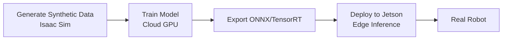
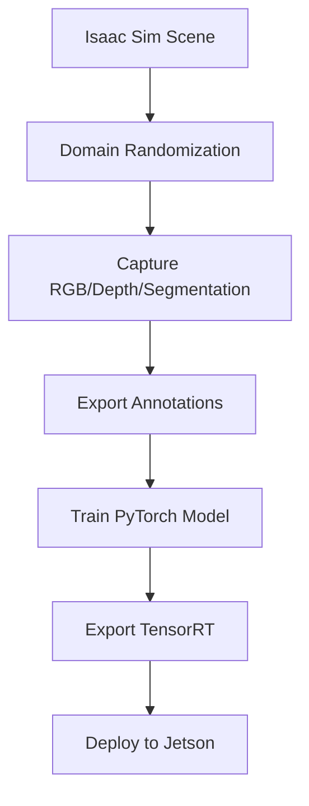

# Module 3: AI-Robot Brain (NVIDIA Isaac Sim)

## Introduction

**NVIDIA Isaac Sim** is a photorealistic robot simulator built on Omniverse, offering GPU-accelerated physics (PhysX), ray-traced rendering, and synthetic data generation at scale. It's the industry standard for training computer vision models and sim-to-real transfer.

In this module, you'll learn to generate millions of synthetic training images, implement Visual SLAM, integrate Nav2 navigation, and deploy trained models to Jetson Orin Nano for edge inference.

---

## Why Isaac Sim?

### Gazebo vs Isaac Sim

| Feature | Gazebo Classic | Isaac Sim |
|---------|---------------|-----------|
| **Rendering** | CPU-based (OGRE) | GPU ray-tracing (RTX) |
| **Physics** | CPU (ODE/Bullet) | GPU-accelerated (PhysX) |
| **Synthetic Data** | Limited | Photorealistic (domain randomization) |
| **Scalability** | Single scene | 1000s of parallel simulations |
| **AI Training** | Manual export | Native PyTorch/TensorFlow integration |
| **Hardware Requirement** | CPU sufficient | RTX GPU required |

**Use Gazebo for**: Quick prototyping, ROS 2 development
**Use Isaac Sim for**: AI training, large-scale data generation, sim-to-real

---

## Module Overview

### What You'll Build

By the end of this module, you'll:
1. Generate 10,000+ synthetic images with domain randomization
2. Implement Visual SLAM (ORB-SLAM3) for indoor navigation
3. Integrate Nav2 for autonomous navigation
4. Train a depth-based obstacle avoidance model in Isaac Sim
5. Export model to TensorRT and deploy to Jetson Orin Nano

### Learning Objectives

- **Week 7**: Install Isaac Sim, generate synthetic data with domain randomization
- **Week 8**: Implement VSLAM and Nav2 navigation
- **Week 9**: Master sim-to-real transfer workflow (cloud training → edge deployment)

---

## Chapters

1. **[Isaac Sim Setup](/docs/isaac/isaac-setup)** - Installation and first simulation
2. **[Synthetic Data Generation](/docs/isaac/synthetic-data)** - Domain randomization for AI training
3. **[Visual SLAM](/docs/isaac/vslam)** - ORB-SLAM3 for mapping and localization
4. **[Nav2 Navigation](/docs/isaac/nav2)** - Autonomous navigation stack
5. **[Sim-to-Real Transfer](/docs/isaac/sim-to-real)** - Cloud training → Edge deployment

---

## System Requirements

### Minimum (for learning)

- **GPU**: NVIDIA RTX 2060 (6GB VRAM)
- **RAM**: 16GB
- **Storage**: 50GB free
- **OS**: Ubuntu 22.04 or Windows 11

### Recommended (for production)

- **GPU**: NVIDIA RTX 4070+ (12GB+ VRAM)
- **RAM**: 32GB
- **Storage**: 100GB SSD
- **OS**: Ubuntu 22.04

### Cloud Alternative

- **AWS g5.xlarge**: A10G GPU (24GB VRAM), $1.006/hour
- **GCP N1 + T4**: Tesla T4 GPU (16GB VRAM), $0.95/hour

---

## Key Concepts Preview

### 1. Domain Randomization

Generate diverse training data by varying:
- **Textures**: Floor patterns, wall colors
- **Lighting**: Sun position, intensity, shadows
- **Object poses**: Random positions, rotations
- **Clutter**: Distractor objects (boxes, furniture)

```python
# Isaac Sim domain randomization API
from omni.replicator.core import randomizer

randomizer.texture(materials=['wood', 'concrete', 'marble'])
randomizer.light_intensity(min=0.5, max=2.0)
randomizer.scatter('props', count=20, area=(10, 10))
```

---

### 2. Sim-to-Real Workflow



**Critical**: Never control real robots from the cloud (50-200ms+ latency). Always deploy to edge.

---

### 3. Synthetic Data Pipeline



---

## Time Commitment

| Week | Reading | Hands-On Lab | Total |
|------|---------|--------------|-------|
| Week 7 | 2 hours | 4 hours | 6 hours |
| Week 8 | 2 hours | 4 hours | 6 hours |
| Week 9 | 2 hours | 5 hours | 7 hours |
| **Total** | **6 hours** | **13 hours** | **19 hours** |

---

## Assessment Preview

**Assessment 3 (Week 9)**: Isaac Sim-to-Real Transfer Project
- Generate 5,000+ synthetic images with domain randomization
- Train depth-based obstacle avoidance model (ResNet18)
- Export to TensorRT (INT8 quantization)
- Deploy to Jetson Orin Nano (&lt;50ms inference latency)
- Test in Gazebo (not Isaac Sim) to validate sim-to-real gap

**Grading**: Data generation (20%), Training (25%), Export (25%), Deployment (20%), Testing (10%)

---

## Next Steps

Ready to start? Begin with **[Chapter 1: Isaac Sim Setup](/docs/isaac/isaac-setup)** to install Isaac Sim and run your first simulation.

---

<div style={{textAlign: 'center', marginTop: '3rem', padding: '2rem', backgroundColor: 'var(--ifm-color-emphasis-100)', borderRadius: '8px'}}>
  <h2>🚀 Master Photorealistic Simulation</h2>
  <p style={{fontSize: '1.1rem', marginTop: '1rem'}}>
    Learn to generate synthetic data and deploy AI models to edge devices.
  </p>
  <div style={{marginTop: '2rem'}}>
    <a
      className="button button--primary button--lg"
      href="/docs/isaac/isaac-setup"
    >
      Start Chapter 1: Isaac Sim Setup →
    </a>
  </div>
</div>
