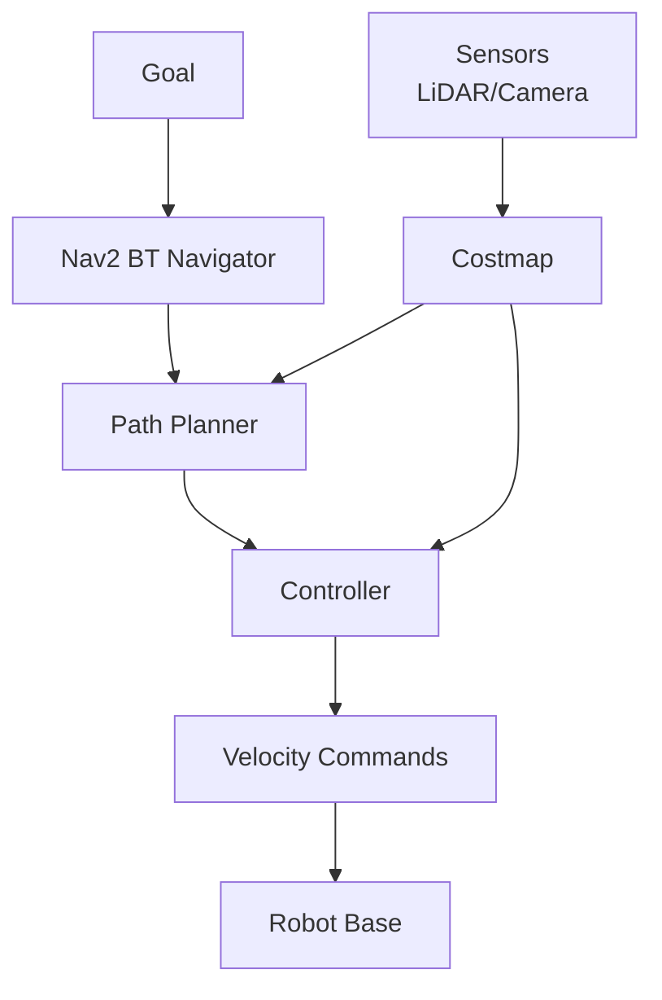

# Nav2 Autonomous Navigation

## What is Nav2?

**Nav2** (Navigation 2) is the industry-standard autonomous navigation stack for ROS 2, providing:
- **Path planning**: Find collision-free paths to goals
- **Obstacle avoidance**: React to dynamic obstacles
- **Recovery behaviors**: Handle stuck situations (rotate, back up)
- **Behavior trees**: Complex mission planning

---

## Nav2 Architecture



**Components**:
- **BT Navigator**: Behavior tree executor
- **Planner**: Global path planning (A*, Dijkstra, Theta*)
- **Controller**: Local trajectory tracking (DWB, TEB, MPPI)
- **Costmap**: 2D occupancy grid (obstacles, inflation)
- **Recovery**: Rotate, back up, wait behaviors

---

## Installing Nav2

```bash
sudo apt install ros-humble-navigation2 ros-humble-nav2-bringup
```

---

## Nav2 Configuration

### Create Nav2 Parameters File

`nav2_params.yaml`:

```yaml
bt_navigator:
  ros__parameters:
    use_sim_time: true
    global_frame: map
    robot_base_frame: base_link
    default_bt_xml_filename: "navigate_w_replanning_and_recovery.xml"

controller_server:
  ros__parameters:
    use_sim_time: true
    controller_frequency: 20.0
    min_x_velocity_threshold: 0.001
    min_y_velocity_threshold: 0.5
    min_theta_velocity_threshold: 0.001
    progress_checker_plugin: "progress_checker"
    goal_checker_plugin: "goal_checker"
    controller_plugins: ["FollowPath"]

    FollowPath:
      plugin: "dwb_core::DWBLocalPlanner"
      min_vel_x: 0.0
      min_vel_y: 0.0
      max_vel_x: 0.5
      max_vel_y: 0.0
      max_vel_theta: 1.0
      min_speed_xy: 0.0
      max_speed_xy: 0.5
      min_speed_theta: 0.0
      acc_lim_x: 2.5
      acc_lim_y: 0.0
      acc_lim_theta: 3.2
      decel_lim_x: -2.5
      decel_lim_y: 0.0
      decel_lim_theta: -3.2

planner_server:
  ros__parameters:
    use_sim_time: true
    planner_plugins: ["GridBased"]
    GridBased:
      plugin: "nav2_navfn_planner/NavfnPlanner"
      tolerance: 0.5
      use_astar: false
      allow_unknown: true

local_costmap:
  local_costmap:
    ros__parameters:
      use_sim_time: true
      global_frame: odom
      robot_base_frame: base_link
      rolling_window: true
      width: 5
      height: 5
      resolution: 0.05
      robot_radius: 0.3
      plugins: ["obstacle_layer", "inflation_layer"]

      obstacle_layer:
        plugin: "nav2_costmap_2d::ObstacleLayer"
        observation_sources: scan
        scan:
          topic: /scan
          max_obstacle_height: 2.0
          clearing: true
          marking: true

      inflation_layer:
        plugin: "nav2_costmap_2d::InflationLayer"
        inflation_radius: 0.5
        cost_scaling_factor: 3.0

global_costmap:
  global_costmap:
    ros__parameters:
      use_sim_time: true
      robot_base_frame: base_link
      global_frame: map
      width: 50
      height: 50
      resolution: 0.05
      robot_radius: 0.3
      plugins: ["static_layer", "obstacle_layer", "inflation_layer"]

      static_layer:
        plugin: "nav2_costmap_2d::StaticLayer"
        map_subscribe_transient_local: true

      obstacle_layer:
        plugin: "nav2_costmap_2d::ObstacleLayer"
        observation_sources: scan
        scan:
          topic: /scan
          max_obstacle_height: 2.0

      inflation_layer:
        plugin: "nav2_costmap_2d::InflationLayer"
        inflation_radius: 0.5
```

---

## Launching Nav2

### Launch File

```python
# nav2.launch.py
from launch import LaunchDescription
from launch_ros.actions import Node
from ament_index_python.packages import get_package_share_directory
import os

def generate_launch_description():
    nav2_params = os.path.join(
        get_package_share_directory('my_robot_navigation'),
        'config',
        'nav2_params.yaml'
    )

    return LaunchDescription([
        Node(
            package='nav2_map_server',
            executable='map_server',
            parameters=[{'yaml_filename': 'warehouse_map.yaml'}]
        ),

        Node(
            package='nav2_amcl',
            executable='amcl',
            parameters=[nav2_params]
        ),

        Node(
            package='nav2_controller',
            executable='controller_server',
            parameters=[nav2_params]
        ),

        Node(
            package='nav2_planner',
            executable='planner_server',
            parameters=[nav2_params]
        ),

        Node(
            package='nav2_bt_navigator',
            executable='bt_navigator',
            parameters=[nav2_params]
        ),

        Node(
            package='nav2_lifecycle_manager',
            executable='lifecycle_manager',
            parameters=[{
                'node_names': [
                    'map_server',
                    'amcl',
                    'controller_server',
                    'planner_server',
                    'bt_navigator'
                ]
            }]
        )
    ])
```

---

## Sending Navigation Goals

### Via Command Line

```bash
ros2 topic pub --once /goal_pose geometry_msgs/PoseStamped "{
  header: {frame_id: 'map'},
  pose: {
    position: {x: 5.0, y: 3.0, z: 0.0},
    orientation: {x: 0.0, y: 0.0, z: 0.0, w: 1.0}
  }
}"
```

### Via Python Action Client

```python
import rclpy
from rclpy.node import Node
from rclpy.action import ActionClient
from nav2_msgs.action import NavigateToPose
from geometry_msgs.msg import PoseStamped

class Nav2Client(Node):
    def __init__(self):
        super().__init__('nav2_client')

        self.action_client = ActionClient(
            self,
            NavigateToPose,
            'navigate_to_pose'
        )

    def send_goal(self, x, y, theta=0.0):
        goal_msg = NavigateToPose.Goal()

        goal_msg.pose.header.frame_id = 'map'
        goal_msg.pose.header.stamp = self.get_clock().now().to_msg()

        goal_msg.pose.pose.position.x = x
        goal_msg.pose.pose.position.y = y
        goal_msg.pose.pose.position.z = 0.0

        # Convert theta to quaternion
        import math
        goal_msg.pose.pose.orientation.z = math.sin(theta / 2.0)
        goal_msg.pose.pose.orientation.w = math.cos(theta / 2.0)

        self.action_client.wait_for_server()
        send_goal_future = self.action_client.send_goal_async(
            goal_msg,
            feedback_callback=self.feedback_callback
        )

        send_goal_future.add_done_callback(self.goal_response_callback)

    def feedback_callback(self, feedback_msg):
        feedback = feedback_msg.feedback
        self.get_logger().info(f'Distance remaining: {feedback.distance_remaining:.2f}m')

    def goal_response_callback(self, future):
        goal_handle = future.result()

        if not goal_handle.accepted:
            self.get_logger().info('Goal rejected')
            return

        self.get_logger().info('Goal accepted')

        get_result_future = goal_handle.get_result_async()
        get_result_future.add_done_callback(self.get_result_callback)

    def get_result_callback(self, future):
        result = future.result().result
        self.get_logger().info('Navigation complete!')

def main():
    rclpy.init()
    client = Nav2Client()

    # Navigate to (5, 3) with 0° heading
    client.send_goal(5.0, 3.0, theta=0.0)

    rclpy.spin(client)
    client.destroy_node()
    rclpy.shutdown()
```

---

## Visualizing in RViz

```bash
rviz2 -d $(ros2 pkg prefix nav2_bringup)/share/nav2_bringup/rviz/nav2_default_view.rviz
```

**Displays**:
- **Map**: Static map from map_server
- **Local Costmap**: Dynamic obstacles
- **Global Costmap**: Full map with inflation
- **Path**: Planned path
- **Robot footprint**: Current robot pose

**Set Goal**: Click **2D Nav Goal** button (toolbar) → Click goal position + drag for orientation

---

## Behavior Trees

Nav2 uses behavior trees for complex missions:

```xml
<BehaviorTree>
  <Sequence>
    <ComputePathToPose goal="{goal}" path="{path}" planner_id="GridBased"/>
    <FollowPath path="{path}" controller_id="FollowPath"/>
  </Sequence>
  <RecoveryNode number_of_retries="6" name="NavigateRecovery">
    <ClearEntireCostmap service_name="local_costmap/clear_entirely_local_costmap"/>
    <Spin spin_dist="1.57"/>
    <Wait wait_duration="5"/>
  </RecoveryNode>
</BehaviorTree>
```

---

## Hands-On Lab: Warehouse Navigation

**Goal**: Autonomous navigation in Isaac Sim warehouse.

### Requirements

1. Launch Isaac Sim with warehouse scene
2. Create map with SLAM (or load existing map)
3. Launch Nav2
4. Send waypoints programmatically: [(-5, -5), (5, 5), (5, -5), (-5, 5)]
5. Robot navigates autonomously between waypoints

### Starter Code

```python
class WaypointFollower(Node):
    def __init__(self):
        super().__init__('waypoint_follower')
        self.client = Nav2Client()

        self.waypoints = [
            (-5.0, -5.0, 0.0),
            (5.0, 5.0, 1.57),
            (5.0, -5.0, 3.14),
            (-5.0, 5.0, -1.57)
        ]

        self.current_waypoint = 0

    def navigate_waypoints(self):
        if self.current_waypoint < len(self.waypoints):
            x, y, theta = self.waypoints[self.current_waypoint]
            self.client.send_goal(x, y, theta)
            self.current_waypoint += 1
```

---

## Key Takeaways

✅ **Nav2** industry-standard for ROS 2 navigation
✅ **Behavior trees** enable complex missions
✅ **Costmaps** represent obstacles and free space
✅ **Action interface** for goal-based navigation

---

## Next Steps

Master sim-to-real transfer in **[Sim-to-Real Transfer](/docs/isaac/sim-to-real)**.

<div style={{textAlign: 'center', marginTop: '3rem', padding: '2rem', backgroundColor: 'var(--ifm-color-emphasis-100)', borderRadius: '8px'}}>
  <h2>📚 Continue Learning</h2>
  <div style={{marginTop: '2rem'}}>
    <a className="button button--primary button--lg" href="/docs/isaac/sim-to-real">
      Next: Sim-to-Real Transfer →
    </a>
  </div>
</div>
