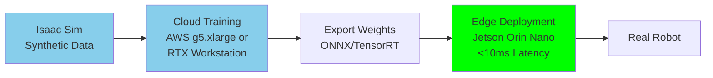

import LatencyWarning from '@site/src/components/LatencyWarning';

# Sim-to-Real Transfer

## The Proper Workflow

<LatencyWarning />

**Sim-to-real transfer** is the process of training AI models in simulation and deploying them to physical robots. The **only safe approach** is:

<LatencyWarning />

1. **Train** in cloud (AWS g5.xlarge, local RTX workstation)
2. **Export** weights (ONNX/TensorRT)
3. **Deploy** to edge device (Jetson Orin Nano)
4. **Never** control real robots from the cloud (50-200ms+ latency is unsafe)



**Why edge deployment?**
- **Latency**: &lt;10ms for real-time control (cloud: 50-200ms+)
- **Reliability**: No network dependency
- **Privacy**: Data stays on device
- **Cost**: No recurring cloud inference fees

---

## Reality Gap

**Reality gap** = difference between simulation and real world:
- **Physics**: Friction, inertia, motor lag
- **Sensors**: Camera noise, LiDAR reflections, calibration errors
- **Environment**: Lighting variations, textures, dynamic obstacles

### Bridging the Reality Gap

**Domain Randomization** (covered in synthetic data chapter):
- Randomize lighting, textures, object poses
- Add sensor noise in simulation
- Train on diverse scenarios

**Physics Tuning**:
- Match simulation friction to real wheels
- Calibrate motor response curves
- Add latency delays to match real hardware

---

## Training Pipeline

### Step 1: Generate Synthetic Data (Isaac Sim)

```python
import omni.replicator.core as rep

# Generate 10,000 images with domain randomization
def generate_training_data():
    camera, obstacles = setup_scene()

    # Domain randomization
    with rep.trigger.on_frame(num_frames=10000):
        randomize_scene(obstacles)

    rep.orchestrator.run()

generate_training_data()
```

**Output**: `synthetic_data/rgb/`, `synthetic_data/depth/`

---

### Step 2: Train Model (Cloud/Workstation)

```python
import torch
import torch.nn as nn
from torch.utils.data import DataLoader
from torchvision.models import resnet18

# Simple depth-based obstacle avoidance model
class ObstacleAvoidanceModel(nn.Module):
    def __init__(self):
        super().__init__()
        self.backbone = resnet18(pretrained=True)
        self.backbone.fc = nn.Linear(512, 3)  # [forward, left, right]

    def forward(self, depth):
        return self.backbone(depth)

# Training loop
model = ObstacleAvoidanceModel().cuda()
optimizer = torch.optim.Adam(model.parameters(), lr=0.001)
criterion = nn.CrossEntropyLoss()

dataset = SyntheticDataset('synthetic_data')
dataloader = DataLoader(dataset, batch_size=32, shuffle=True)

for epoch in range(10):
    for batch in dataloader:
        depth = batch['depth'].cuda()
        label = batch['action'].cuda()  # 0=forward, 1=left, 2=right

        output = model(depth)
        loss = criterion(output, label)

        optimizer.zero_grad()
        loss.backward()
        optimizer.step()

    print(f'Epoch {epoch}, Loss: {loss.item()}')

# Save trained model
torch.save(model.state_dict(), 'obstacle_avoidance.pth')
```

---

### Step 3: Export to ONNX

```python
import torch.onnx

# Load trained model
model = ObstacleAvoidanceModel()
model.load_state_dict(torch.load('obstacle_avoidance.pth'))
model.eval()

# Export to ONNX
dummy_input = torch.randn(1, 1, 224, 224)  # Batch x Channels x Height x Width
torch.onnx.export(
    model,
    dummy_input,
    'obstacle_avoidance.onnx',
    input_names=['depth'],
    output_names=['action'],
    dynamic_axes={'depth': {0: 'batch'}, 'action': {0: 'batch'}}
)

print('Model exported to obstacle_avoidance.onnx')
```

---

### Step 4: Convert to TensorRT (on Jetson)

```bash
# Transfer ONNX model to Jetson
scp obstacle_avoidance.onnx jetson@192.168.1.100:~/models/

# SSH to Jetson
ssh jetson@192.168.1.100

# Convert ONNX → TensorRT (INT8 quantization for speed)
/usr/src/tensorrt/bin/trtexec \
    --onnx=models/obstacle_avoidance.onnx \
    --saveEngine=models/obstacle_avoidance.trt \
    --int8 \
    --best
```

**Expected output**: `obstacle_avoidance.trt` (TensorRT engine)

---

### Step 5: Deploy to Jetson

```python
import tensorrt as trt
import pycuda.driver as cuda
import pycuda.autoinit
import numpy as np

class TensorRTInference:
    def __init__(self, engine_path):
        self.logger = trt.Logger(trt.Logger.WARNING)

        # Load TensorRT engine
        with open(engine_path, 'rb') as f:
            self.engine = trt.Runtime(self.logger).deserialize_cuda_engine(f.read())

        self.context = self.engine.create_execution_context()

        # Allocate buffers
        self.input_buffer = cuda.mem_alloc(1 * 1 * 224 * 224 * 4)  # float32
        self.output_buffer = cuda.mem_alloc(1 * 3 * 4)  # 3 classes

    def infer(self, depth_image):
        # Copy input to GPU
        cuda.memcpy_htod(self.input_buffer, depth_image.astype(np.float32))

        # Run inference
        self.context.execute_v2([int(self.input_buffer), int(self.output_buffer)])

        # Copy output from GPU
        output = np.empty(3, dtype=np.float32)
        cuda.memcpy_dtoh(output, self.output_buffer)

        return output

# ROS 2 node
class ObstacleAvoidanceNode(Node):
    def __init__(self):
        super().__init__('obstacle_avoidance')

        self.inference = TensorRTInference('obstacle_avoidance.trt')

        self.depth_sub = self.create_subscription(
            Image, '/camera/depth/image_raw', self.depth_callback, 10
        )

        self.cmd_vel_pub = self.create_publisher(Twist, '/cmd_vel', 10)

        self.bridge = CvBridge()

    def depth_callback(self, msg):
        # Convert ROS Image → NumPy
        depth = self.bridge.imgmsg_to_cv2(msg, '32FC1')

        # Preprocess (resize, normalize)
        depth_resized = cv2.resize(depth, (224, 224))
        depth_normalized = (depth_resized - depth_resized.mean()) / depth_resized.std()

        # Inference
        start_time = time.time()
        action_probs = self.inference.infer(depth_normalized)
        latency = (time.time() - start_time) * 1000  # ms

        self.get_logger().info(f'Inference latency: {latency:.2f}ms')

        # Convert to action
        action = np.argmax(action_probs)  # 0=forward, 1=left, 2=right

        twist = Twist()
        if action == 0:
            twist.linear.x = 0.5
        elif action == 1:
            twist.angular.z = 0.5  # Turn left
        elif action == 2:
            twist.angular.z = -0.5  # Turn right

        self.cmd_vel_pub.publish(twist)
```

---

## Performance Benchmarks

| Platform | Model | Precision | Latency | Power |
|----------|-------|-----------|---------|-------|
| **Jetson Orin Nano** | ResNet18 | FP32 | 45ms | 10W |
| **Jetson Orin Nano** | ResNet18 | INT8 | 8ms | 7W |
| **Cloud (A10G)** | ResNet18 | FP32 | 5ms + 50-200ms network | N/A |
| **Jetson AGX Orin** | ResNet50 | FP16 | 12ms | 25W |

**Target**: &lt;10ms for real-time control (100 Hz control loop)

---

## Testing Sim-to-Real Transfer

### Test in Gazebo (Not Isaac Sim!)

To validate sim-to-real gap:

1. Train model in Isaac Sim
2. Export TensorRT engine
3. **Test in Gazebo** (different physics engine)
4. Measure success rate (% episodes without collision)

**Why Gazebo?** Different physics/rendering = realistic test of generalization.

---

## Hands-On Lab: Depth-Based Obstacle Avoidance

**Goal**: Train in Isaac Sim, deploy to Jetson, test in Gazebo.

### Requirements

1. Generate 5,000+ depth images in Isaac Sim (obstacles at varying distances)
2. Label actions: forward (if clear), turn left/right (if obstacle)
3. Train ResNet18 model
4. Export ONNX → TensorRT
5. Deploy to Jetson
6. Test in Gazebo: >70% success rate (100 episodes)

### Deliverables

- Training script (`train.py`)
- ONNX model (`obstacle_avoidance.onnx`)
- TensorRT engine (`obstacle_avoidance.trt`)
- ROS 2 inference node (`obstacle_avoidance_node.py`)
- Test results (success rate, average latency)

---

## Key Takeaways

✅ **Train in cloud/workstation** (Isaac Sim, unlimited compute)
✅ **Export to ONNX/TensorRT** for edge deployment
✅ **Deploy to Jetson** for &lt;10ms latency
✅ **Never control real robots from cloud** (50-200ms+ latency unsafe)
✅ **Test in different simulator** (Gazebo) to validate generalization

---

## Next Steps

You've completed Module 3! Move to **[Module 4: Vision-Language-Action](/docs/vla)** to integrate LLMs with robots.

<div style={{textAlign: 'center', marginTop: '3rem', padding: '2rem', backgroundColor: 'var(--ifm-color-emphasis-100)', borderRadius: '8px'}}>
  <h2>🎉 Module 3 Complete!</h2>
  <p style={{fontSize: '1.1rem', marginTop: '1rem'}}>
    You've mastered Isaac Sim, VSLAM, Nav2, and sim-to-real transfer. Ready for VLA models?
  </p>
  <div style={{marginTop: '2rem'}}>
    <a
      className="button button--primary button--lg"
      href="/docs/vla"
    >
      Start Module 4: Vision-Language-Action →
    </a>
  </div>
</div>
