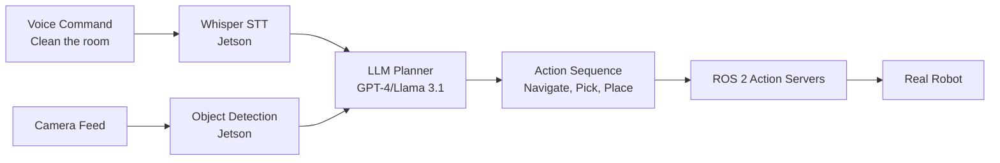

# Module 4: Vision-Language-Action (VLA)

## Introduction

**Vision-Language-Action (VLA) models** enable robots to understand natural language commands and execute complex tasks. By combining:
- **Vision**: Camera input (RGB, depth)
- **Language**: Natural language understanding (LLMs like GPT-4, Claude)
- **Action**: Robot motor commands (navigation, manipulation)

You can command a robot: **"Clean the room"** → Robot plans and executes: navigate, detect objects, pick, place, return.

---

## Module Overview

### What You'll Build

By the end of this module, you'll create an **autonomous humanoid system** that:
1. Listens to voice commands (Whisper speech-to-text)
2. Plans actions using LLM (GPT-4 or Llama 3.1)
3. Executes via ROS 2 action servers (navigation, manipulation)
4. Runs on edge (Jetson Orin Nano for &lt;10ms perception)

### Example Commands

- **"Go to the kitchen"** → Navigate to kitchen waypoint
- **"Bring me water"** → Navigate to kitchen, detect water bottle, pick, navigate to user, place
- **"Clean the room"** → Navigate to room, detect trash, pick, navigate to bin, place, repeat

---

## Learning Objectives

- **Week 10**: Speech-to-text with Whisper on Jetson
- **Week 11**: LLM-based planning (natural language → robot actions)
- **Week 12**: ROS 2 integration, safety protocols, error handling
- **Week 13**: Capstone project (end-to-end autonomous humanoid)

---

## Chapters

1. **[Whisper](/docs/vla/whisper)** - Speech-to-text on edge devices
2. **[LLM Planning](/docs/vla/llm-planning)** - Natural language → action sequences
3. **[ROS 2 Integration](/docs/vla/ros-integration)** - Connect LLMs to robot actions
4. **[Capstone Project](/docs/vla/capstone)** - Autonomous humanoid demo

---

## VLA Architecture

**Key components**:
- **Whisper**: Speech → text (runs on Jetson)
- **LLM**: Text → action plan (cloud API or local Llama)
- **Object Detection**: Vision model (YOLO, runs on Jetson)
- **Action Servers**: Nav2, MoveIt (execution)

---

## System Requirements

### For Whisper + YOLO (Edge Inference)

- **Jetson Orin Nano** ($249): 10 TOPS, 8GB RAM
- **ReSpeaker Mic Array** ($69): 4-mic array for far-field voice
- **RealSense D435i** ($349): RGB-D camera

### For LLM Planning

**Option 1: Cloud APIs** (GPT-4, Claude)
- Pro: Best quality, no local compute
- Con: Requires internet, 50-200ms latency (acceptable for planning, not real-time control)

**Option 2: Local Models** (Llama 3.1 8B)
- Pro: No latency, offline, privacy
- Con: Requires 16GB+ VRAM (RTX 4070+)

---

## Time Commitment

| Week | Reading | Hands-On Lab | Total |
|------|---------|--------------|-------|
| Week 10 | 2 hours | 3 hours | 5 hours |
| Week 11 | 2 hours | 4 hours | 6 hours |
| Week 12 | 2 hours | 4 hours | 6 hours |
| Week 13 | 1 hour | 8 hours | 9 hours |
| **Total** | **7 hours** | **19 hours** | **26 hours** |

---

## Assessment Preview

**Assessment 4 (Week 13)**: VLA Capstone Project

Build an end-to-end autonomous humanoid with:
- Voice commands (Whisper)
- LLM planning (GPT-4 or Llama 3.1)
- ROS 2 action servers (navigation, manipulation)
- Edge inference (Jetson)
- Safety protocols (timeout, collision avoidance)

**Supported commands** (minimum 3):
1. "Navigate to the kitchen"
2. "Pick up the red cup"
3. "Return to the charging station"

**Grading**: System integration (40%), Functionality (30%), Safety (15%), Documentation (15%)

---

## Next Steps

Ready to start? Begin with **[Chapter 1: Whisper](/docs/vla/whisper)** to implement speech-to-text on Jetson.

---

  <h2>🚀 Build Your Autonomous Humanoid</h2>
  

    Integrate speech, vision, and language models for natural robot interaction.
  

  

    <a
      className="button button--primary button--lg"
      href="/docs/vla/whisper"
    >
      Start Chapter 1: Whisper →
    </a>
  

