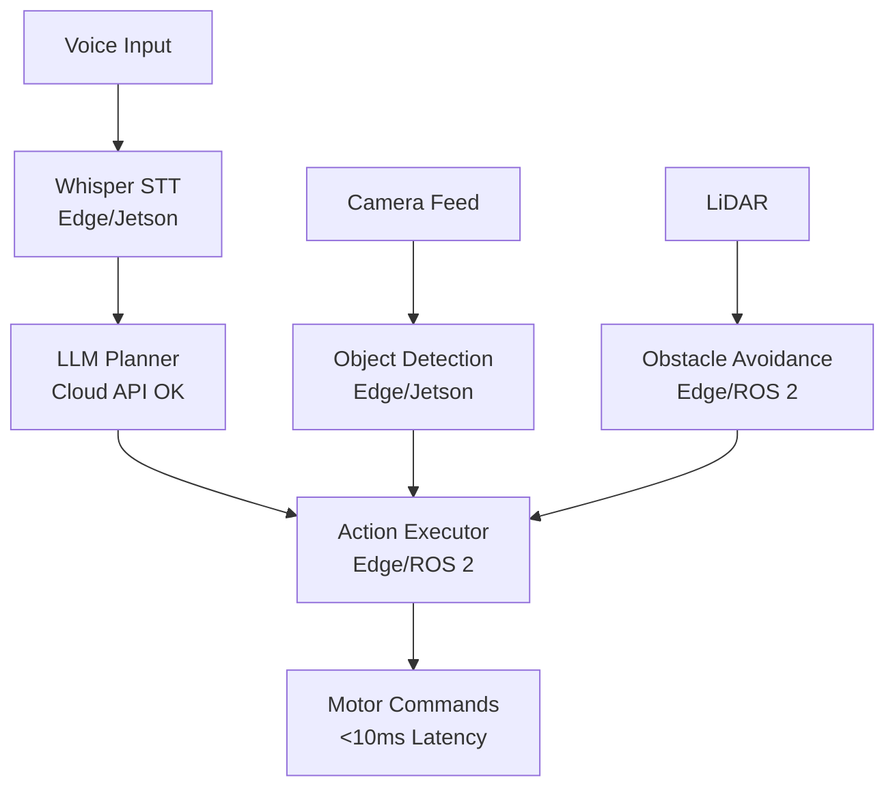

import LatencyWarning from '@site/src/components/LatencyWarning';

# ROS 2 Integration & Safety

## Architecture Overview

<LatencyWarning />

When integrating LLMs with robots, **always distinguish** between:
- **High-level planning** (LLM, cloud API acceptable: 50-200ms)
- **Low-level control** (perception, motor commands, edge only: &lt;10ms)

<LatencyWarning />

**Safe architecture**:



**Key principles**:
- **Cloud LLMs OK for planning** (infrequent, high-level decisions)
- **Edge inference REQUIRED for perception and control** (real-time, safety-critical)

---

## Action Executor Node

Connects LLM plans to ROS 2 action servers:

```python
import rclpy
from rclpy.node import Node
from rclpy.action import ActionClient
from my_robot_interfaces.msg import ActionSequence, Action
from nav2_msgs.action import NavigateToPose
from manipulation_msgs.action import PickPlace
import json

class ActionExecutor(Node):
    def __init__(self):
        super().__init__('action_executor')

        # Subscribe to action plans from LLM
        self.plan_sub = self.create_subscription(
            ActionSequence,
            '/action_plan',
            self.plan_callback,
            10
        )

        # Action clients
        self.nav_client = ActionClient(self, NavigateToPose, 'navigate_to_pose')
        self.pick_client = ActionClient(self, PickPlace, 'pick_place')

        # State
        self.current_plan = []
        self.current_action_index = 0

        self.get_logger().info('Action executor ready')

    def plan_callback(self, msg):
        """Receive new action plan"""
        self.current_plan = msg.actions
        self.current_action_index = 0

        self.get_logger().info(f'Received plan with {len(self.current_plan)} actions')

        # Start executing
        self.execute_next_action()

    def execute_next_action(self):
        """Execute next action in sequence"""
        if self.current_action_index >= len(self.current_plan):
            self.get_logger().info('Plan completed!')
            return

        action = self.current_plan[self.current_action_index]
        params = json.loads(action.parameters)

        self.get_logger().info(f'Executing action {self.current_action_index + 1}/{len(self.current_plan)}: {params["action"]}')

        if params["action"] == "navigate":
            self.execute_navigate(params)
        elif params["action"] == "pick":
            self.execute_pick(params)
        elif params["action"] == "place":
            self.execute_place(params)
        else:
            self.get_logger().error(f'Unknown action: {params["action"]}')
            self.current_action_index += 1
            self.execute_next_action()

    def execute_navigate(self, params):
        """Execute navigation action"""
        target = params["target"]

        # Map location names → coordinates
        waypoints = {
            "kitchen": (5.0, 3.0, 0.0),
            "bedroom": (8.0, 8.0, 1.57),
            "living_room": (2.0, 2.0, 0.0),
            "charging_station": (0.0, 0.0, 0.0),
            "trash_bin": (10.0, 10.0, 3.14)
        }

        if target not in waypoints:
            self.get_logger().error(f'Unknown location: {target}')
            self.on_action_complete(success=False)
            return

        x, y, theta = waypoints[target]

        # Send navigation goal
        goal_msg = NavigateToPose.Goal()
        goal_msg.pose.header.frame_id = 'map'
        goal_msg.pose.pose.position.x = x
        goal_msg.pose.pose.position.y = y
        goal_msg.pose.pose.orientation.z = math.sin(theta / 2)
        goal_msg.pose.pose.orientation.w = math.cos(theta / 2)

        self.nav_client.wait_for_server()
        send_goal_future = self.nav_client.send_goal_async(goal_msg)
        send_goal_future.add_done_callback(self.nav_response_callback)

    def nav_response_callback(self, future):
        goal_handle = future.result()

        if not goal_handle.accepted:
            self.get_logger().error('Navigation goal rejected')
            self.on_action_complete(success=False)
            return

        get_result_future = goal_handle.get_result_async()
        get_result_future.add_done_callback(self.nav_result_callback)

    def nav_result_callback(self, future):
        result = future.result().status

        if result == 4:  # SUCCEEDED
            self.get_logger().info('Navigation succeeded')
            self.on_action_complete(success=True)
        else:
            self.get_logger().error(f'Navigation failed with status {result}')
            self.on_action_complete(success=False)

    def execute_pick(self, params):
        """Execute pick action"""
        object_id = params["object_id"]

        goal_msg = PickPlace.Goal()
        goal_msg.object_id = object_id
        goal_msg.action_type = "pick"

        self.pick_client.wait_for_server()
        send_goal_future = self.pick_client.send_goal_async(goal_msg)
        send_goal_future.add_done_callback(self.pick_response_callback)

    def pick_response_callback(self, future):
        goal_handle = future.result()

        if not goal_handle.accepted:
            self.on_action_complete(success=False)
            return

        get_result_future = goal_handle.get_result_async()
        get_result_future.add_done_callback(self.pick_result_callback)

    def pick_result_callback(self, future):
        result = future.result().result

        if result.success:
            self.on_action_complete(success=True)
        else:
            self.on_action_complete(success=False)

    def on_action_complete(self, success):
        """Called when action finishes"""
        if success:
            self.current_action_index += 1
            self.execute_next_action()
        else:
            self.get_logger().error('Action failed, aborting plan')
            # TODO: Trigger replanning

def main():
    rclpy.init()
    node = ActionExecutor()
    rclpy.spin(node)
    node.destroy_node()
    rclpy.shutdown()
```

---

## Safety Protocols

### 1. Timeout Handling

```python
class TimeoutHandler:
    def __init__(self, node, timeout_sec=60.0):
        self.node = node
        self.timeout_sec = timeout_sec
        self.timer = None

    def start_action(self, action_name):
        """Start timeout timer for action"""
        self.node.get_logger().info(f'Starting action: {action_name} (timeout: {self.timeout_sec}s)')

        self.timer = self.node.create_timer(self.timeout_sec, self.on_timeout)

    def cancel(self):
        """Cancel timeout timer"""
        if self.timer:
            self.timer.cancel()

    def on_timeout(self):
        """Called if action exceeds timeout"""
        self.node.get_logger().error('Action timed out!')
        # Send emergency stop
        stop_msg = Twist()
        self.node.cmd_vel_pub.publish(stop_msg)
        # Abort current action
        # ...
```

### 2. Collision Avoidance

```python
class SafetyMonitor(Node):
    def __init__(self):
        super().__init__('safety_monitor')

        # Subscribe to LiDAR
        self.scan_sub = self.create_subscription(
            LaserScan,
            '/scan',
            self.scan_callback,
            10
        )

        # Emergency stop publisher
        self.cmd_vel_pub = self.create_publisher(Twist, '/cmd_vel', 10)

        self.emergency_stop_distance = 0.3  # meters

    def scan_callback(self, msg):
        """Monitor for obstacles"""
        min_distance = min(msg.ranges)

        if min_distance < self.emergency_stop_distance:
            self.get_logger().error(f'Emergency stop! Obstacle at {min_distance:.2f}m')

            # Send stop command
            stop_msg = Twist()
            self.cmd_vel_pub.publish(stop_msg)

            # TODO: Trigger replanning
```

### 3. Graceful Degradation

```python
def execute_with_fallback(action):
    """Execute action with fallback behaviors"""

    # Try primary method
    success = execute_action(action)

    if not success:
        # Try fallback 1: Retry with different parameters
        self.get_logger().warn('Primary method failed, trying fallback...')
        success = execute_action_fallback(action)

    if not success:
        # Try fallback 2: Simpler behavior
        self.get_logger().warn('Fallback failed, using simple behavior...')
        success = execute_simple_action(action)

    if not success:
        # Give up, ask for help
        self.get_logger().error('All methods failed, requesting human assistance')
        request_human_help(action)

    return success
```

---

## Error Recovery

### Replanning on Failure

```python
class RobustExecutor(Node):
    def on_action_failure(self, failed_action):
        """Replan when action fails"""

        # Get current state
        current_location = self.get_current_location()
        remaining_goal = self.infer_remaining_goal()

        # Ask LLM to replan
        new_plan = self.llm_planner.plan_task(
            f"From {current_location}, complete goal: {remaining_goal}"
        )

        self.get_logger().info('Replanned after failure')
        self.execute_plan(new_plan)
```

---

## Hands-On Lab: Safe Voice-Controlled Robot

**Goal**: Implement safety-critical voice control.

### Requirements

1. Voice command → LLM plan → Action execution
2. Timeout handling (abort if action >30s)
3. Emergency stop if obstacle &lt;0.5m
4. Replanning on navigation failure
5. Graceful degradation (retry 3 times before giving up)

### Test Cases

- **Happy path**: "Go to kitchen" → Navigates successfully
- **Timeout**: Command takes >30s → Emergency stop + replan
- **Obstacle**: Obstacle appears → Emergency stop + replan around
- **Failure**: Navigation fails 3 times → Request human help

---

## Key Takeaways

✅ **Cloud LLMs OK for planning** (infrequent, high-level)
✅ **Edge inference REQUIRED for control** (&lt;10ms latency)
✅ **Always implement timeouts** (abort stuck actions)
✅ **Monitor for obstacles** (emergency stop)
✅ **Replan on failures** (graceful degradation)

---

## Next Steps

Complete the capstone project in **[Chapter 4: Capstone](/docs/vla/capstone)**.

<div style={{textAlign: 'center', marginTop: '3rem', padding: '2rem', backgroundColor: 'var(--ifm-color-emphasis-100)', borderRadius: '8px'}}>
  <h2>📚 Continue Learning</h2>
  <div style={{marginTop: '2rem'}}>
    <a className="button button--primary button--lg" href="/docs/vla/capstone">
      Next: Capstone Project →
    </a>
  </div>
</div>
