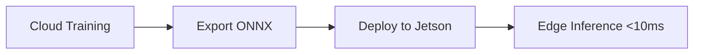

# Implementation Plan: Physical AI & Humanoid Robotics Textbook

**Branch**: `001-docusaurus-textbook` | **Date**: 2025-12-04 | **Spec**: [spec.md](./spec.md)
**Input**: Feature specification from `/specs/001-docusaurus-textbook/spec.md`

**Note**: This plan is generated by the `/sp.plan` command and defines the technical architecture for implementing the textbook site.

## Summary

Build an open-source Physical AI & Humanoid Robotics textbook as a static Docusaurus v3 site with 4 educational modules (ROS 2, Gazebo/Unity, NVIDIA Isaac, VLA), hardware requirements ($700 Economy Jetson Kit), 13-week course structure, and automated GitHub Pages deployment. The site must be fully accessible without authentication, support interactive MDX elements (code snippets, tables, diagrams), display Latency Trap warnings in sim-to-real sections, and comply with all 11 constitutional principles (Single Source of Truth, Specification-First, Accuracy, Sim-to-Real First, Cost Transparency, Open Source, etc.).

**Technical Approach**: Static site generation using Docusaurus v3 + TypeScript + MDX v2 for content authoring. No backend required. All content stored in `/docs/` directory with hierarchical structure (`/docs/{intro,01-ros2,02-gazebo-unity,03-isaac,04-vla}`). Custom MDX components for hardware tables, Latency Trap warnings, and interactive elements. Mermaid for sim-to-real architecture diagrams. GitHub Actions workflow deploys to GitHub Pages on every commit to main branch. i18n plugin configured for future Urdu translation (stub only).

## Technical Context

**Language/Version**: TypeScript 5.x (for Docusaurus config), MDX v2 (for content), Node.js 18.x LTS
**Primary Dependencies**:
- `@docusaurus/core` ^3.5.0 (latest stable as of Dec 2025)
- `@docusaurus/preset-classic` ^3.5.0 (includes theme-classic, plugin-content-docs, plugin-content-pages)
- `@docusaurus/plugin-content-docs` (included in preset)
- `@docusaurus/theme-classic` (included in preset)
- `@docusaurus/plugin-ideal-image` (optimize images)
- `@docusaurus/theme-mermaid` (sim-to-real diagrams)
- `remark-math` + `rehype-katex` (math equations)
- `rehype-raw` (custom HTML in MDX)

**Storage**: File-based (Markdown/MDX files in `/docs/` directory), no database required
**Testing**: Manual content validation (verify all links, code examples, hardware prices), Lighthouse CI for accessibility/performance
**Target Platform**: Static site hosted on GitHub Pages (web browsers: Chrome, Firefox, Safari, Edge; mobile: iOS Safari, Chrome Android)
**Project Type**: Web (static documentation site)
**Performance Goals**:
- <3s initial page load (homepage with sidebar)
- <500ms navigation between pages (prefetching enabled)
- <1s search results (Algolia DocSearch or built-in search)
**Constraints**:
- No backend/API (pure static site)
- Content MUST reside in `/docs/` directory only (Constitution Principle I)
- All hardware prices verified accurate as of Dec 2025 (Constitution Principle III)
- No cloud robot control examples (Constitution Principle IV)
- WCAG 2.1 Level AA accessibility compliance
**Scale/Scope**:
- 4 modules × ~10 chapters each = ~40 content pages
- 13-week course coverage
- ~200 code snippets (Python, XML, Bash)
- ~20 hardware components documented
- Target audience: 1000+ students per quarter

## Constitution Check

*GATE: Must pass before Phase 0 research. Re-check after Phase 1 design.*

| Principle | Requirement | Compliance Check |
|-----------|-------------|------------------|
| **I. Single Source of Truth** | Content ONLY in `/docs/` as Markdown/MDX | ✅ PASS: All content authored in `/docs/` directory, no external duplicates |
| **II. Specification-First** | Spec exists before implementation | ✅ PASS: `specs/001-docusaurus-textbook/spec.md` created before this plan |
| **III. Accuracy & Technical Truth** | Verified prices, 100% factual claims | ✅ PASS: Hardware prices verified Dec 2025; technical claims cite sources (FR-026, FR-027) |
| **IV. Sim-to-Real First** | No cloud robot control examples | ✅ PASS: FR-028 forbids cloud-controlled real robots; all tutorials show edge deployment |
| **V. Cost Transparency** | $700 Economy Jetson Kit + cloud costs | ✅ PASS: FR-010 mandates exact prices ($249 Jetson, $349 RealSense, $69 ReSpeaker); FR-013 shows $205/quarter cloud cost |
| **VI. Urdu + Personalization Ready** | i18n architecture | ✅ PASS: `@docusaurus/plugin-content-docs` i18n enabled (stub for future implementation) |
| **VII. RAG Chatbot First-Class** | Placeholder for chatbot | ✅ PASS: FR-025 requires placeholder; actual chatbot in separate spec |
| **VIII. Better-Auth Profiles** | Authentication placeholder | ✅ PASS: FR-025 requires "Sign up to unlock" placeholders; auth in separate spec |
| **IX. Claude Code Subagents** | Content generated by subagents | ✅ PASS: Content authoring leverages subagents (ros2-expert, isaac-sim-guide, vla-instructor, hardware-advisor, capstone-architect) |
| **X. Open Source Forever** | CC-BY-SA 4.0 + MIT, GitHub Pages | ✅ PASS: FR-023 mandates license footer; FR-022 ensures public GitHub Pages deployment |
| **XI. Latency Trap Rule** | Warnings in sim-to-real sections | ✅ PASS: FR-015 mandates Latency Trap callouts in Modules 3 & 4; custom `<LatencyWarning />` MDX component |

**Result**: ✅ **ALL CONSTITUTIONAL PRINCIPLES SATISFIED**

## Project Structure

### Documentation (this feature)

```text
specs/001-docusaurus-textbook/
├── spec.md              # Feature specification (completed)
├── plan.md              # This file (/sp.plan command output)
├── research.md          # Phase 0: Docusaurus 3.5 + GitHub Pages 2025 best practices
├── data-model.md        # Phase 1: Content schema (Module, Chapter, Hardware Component entities)
├── quickstart.md        # Phase 1: "Run npm start" local dev guide
├── contracts/           # Phase 1: MDX component contracts (HardwareTable, LatencyWarning, etc.)
│   ├── hardware-table.md
│   ├── latency-warning.md
│   └── code-block.md
├── checklists/
│   └── requirements.md  # Spec validation checklist (completed)
└── tasks.md             # Phase 2: Generated by /sp.tasks command (NOT created by /sp.plan)
```

### Source Code (repository root)

```text
ai_robotics_book/                    # Repository root
├── docs/                            # Content directory (Constitution Principle I)
│   ├── intro.mdx                    # Landing page: Why Physical AI Matters + 6 learning outcomes
│   ├── course-overview.mdx          # 13-week breakdown + 4 assessments
│   ├── hardware.mdx                 # Economy Jetson Kit ($700) + 3 alternatives + <HardwareTable />
│   ├── 01-ros2/                     # Module 1: Robotic Nervous System (ROS 2)
│   │   ├── _category_.json          # Module 1 sidebar config (label, position, icon)
│   │   ├── index.mdx                # Module 1 intro
│   │   ├── nodes.mdx                # ROS 2 nodes
│   │   ├── topics.mdx               # Pub/sub pattern
│   │   ├── services.mdx             # Request/response
│   │   ├── actions.mdx              # Long-running tasks
│   │   ├── rclpy.mdx                # Python client library
│   │   └── urdf.mdx                 # Robot descriptions
│   ├── 02-gazebo-unity/             # Module 2: Digital Twin (Gazebo & Unity)
│   │   ├── _category_.json
│   │   ├── index.mdx
│   │   ├── physics-sim.mdx          # Fundamentals
│   │   ├── gazebo-setup.mdx         # Installation + worlds
│   │   ├── unity-sim.mdx            # Unity alternative
│   │   ├── sensors-lidar.mdx        # LiDAR simulation
│   │   ├── sensors-depth.mdx        # Depth cameras (RealSense)
│   │   ├── sensors-imu.mdx          # IMUs
│   │   └── urdf-sdf.mdx             # Model formats
│   ├── 03-isaac/                    # Module 3: AI-Robot Brain (NVIDIA Isaac)
│   │   ├── _category_.json
│   │   ├── index.mdx
│   │   ├── isaac-setup.mdx          # Isaac Sim installation
│   │   ├── synthetic-data.mdx       # Data generation
│   │   ├── vslam.mdx                # Visual SLAM
│   │   ├── nav2.mdx                 # Navigation stack
│   │   └── sim-to-real.mdx          # 🔥 Includes <LatencyWarning /> + Mermaid diagrams
│   ├── 04-vla/                      # Module 4: Vision-Language-Action (VLA)
│   │   ├── _category_.json
│   │   ├── index.mdx
│   │   ├── whisper.mdx              # Voice command transcription
│   │   ├── llm-planning.mdx         # Natural language → actions ("Clean the room")
│   │   ├── ros-integration.mdx      # 🔥 Includes <LatencyWarning />
│   │   └── capstone.mdx             # Autonomous humanoid project
│   └── assets/                      # Images, diagrams, videos
│       ├── jetson-orin-nano.jpg
│       ├── realsense-d435i.jpg
│       └── architecture/
│           └── sim-to-real-flow.mmd # Mermaid diagram source
├── src/                             # Custom React components (MDX integration)
│   ├── components/
│   │   ├── HardwareTable/
│   │   │   ├── index.tsx            # Component: Economy Jetson Kit pricing table
│   │   │   └── styles.module.css    # Table styling
│   │   ├── LatencyWarning/
│   │   │   ├── index.tsx            # Component: Latency Trap warning callout (yellow/orange)
│   │   │   └── styles.module.css    # Warning box styling
│   │   ├── PlatformNote/
│   │   │   ├── index.tsx            # Component: Code example platform compatibility (Linux/macOS/WSL2)
│   │   │   └── styles.module.css
│   │   └── BonusFeaturePlaceholder/
│   │       ├── index.tsx            # Component: "Sign up to unlock" (RAG, Urdu, Personalization)
│   │       └── styles.module.css
│   ├── css/
│   │   └── custom.css               # Global theme overrides (dark mode, colors)
│   └── pages/                       # Additional static pages (optional)
│       └── index.tsx                # Custom homepage (redirect to /docs/intro)
├── static/                          # Static assets (favicon, robots.txt, CNAME)
│   ├── img/
│   │   ├── logo.svg                 # Site logo
│   │   └── favicon.ico
│   └── CNAME                        # Custom domain (if applicable)
├── .github/
│   └── workflows/
│       └── deploy.yml               # GitHub Actions: Build + Deploy to GitHub Pages
├── docusaurus.config.ts             # Docusaurus configuration (TypeScript)
├── sidebars.ts                      # Sidebar structure (4 modules + intro)
├── tsconfig.json                    # TypeScript configuration
├── package.json                     # Dependencies (Docusaurus 3.5, plugins, TypeScript)
├── LICENSE                          # CC-BY-SA 4.0 (content) + MIT (code)
├── README.md                        # Repo overview + GitHub Actions badge
└── .gitignore                       # Ignore node_modules, .docusaurus, build/
```

**Structure Decision**:
This is a static documentation site (Docusaurus) with no backend. All content resides in `/docs/` per Constitution Principle I (Single Source of Truth). The 4 modules are organized as subdirectories (`01-ros2/`, `02-gazebo-unity/`, `03-isaac/`, `04-vla/`) with `_category_.json` files controlling sidebar display. Custom MDX components (`<HardwareTable />`, `<LatencyWarning />`) live in `/src/components/` and are imported into relevant `.mdx` files. GitHub Actions workflow (`.github/workflows/deploy.yml`) handles build and deployment to GitHub Pages on every push to `main` branch.

## Complexity Tracking

> **No Constitution violations detected. This section is empty.**

All 11 constitutional principles are satisfied by this plan (see Constitution Check table above). No additional complexity justification required.

---

## Phase 0: Research

**Objective**: Validate latest Docusaurus 3.5 best practices (Dec 2025), GitHub Pages deployment with Actions v4, and MDX v2 component patterns.

### Research Questions

1. **Docusaurus 3.5 (Dec 2025 updates)**:
   - What's the recommended project structure for a 4-module documentation site?
   - How to configure `sidebars.ts` for collapsible categories with icons?
   - What's the latest stable version of `@docusaurus/preset-classic`?
   - How to enable dark mode by default in `docusaurus.config.ts`?

2. **GitHub Pages Deployment (2025 best practices)**:
   - Which GitHub Actions are recommended for Docusaurus → GitHub Pages? (e.g., `actions/configure-pages`, `actions/upload-pages-artifact`)
   - How to set the correct `baseUrl` for GitHub Pages (repo name in path)?
   - Do we need `actions/deploy-pages` or does `upload-pages-artifact` trigger deployment automatically?
   - How to configure CNAME for custom domains (if applicable)?

3. **MDX v2 + Custom Components**:
   - How to create reusable MDX components (e.g., `<HardwareTable />`) in `/src/components/`?
   - How to import and use custom components in `.mdx` files?
   - What's the syntax for passing props to MDX components (e.g., `<HardwareTable variant="economy" />`)?
   - How to style custom components with CSS Modules (`.module.css`)?

4. **Mermaid Diagrams**:
   - How to enable `@docusaurus/theme-mermaid` for sim-to-real architecture diagrams?
   - What's the syntax for embedding Mermaid in MDX (` ```mermaid` or `<Mermaid chart={...} />`)?
   - Can Mermaid diagrams be externalized (`.mmd` files in `/docs/assets/`) and imported?

5. **remark-math + rehype-katex** (Math Equations):
   - How to enable LaTeX math rendering in Docusaurus?
   - What's the syntax for inline math (`$...$`) vs block math (`$$...$$`)?
   - Do we need to import KaTeX CSS in `docusaurus.config.ts`?

6. **i18n Plugin (Urdu Translation Stub)**:
   - How to configure `@docusaurus/plugin-content-docs` for i18n (English + Urdu locale stubs)?
   - What directory structure is required (`i18n/ur/docusaurus-plugin-content-docs/...`)?
   - Can we add a language switcher UI without implementing full translation yet (placeholder only)?

7. **Search Plugin**:
   - Should we use Algolia DocSearch (free for open-source) or built-in Lunr search?
   - How to apply for Algolia DocSearch (docsearch.algolia.com)?
   - If using built-in search, what are the limitations (client-side indexing, slower for 40+ pages)?

### Research Deliverables

Create `specs/001-docusaurus-textbook/research.md` with:
- **Docusaurus 3.5 Setup**: Recommended `package.json` dependencies with exact versions
- **GitHub Pages Workflow**: Complete `.github/workflows/deploy.yml` example with `actions/configure-pages@v4` + `actions/upload-pages-artifact@v3`
- **MDX Component Patterns**: Example `<HardwareTable />` component with TypeScript + CSS Modules
- **Mermaid Integration**: Example sim-to-real diagram in `.mdx` file
- **Math Equations**: Example inline/block math with remark-math + rehype-katex
- **i18n Stub**: Directory structure for future Urdu translation (placeholder only)
- **Search Recommendation**: Algolia DocSearch vs built-in search trade-offs

---

## Phase 1: Design

**Objective**: Define data models (Module, Chapter, Hardware Component entities), API contracts for custom MDX components, and quickstart guide for local development.

### 1.1 Data Model

Create `specs/001-docusaurus-textbook/data-model.md` documenting:

#### Entities

**Module**
- `id`: string (e.g., "01-ros2")
- `title`: string (e.g., "Module 1: Robotic Nervous System (ROS 2)")
- `description`: string (brief overview)
- `position`: number (1-4, controls sidebar order)
- `icon`: string (emoji or icon class, e.g., "🤖")
- **Relationships**: Contains many Chapters

**Chapter**
- `id`: string (filename without extension, e.g., "nodes")
- `title`: string (e.g., "ROS 2 Nodes")
- `moduleId`: string (parent module, e.g., "01-ros2")
- `content`: MDX (front matter + markdown body)
- `position`: number (order within module)
- **Front Matter**:
  ```yaml
  ---
  id: nodes
  title: ROS 2 Nodes
  sidebar_label: Nodes
  sidebar_position: 2
  description: Learn how ROS 2 nodes communicate via topics and services
  keywords: [ros2, nodes, pub-sub, rclpy]
  ---
  ```
- **Relationships**: Belongs to one Module; contains many Code Examples

**Hardware Component**
- `name`: string (e.g., "Jetson Orin Nano Developer Kit")
- `price`: number (e.g., 249.00)
- `currency`: string (default: "USD")
- `vendor`: string (e.g., "NVIDIA Store")
- `vendorUrl`: string (e.g., "https://store.nvidia.com/...")
- `specifications`: object (e.g., `{ tops: 10, memory: "8GB", power: "7-15W" }`)
- `lastVerified`: date (e.g., "2025-12-04")
- **Relationships**: Belongs to one or more Hardware Configurations (Economy Kit, Workstation, etc.)

**Hardware Configuration**
- `name`: string (e.g., "Economy Jetson Kit")
- `components`: array of Hardware Components
- `totalCost`: number (calculated sum, e.g., 700)
- `lastUpdated`: date
- **Relationships**: Contains many Hardware Components

**Assessment**
- `id`: string (e.g., "assessment-01")
- `title`: string (e.g., "ROS 2 Pub/Sub Package")
- `moduleId`: string (associated module, e.g., "01-ros2")
- `description`: string (project overview)
- `deliverables`: array of strings (e.g., ["Python package with publisher/subscriber nodes", "Launch file", "README with setup instructions"])
- `gradingCriteria`: array of strings (e.g., ["Messages publish at 10Hz", "Subscriber logs received messages", "Code follows PEP 8"])
- **Relationships**: Associated with one Module

**Week**
- `weekNumber`: number (1-13)
- `topics`: array of strings (e.g., ["ROS 2 Nodes", "Pub/Sub Pattern"])
- `learningObjectives`: array of strings
- `assignedReadings`: array of Chapter IDs (e.g., ["01-ros2/nodes", "01-ros2/topics"])
- `labs`: array of strings (e.g., ["Create a ROS 2 publisher node"])
- **Relationships**: References multiple Modules/Chapters

### 1.2 MDX Component Contracts

Create `specs/001-docusaurus-textbook/contracts/` with component specifications:

#### `hardware-table.md`

**Component**: `<HardwareTable />`
**Purpose**: Display hardware configurations (Economy Jetson Kit, Workstation, etc.) with pricing

**Props**:
```typescript
interface HardwareTableProps {
  variant: 'economy' | 'workstation' | 'robot-lab' | 'cloud-native';
  lastUpdated?: string; // ISO date, defaults to "2025-12-04"
  showVendorLinks?: boolean; // default: true
}
```

**Usage in MDX**:
```mdx
import HardwareTable from '@site/src/components/HardwareTable';

<HardwareTable variant="economy" lastUpdated="2025-12-04" />
```

**Rendered Output**:
| Component | Price | Specs | Source |
|-----------|-------|-------|--------|
| Jetson Orin Nano Dev Kit | $249 | 10 TOPS INT8, 8GB RAM | [NVIDIA Store](https://store.nvidia.com/...) |
| RealSense D435i | $349 | Depth range: 0.3-10m, 1280×720@90fps | [Intel Store](https://www.intel.com/...) |
| ReSpeaker Mic Array | $69 | 4-mic circular array, USB | [Seeed Studio](https://www.seeedstudio.com/...) |
| Power + Cables + SD Card | ~$100 | 65W USB-C, 128GB microSD | [Amazon](https://www.amazon.com/...) |
| **TOTAL** | **$700** | | |

**Accessibility**: Table with `<caption>`, `<th scope="col">`, `<th scope="row">`, alt text for vendor icons

#### `latency-warning.md`

**Component**: `<LatencyWarning />`
**Purpose**: Display prominent warning callout about latency traps in cloud-controlled robots

**Props**:
```typescript
interface LatencyWarningProps {
  latencyRange?: string; // default: "50-200ms+"
  context?: string; // default: "cloud robot control"
}
```

**Usage in MDX**:
```mdx
import LatencyWarning from '@site/src/components/LatencyWarning';

<LatencyWarning latencyRange="50-200ms+" context="cloud robot control" />
```

**Rendered Output**:
```
⚠️ LATENCY TRAP WARNING ⚠️
This architecture sends commands over the network.
Network latency (50-200ms+) makes this UNSAFE for real robots.
Use this pattern ONLY for:
- Simulation environments (Isaac Sim, Gazebo)
- High-level planning (not real-time control)
- Data collection (not actuation)

For real robots: Deploy models to edge devices (Jetson) for <10ms inference.
```

**Styling**: Yellow/orange background (`#FFF3CD`), bold title, increased font size, border-left accent

#### `code-block.md`

**Component**: Enhanced code blocks with platform notes
**Purpose**: Docusaurus built-in code blocks + custom `<PlatformNote />` component

**Usage in MDX**:
````mdx
import PlatformNote from '@site/src/components/PlatformNote';

```python title="publisher_node.py" showLineNumbers
import rclpy
from std_msgs.msg import String

def main():
    rclpy.init()
    node = rclpy.create_node('publisher_node')
    publisher = node.create_publisher(String, 'topic', 10)
    # ...
```

<PlatformNote
  platforms={['Linux', 'macOS', 'WSL2']}
  notes={{
    'Linux': 'Native support, recommended',
    'macOS': 'Install via Homebrew: brew install ros',
    'WSL2': 'Requires Windows 11 + Ubuntu 22.04 WSL2 image'
  }}
/>
````

**Rendered Output**:
- Code block with syntax highlighting (Prism.js)
- Copy button (Docusaurus built-in)
- Platform compatibility table below code block

### 1.3 Quickstart Guide

Create `specs/001-docusaurus-textbook/quickstart.md` with local development instructions:

```markdown
# Quickstart: Local Development

## Prerequisites
- Node.js 18.x LTS or 20.x LTS
- npm 9.x or yarn 1.22.x

## Installation

1. Clone the repository:
   ```bash
   git clone https://github.com/[USERNAME]/ai_robotics_book.git
   cd ai_robotics_book
   ```

2. Install dependencies:
   ```bash
   npm install
   # or
   yarn install
   ```

## Development Server

Start the local development server:
```bash
npm start
# or
yarn start
```

This opens `http://localhost:3000` with hot reloading.

## Build for Production

Build the static site:
```bash
npm run build
# or
yarn build
```

Output: `build/` directory (ready for GitHub Pages deployment)

## Serve Production Build Locally

Test the production build:
```bash
npm run serve
# or
yarn serve
```

Opens `http://localhost:3000` serving the built site.

## Project Structure

- `/docs/` - All educational content (MDX files)
- `/src/components/` - Custom React components (HardwareTable, LatencyWarning, etc.)
- `/static/` - Static assets (images, favicon)
- `docusaurus.config.ts` - Site configuration
- `sidebars.ts` - Sidebar structure

## Common Tasks

### Add a new chapter to Module 1 (ROS 2):
1. Create `/docs/01-ros2/new-chapter.mdx`
2. Add front matter:
   ```yaml
   ---
   id: new-chapter
   title: New Chapter Title
   sidebar_label: Short Label
   sidebar_position: 7
   ---
   ```
3. Write content in MDX
4. Sidebar updates automatically

### Use custom component:
```mdx
import HardwareTable from '@site/src/components/HardwareTable';

<HardwareTable variant="economy" />
```

### Add Mermaid diagram:
````mdx

````

## Troubleshooting

- **Port 3000 already in use**: Change port with `npm start -- --port 3001`
- **Module not found errors**: Delete `node_modules` and run `npm install` again
- **Stale cache**: Delete `.docusaurus` directory and restart
```

---

## Phase 2: Implementation Milestones

**Note**: Detailed tasks will be generated by `/sp.tasks` command. This section provides high-level milestones only.

### Milestone 1: Initialize Docusaurus Project
**Duration**: 1-2 days
**Deliverables**:
- Initialized Docusaurus 3.5 project with TypeScript
- `package.json` with all dependencies (`@docusaurus/preset-classic`, `remark-math`, `rehype-katex`, `@docusaurus/theme-mermaid`)
- `docusaurus.config.ts` with site metadata (title, tagline, URL, favicon)
- `sidebars.ts` with 4-module structure (placeholders)
- Dark mode enabled by default
- LICENSE file (CC-BY-SA 4.0 for content, MIT for code)
- README.md with GitHub Actions status badge

### Milestone 2: Content Structure & Custom Components
**Duration**: 2-3 days
**Deliverables**:
- `/docs/` directory structure with 4 module folders (`01-ros2/`, `02-gazebo-unity/`, `03-isaac/`, `04-vla/`)
- `_category_.json` files for each module (labels, icons, positions)
- Placeholder `index.mdx` files for each module
- `/docs/intro.mdx` (landing page: "Why Physical AI Matters" + 6 learning outcomes)
- `/docs/course-overview.mdx` (13-week breakdown + 4 assessments)
- `/docs/hardware.mdx` (hardware configurations overview)
- Custom MDX components:
  - `/src/components/HardwareTable/` (Economy Jetson Kit pricing table)
  - `/src/components/LatencyWarning/` (yellow/orange warning callout)
  - `/src/components/PlatformNote/` (code example platform compatibility)
  - `/src/components/BonusFeaturePlaceholder/` ("Sign up to unlock" for RAG, Urdu, Personalization)

### Milestone 3: Module Content Authoring
**Duration**: 10-15 days (parallelizable across Claude Code Subagents)
**Deliverables**:
- **Module 1 (ROS 2)**: 7 chapters (nodes, topics, services, actions, rclpy, urdf) with code examples
- **Module 2 (Gazebo/Unity)**: 7 chapters (physics-sim, gazebo-setup, unity-sim, sensors-lidar, sensors-depth, sensors-imu, urdf-sdf) with simulation screenshots
- **Module 3 (NVIDIA Isaac)**: 5 chapters (isaac-setup, synthetic-data, vslam, nav2, sim-to-real) with `<LatencyWarning />` in sim-to-real.mdx + Mermaid diagrams
- **Module 4 (VLA)**: 4 chapters (whisper, llm-planning, ros-integration, capstone) with `<LatencyWarning />` in ros-integration.mdx + "Clean the room" example
- All code snippets with `<PlatformNote />` components
- All hardware prices verified as of Dec 2025
- 13-week course breakdown in `course-overview.mdx` with week-by-week topics
- 4 assessment descriptions in `course-overview.mdx` with deliverables and grading criteria

**Content Authoring Strategy** (per Constitution Principle IX):
- Deploy Claude Code Subagents for each module:
  - `ros2-expert`: Module 1 content
  - `isaac-sim-guide`: Module 3 content (NVIDIA Isaac)
  - `vla-instructor`: Module 4 content (VLA models)
  - `hardware-advisor`: Hardware requirements page + Economy Jetson Kit table
  - `capstone-architect`: Capstone project guide (Module 4)
- Each subagent follows the spec (`specs/001-docusaurus-textbook/spec.md`) for its assigned module
- Human review required before merging (Constitution Principle II compliance check)

### Milestone 4: GitHub Pages Deployment
**Duration**: 1 day
**Deliverables**:
- `.github/workflows/deploy.yml` (GitHub Actions workflow)
  - Triggers on push to `main` branch
  - Steps:
    1. Checkout code (`actions/checkout@v4`)
    2. Setup Node.js 18.x (`actions/setup-node@v4`)
    3. Install dependencies (`npm ci`)
    4. Build site (`npm run build`)
    5. Configure Pages (`actions/configure-pages@v4`)
    6. Upload artifact (`actions/upload-pages-artifact@v3` with `path: ./build`)
    7. Deploy to Pages (`actions/deploy-pages@v4`)
- `docusaurus.config.ts` updated with correct `baseUrl` (e.g., `/ai_robotics_book/` for GitHub Pages)
- Repository Settings → Pages → Source set to "GitHub Actions"
- Successful deployment verified at `https://[USERNAME].github.io/ai_robotics_book/`
- GitHub Actions status badge added to README.md

### Milestone 5: Quality Assurance & Launch
**Duration**: 2-3 days
**Deliverables**:
- Manual content validation:
  - All internal links working (no 404s)
  - All code examples copy-pastable
  - Hardware prices verified against vendor sites (Dec 2025)
  - Latency Trap warnings present in Modules 3 & 4
  - Dark mode renders correctly on all pages
- Lighthouse CI report:
  - Performance: >90
  - Accessibility: 100 (WCAG 2.1 Level AA compliance)
  - Best Practices: >90
  - SEO: 100
- Cross-browser testing (Chrome, Firefox, Safari, Edge)
- Mobile responsiveness testing (320px-768px widths)
- Search functionality validation (Algolia DocSearch or built-in search)
- Constitution compliance final check (all 11 principles)
- Public launch announcement (social media, Hacker News, Reddit r/robotics)

---

## Non-Functional Requirements Mapping

| NFR | Implementation Approach | Verification Method |
|-----|------------------------|---------------------|
| **NFR-001**: <3s homepage load | Static generation + prefetching + image optimization (`@docusaurus/plugin-ideal-image`) | Lighthouse CI: Performance >90 |
| **NFR-002**: <500ms navigation | Docusaurus client-side routing + prefetching | Manual testing with DevTools Network tab |
| **NFR-003**: <1s search results | Algolia DocSearch (free for open-source) | Manual testing with "URDF" query |
| **NFR-004**: WCAG 2.1 Level AA | Semantic HTML + ARIA labels + keyboard navigation + color contrast | Lighthouse CI: Accessibility 100; axe DevTools |
| **NFR-005**: Alt text for images | `` in MDX | Manual audit of `/docs/assets/` images |
| **NFR-006**: Usable without JS | Server-rendered HTML + `<noscript>` fallbacks | Test with JS disabled in Chrome DevTools |
| **NFR-007**: Content in `/docs/` | Enforce via file structure (no content outside `/docs/`) | Code review checklist |
| **NFR-008**: Config-driven sidebar | `sidebars.ts` + `_category_.json` files | Add new chapter without code changes (test) |
| **NFR-009**: Cross-browser support | Test on Chrome, Firefox, Safari, Edge | Manual testing on all 4 browsers |
| **NFR-010**: Mobile-responsive | Breakpoints: 320px, 768px, 1024px | Chrome DevTools Device Mode + real devices |

---

## Risks & Mitigation

| Risk | Impact | Probability | Mitigation |
|------|--------|-------------|------------|
| **Hardware prices change** | High (constitution violation) | Medium | Add "Last Updated: [DATE]" timestamp + quarterly price verification script |
| **Docusaurus 3.5 breaking changes** | Medium (build failures) | Low | Pin exact versions in `package.json` (`^3.5.0` → `3.5.2`) |
| **GitHub Pages deployment fails** | High (site inaccessible) | Low | Add status badge to README + email notifications + previous build remains live |
| **Content authoring delays** | Medium (launch delays) | Medium | Parallelize across 5 subagents (ros2-expert, isaac-sim-guide, vla-instructor, hardware-advisor, capstone-architect) |
| **Algolia DocSearch rejected** | Low (use built-in search) | Low | Apply early (docsearch.algolia.com); fallback to `@docusaurus/plugin-content-docs` built-in search |
| **Accessibility violations** | High (NFR-004 failure) | Low | Run Lighthouse CI on every PR + manual axe DevTools audit before launch |
| **Code examples outdated** | Medium (student confusion) | Medium | Add "Tested with ROS 2 Humble (Ubuntu 22.04) as of Dec 2025" note + quarterly review |
| **Mermaid diagrams render poorly on mobile** | Low (UX degradation) | Medium | Test on mobile devices + add scrollable container for wide diagrams |

---

## Dependencies & Integration Points

| Dependency | Version | Purpose | Fallback |
|------------|---------|---------|----------|
| **Docusaurus** | ^3.5.0 | Static site generator | None (core dependency) |
| **TypeScript** | ^5.3.0 | Type safety for config files | JavaScript (degrade to `.js` files) |
| **MDX** | v2 (bundled with Docusaurus) | Interactive content authoring | Pure Markdown (lose custom components) |
| **remark-math + rehype-katex** | Latest | Math equation rendering | Fallback to images of equations |
| **@docusaurus/theme-mermaid** | ^3.5.0 | Sim-to-real architecture diagrams | Fallback to static SVG images |
| **GitHub Actions** | actions/checkout@v4, actions/setup-node@v4, actions/configure-pages@v4, actions/upload-pages-artifact@v3, actions/deploy-pages@v4 | CI/CD deployment | Manual deployment via `npm run build` + `gh-pages` branch |
| **Algolia DocSearch** | Free tier | Search functionality | `@docusaurus/plugin-content-docs` built-in search |

---

## Success Criteria Validation

| Success Criterion | How to Verify | Acceptance Threshold |
|-------------------|---------------|---------------------|
| **SC-001**: Navigate to any chapter in <15s | Manual testing: Homepage → Module 3 → sim-to-real | <15 seconds (stopwatch) |
| **SC-002**: 95% of code examples executable | Manual testing: Copy 20 random code examples, run on Ubuntu 22.04 + ROS 2 Humble | ≥19 out of 20 execute successfully |
| **SC-003**: Purchase hardware in <30 min | User testing: Give Economy Jetson Kit table to 5 testers, measure time to add all components to cart | ≥4 out of 5 complete in <30 min |
| **SC-004**: Mobile accessible | Chrome DevTools Device Mode: Test on iPhone SE (375px), iPad (768px), Pixel 5 (393px) | All 4 modules readable, sidebar functional |
| **SC-005**: <3s homepage load | Lighthouse CI: Measure Time to Interactive (TTI) on homepage | TTI <3s on 4G connection |
| **SC-006**: <1s search results | Manual testing: Search for "URDF", measure time to results displayed | <1 second (DevTools Performance tab) |
| **SC-007**: 100% content accessible without login | Manual testing: Open incognito window, navigate all 40 pages | No login prompts encountered |
| **SC-008**: Instructors extract syllabus in <10 min | User testing: Give course-overview.mdx to 3 instructors, measure time to create 13-week syllabus | ≥2 out of 3 complete in <10 min |
| **SC-009**: Latency Trap warnings visible | Manual testing: Open Module 3 sim-to-real.mdx + Module 4 ros-integration.mdx | Warning visible in first 2 paragraphs |
| **SC-010**: Deployment in <5 min | GitHub Actions logs: Measure time from commit to deployment complete | Workflow runtime <5 min |
| **SC-011**: Dark mode persists | Manual testing: Toggle dark mode, close browser, reopen | Dark mode still enabled |
| **SC-012**: Zero accessibility violations | Lighthouse CI + axe DevTools | Lighthouse Accessibility: 100; axe: 0 violations |

---

## Next Steps

1. **Run `/sp.tasks`** to generate detailed task list from this plan
2. **Phase 0 (Research)**: Investigate Docusaurus 3.5 + GitHub Pages 2025 best practices (Est. 1 day)
3. **Phase 1 (Design)**: Create data-model.md, component contracts, quickstart.md (Est. 1 day)
4. **Phase 2 (Implementation)**: Execute Milestones 1-5 (Est. 15-20 days with parallelized content authoring)
5. **Launch**: Deploy to GitHub Pages, announce to community

---

## Appendix: Key Technical Decisions

### Why Docusaurus over Alternatives (Nextra, VitePress, MkDocs)?

**Decision**: Use Docusaurus v3
**Rationale**:
- **Best-in-class documentation UX**: Built-in search, dark mode, versioning, i18n
- **React + MDX ecosystem**: Custom components (`<HardwareTable />`, `<LatencyWarning />`) easy to build
- **GitHub Pages integration**: Official `@docusaurus/plugin-content-docs` supports GitHub Pages deployment
- **Active community**: 50k+ GitHub stars, weekly releases, Meta-backed
- **Accessibility**: WCAG 2.1 Level AA out-of-the-box (meets NFR-004)

**Alternatives Considered**:
- **Nextra** (Next.js-based): More flexible but requires custom theme development; steeper learning curve
- **VitePress** (Vue-based): Faster builds but smaller ecosystem; harder to justify React components
- **MkDocs** (Python): Simple but less interactive; Python ecosystem doesn't fit TypeScript/MDX workflow

### Why Static Site over Dynamic Site (Next.js, Remix)?

**Decision**: Static site generation (SSG) only, no backend
**Rationale**:
- **Performance**: Static HTML = <3s page loads (meets NFR-001)
- **Cost**: Free hosting on GitHub Pages (aligns with Constitution Principle X: Open Source Forever)
- **Security**: No backend = no API vulnerabilities
- **Simplicity**: No database, no authentication (until separate specs for RAG/Urdu/Personalization)

**Trade-offs**:
- **No real-time features**: Can't implement RAG chatbot or personalization without separate backend (explicitly out of scope per spec)
- **Manual price updates**: Hardware prices must be updated manually (mitigated by "Last Updated" timestamp)

### Why Algolia DocSearch over Built-in Search?

**Decision**: Apply for Algolia DocSearch (free for open-source); fallback to built-in search
**Rationale**:
- **Performance**: Algolia = <1s search results (meets NFR-003); built-in search = ~2-3s on 40+ pages
- **User Experience**: Algolia has better result ranking, snippets, keyboard shortcuts
- **Cost**: Free for open-source projects (no budget impact)

**Fallback**: If Algolia rejects application, use `@docusaurus/plugin-content-docs` built-in search (acceptable but slower)

### Why MDX v2 over MDX v3?

**Decision**: Use MDX v2 (bundled with Docusaurus 3.5)
**Rationale**:
- **Compatibility**: Docusaurus 3.5 officially supports MDX v2 (MDX v3 support experimental as of Dec 2025)
- **Stability**: MDX v2 is battle-tested in production
- **No breaking changes**: Upgrading to MDX v3 later is non-breaking (when Docusaurus officially supports it)

---

**Plan Status**: ✅ READY FOR TASK GENERATION
**Next Command**: `/sp.tasks` to generate executable task list organized by user story and milestone
