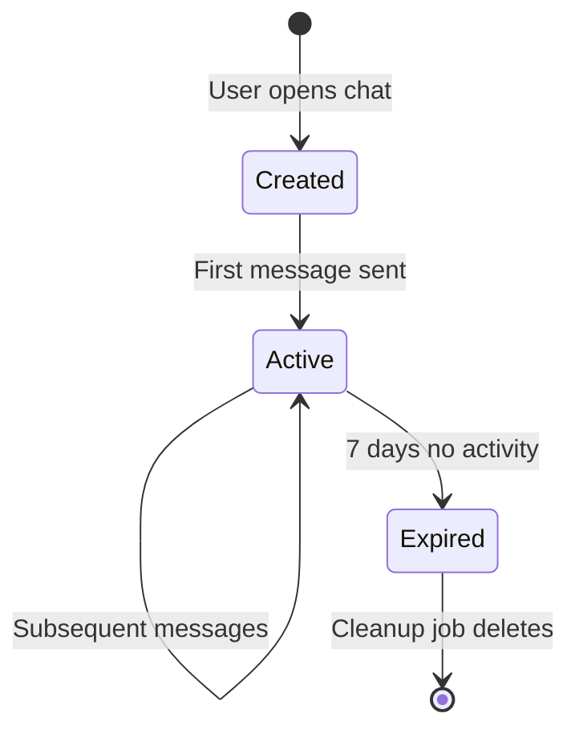
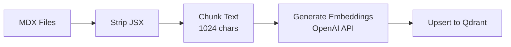
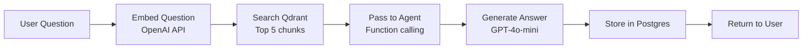
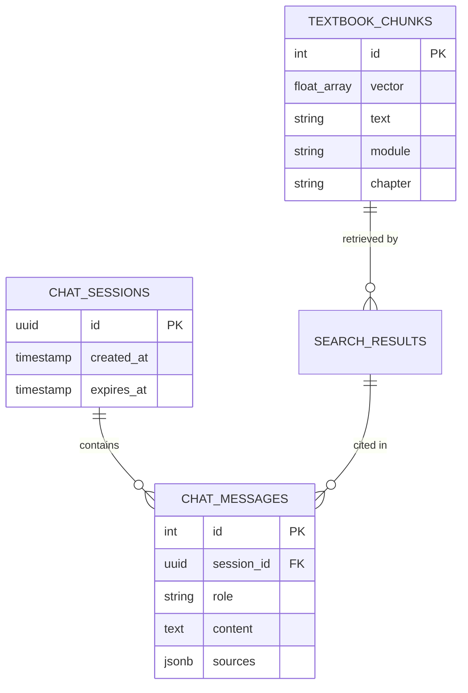

# Data Model: RAG Chatbot

**Feature**: 002-rag-chatbot
**Date**: 2025-12-04
**Status**: Design Complete

This document defines all data structures for the RAG chatbot feature.

---

## Overview

The RAG chatbot uses two primary storage systems:
1. **Qdrant Cloud**: Vector embeddings for semantic search
2. **Neon Postgres**: Chat sessions and message history

---

## 1. Vector Storage (Qdrant)

### Collection: `textbook_embeddings`

**Purpose**: Store text embeddings of textbook chunks for semantic similarity search.

**Schema**:

```python
from qdrant_client.models import VectorParams, Distance

collection_config = {
    "collection_name": "textbook_embeddings",
    "vectors_config": VectorParams(
        size=1536,  # OpenAI text-embedding-3-small dimension
        distance=Distance.COSINE
    ),
    "hnsw_config": {
        "m": 32,              # Connections per point
        "ef_construct": 200,  # Index build quality
        "ef": 128             # Search quality
    }
}
```

### Point Structure

**Fields**:

| Field | Type | Required | Description | Example |
|-------|------|----------|-------------|---------|
| `id` | int | Yes | Unique chunk identifier | `12345` |
| `vector` | float[1536] | Yes | OpenAI embedding | `[0.123, -0.456, ...]` |
| `payload.text` | string | Yes | Chunk content (max 1024 chars) | `"A ROS 2 node is a process..."` |
| `payload.module` | string | Yes | Module identifier | `"01-ros2"` |
| `payload.chapter` | string | Yes | Chapter filename | `"nodes.md"` |
| `payload.section` | string | No | Section heading | `"Creating Nodes"` |
| `payload.source_url` | string | Yes | Relative URL | `"/docs/ros2/nodes"` |
| `payload.chunk_index` | int | Yes | Position in document | `0, 1, 2, ...` |
| `payload.created_at` | timestamp | Yes | Ingestion timestamp | `"2025-12-04T10:30:00Z"` |

**Python Model**:

```python
from pydantic import BaseModel
from typing import List

class TextbookChunk(BaseModel):
    id: int
    text: str
    module: str
    chapter: str
    section: str | None = None
    source_url: str
    chunk_index: int
    created_at: str

class QdrantPoint(BaseModel):
    id: int
    vector: List[float]
    payload: TextbookChunk
```

**Example Point**:

```json
{
  "id": 12345,
  "vector": [0.123, -0.456, ..., 0.789],
  "payload": {
    "text": "A ROS 2 node is a process that performs computation. Nodes communicate with each other using topics, services, and actions.",
    "module": "01-ros2",
    "chapter": "nodes.md",
    "section": "What is a Node?",
    "source_url": "/docs/ros2/nodes",
    "chunk_index": 0,
    "created_at": "2025-12-04T10:30:00Z"
  }
}
```

### Validation Rules

- `text` must not exceed 1024 characters (enforced by LangChain splitter)
- `module` must match one of: `["01-ros2", "02-gazebo-unity", "03-isaac", "04-vla", "hardware"]`
- `source_url` must start with `/docs/`
- `chunk_index` must be >= 0

### Indexing Strategy

**Primary Index**: HNSW (Hierarchical Navigable Small World)
- Optimized for ~450 vectors
- Sub-50ms search latency
- 95%+ recall at top-5 results

**Search Query**:

```python
results = qdrant_client.search(
    collection_name="textbook_embeddings",
    query_vector=query_embedding,
    limit=5,
    score_threshold=0.7  # Cosine similarity threshold
)
```

---

## 2. Relational Storage (Neon Postgres)

### Table: `chat_sessions`

**Purpose**: Track individual chat sessions with expiration.

**Schema**:

```sql
CREATE TABLE chat_sessions (
    id UUID PRIMARY KEY DEFAULT gen_random_uuid(),
    created_at TIMESTAMP DEFAULT CURRENT_TIMESTAMP,
    last_activity TIMESTAMP DEFAULT CURRENT_TIMESTAMP,
    expires_at TIMESTAMP DEFAULT CURRENT_TIMESTAMP + INTERVAL '7 days',
    metadata JSONB DEFAULT '{}'::jsonb
);

CREATE INDEX idx_sessions_expires_at ON chat_sessions(expires_at);
CREATE INDEX idx_sessions_last_activity ON chat_sessions(last_activity DESC);
```

**Fields**:

| Field | Type | Nullable | Default | Description |
|-------|------|----------|---------|-------------|
| `id` | UUID | No | `gen_random_uuid()` | Unique session identifier |
| `created_at` | TIMESTAMP | No | `NOW()` | Session creation time |
| `last_activity` | TIMESTAMP | No | `NOW()` | Last message timestamp (updated on each query) |
| `expires_at` | TIMESTAMP | No | `NOW() + 7 days` | Auto-expiration time |
| `metadata` | JSONB | No | `{}` | Additional session data (user agent, IP, etc.) |

**Python Model**:

```python
from pydantic import BaseModel
from datetime import datetime
from uuid import UUID

class ChatSession(BaseModel):
    id: UUID
    created_at: datetime
    last_activity: datetime
    expires_at: datetime
    metadata: dict = {}
```

**Example Row**:

```json
{
  "id": "550e8400-e29b-41d4-a716-446655440000",
  "created_at": "2025-12-04T10:00:00Z",
  "last_activity": "2025-12-04T10:15:00Z",
  "expires_at": "2025-12-11T10:00:00Z",
  "metadata": {
    "user_agent": "Mozilla/5.0...",
    "referrer": "/docs/ros2"
  }
}
```

### Table: `chat_messages`

**Purpose**: Store conversation history with source citations.

**Schema**:

```sql
CREATE TABLE chat_messages (
    id SERIAL PRIMARY KEY,
    session_id UUID NOT NULL REFERENCES chat_sessions(id) ON DELETE CASCADE,
    role VARCHAR(10) NOT NULL CHECK (role IN ('user', 'assistant')),
    content TEXT NOT NULL,
    sources JSONB,
    created_at TIMESTAMP DEFAULT CURRENT_TIMESTAMP
);

CREATE INDEX idx_messages_session ON chat_messages(session_id, created_at DESC);
CREATE INDEX idx_messages_created_at ON chat_messages(created_at DESC);
```

**Fields**:

| Field | Type | Nullable | Default | Description |
|-------|------|----------|---------|-------------|
| `id` | SERIAL | No | Auto-increment | Unique message identifier |
| `session_id` | UUID | No | - | Foreign key to `chat_sessions.id` |
| `role` | VARCHAR(10) | No | - | `"user"` or `"assistant"` |
| `content` | TEXT | No | - | Message text (question or answer) |
| `sources` | JSONB | Yes | `NULL` | Source citations (null for user messages) |
| `created_at` | TIMESTAMP | No | `NOW()` | Message timestamp |

**Python Model**:

```python
from pydantic import BaseModel
from datetime import datetime
from uuid import UUID
from typing import List, Optional

class Source(BaseModel):
    title: str
    url: str
    chunk_id: int
    score: float

class ChatMessage(BaseModel):
    id: int
    session_id: UUID
    role: str  # "user" or "assistant"
    content: str
    sources: Optional[List[Source]] = None
    created_at: datetime
```

**Example Rows**:

```json
[
  {
    "id": 1,
    "session_id": "550e8400-e29b-41d4-a716-446655440000",
    "role": "user",
    "content": "What is ROS 2?",
    "sources": null,
    "created_at": "2025-12-04T10:00:00Z"
  },
  {
    "id": 2,
    "session_id": "550e8400-e29b-41d4-a716-446655440000",
    "role": "assistant",
    "content": "ROS 2 (Robot Operating System 2) is the industry-standard middleware for building distributed robot systems... [Source: Module 1 - ROS 2 Fundamentals]",
    "sources": [
      {
        "title": "Module 1 - ROS 2 Fundamentals",
        "url": "/docs/ros2",
        "chunk_id": 12345,
        "score": 0.92
      }
    ],
    "created_at": "2025-12-04T10:00:05Z"
  }
]
```

### Validation Rules

- `role` must be either `"user"` or `"assistant"` (enforced by CHECK constraint)
- `content` must not be empty
- `sources` must be valid JSONB array for assistant messages
- `session_id` must reference existing session (enforced by foreign key)

---

## 3. Session Lifecycle

### State Diagram



### Cleanup Job

**CRON Schedule**: Daily at midnight UTC

```sql
-- pg_cron job
SELECT cron.schedule(
    'cleanup-expired-sessions',
    '0 0 * * *',
    'DELETE FROM chat_sessions WHERE expires_at < CURRENT_TIMESTAMP'
);
```

**Effect**: Cascade deletes all messages via `ON DELETE CASCADE` foreign key.

---

## 4. Data Flow

### Ingestion Flow



### Query Flow



---

## 5. Storage Estimates

### Qdrant (Vector Storage)

**Calculation**:
- 450 chunks × 1536 dims × 4 bytes = **2.7 MB** (vectors only)
- Payload (~500 chars avg) × 450 = **225 KB** (metadata)
- **Total**: ~3 MB (well within 1GB free tier)

### Neon Postgres (Session Storage)

**Calculation**:
- Average session: 10 messages × 500 chars = **5 KB**
- 10,000 sessions × 5 KB = **50 MB**
- **Total**: ~50 MB (well within 0.5GB free tier)

**Expected Load**:
- 1000 queries/month ÷ 30 days = ~33 queries/day
- Average 5 messages/session = ~7 sessions/day
- ~210 sessions/month (grows until 7-day TTL cleanup)

---

## 6. Relationships



---

## 7. Access Patterns

### Query: Search textbook by question

```python
# 1. Embed question
embedding = openai.embeddings.create(
    input="What is ROS 2?",
    model="text-embedding-3-small"
).data[0].embedding

# 2. Search Qdrant
results = qdrant_client.search(
    collection_name="textbook_embeddings",
    query_vector=embedding,
    limit=5,
    score_threshold=0.7
)
```

### Query: Get chat history for session

```sql
SELECT role, content, sources, created_at
FROM chat_messages
WHERE session_id = '550e8400-e29b-41d4-a716-446655440000'
ORDER BY created_at ASC
LIMIT 20;
```

### Query: Store new message

```sql
-- Update session activity
UPDATE chat_sessions
SET last_activity = CURRENT_TIMESTAMP
WHERE id = '550e8400-e29b-41d4-a716-446655440000';

-- Insert message
INSERT INTO chat_messages (session_id, role, content, sources)
VALUES (
    '550e8400-e29b-41d4-a716-446655440000',
    'assistant',
    'ROS 2 is...',
    '[{"title": "Module 1", "url": "/docs/ros2", "chunk_id": 12345, "score": 0.92}]'::jsonb
);
```

---

## 8. Migration Strategy

### Initial Setup

1. **Qdrant**: Create collection via Python script
2. **Neon**: Run SQL schema via psql or Python
3. **Ingestion**: Load 450 chunks from `/frontend/docs/`

### Future Migrations

**Scenario**: Add new textbook chapter

```python
# 1. Ingest new chapter
new_chunks = ingest_chapter("frontend/docs/05-deployment/docker.md")

# 2. Upsert to Qdrant
qdrant_client.upsert(
    collection_name="textbook_embeddings",
    points=new_chunks
)
```

**Scenario**: Schema change (add field to payload)

```python
# 1. Update all points with new field
qdrant_client.set_payload(
    collection_name="textbook_embeddings",
    payload={"version": "1.0"},
    points=list(range(1, 451))  # All point IDs
)
```

---

## Next Steps

1. ✅ Data model design complete
2. ⏭ Generate API contracts (`contracts/ingest.yaml`, `contracts/query.yaml`)
3. ⏭ Generate `quickstart.md` with setup instructions
4. ⏭ Run `/sp.tasks` to create implementation tasks

---

**Data Model Version**: 1.0
**Last Updated**: 2025-12-04
**Status**: Ready for implementation
