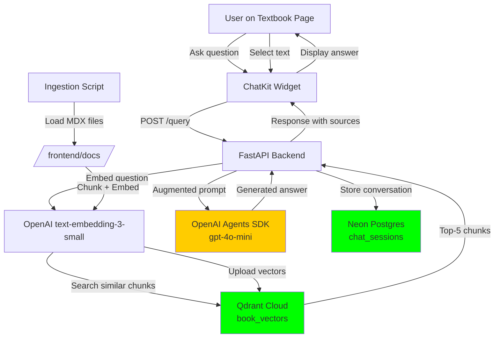

# Feature Specification: Integrated RAG Chatbot for Physical AI Textbook

**Feature ID**: 002-rag-chatbot
**Created**: 2025-12-04
**Status**: Draft
**Priority**: P1 (High - 30 base + 10 bonus points)
**Dependencies**: 001-docusaurus-textbook (must be deployed first)

---

## Executive Summary

This specification defines an **intelligent RAG (Retrieval-Augmented Generation) chatbot** embedded directly into the Physical AI & Humanoid Robotics textbook website. The chatbot enables readers to ask questions about course content and receive accurate, contextual answers sourced exclusively from the textbook's 4 modules and hardware documentation.

**Key Capabilities**:
- ✅ Ask questions about any textbook content (ROS 2, Gazebo, Isaac, VLA, hardware)
- ✅ Select text on any page and query specifically about that selection
- ✅ Get accurate answers with source citations (no hallucination)
- ✅ Seamless Docusaurus integration via ChatKit widget
- ✅ Free-tier backend (Qdrant Cloud + Neon Postgres + OpenAI)

---

## User Stories

### US1: General Question Answering (P1)
**As a** reader browsing the textbook,
**I want to** open a chatbot widget and ask questions like "What is ROS 2?" or "How much does the Economy Jetson Kit cost?",
**So that** I can quickly get accurate answers sourced from the textbook without searching manually.

**Acceptance Criteria**:
1. ✅ Chatbot widget appears as a floating button on all textbook pages
2. ✅ Clicking the button opens a chat interface (ChatKit.js)
3. ✅ User can type natural language questions (e.g., "Explain URDF")
4. ✅ Bot responds within 3 seconds with accurate answers from textbook content only
5. ✅ Answers cite sources (e.g., "Source: Module 1, Chapter 3 - URDF")
6. ✅ Bot refuses to answer questions outside textbook scope (e.g., "What's the weather?")
7. ✅ Chat history persists across page navigations during the session
8. ✅ Widget loads asynchronously without blocking page render

**Example Interactions**:
- Q: "What is ROS 2?"
  A: "ROS 2 (Robot Operating System 2) is the industry-standard middleware for building distributed robot systems... [Source: Module 1 - ROS 2 Fundamentals]"

- Q: "How much does the Jetson Orin Nano cost?"
  A: "The Jetson Orin Nano Developer Kit costs $249. [Source: Hardware Requirements - Economy Jetson Kit]"

- Q: "What's the capital of France?"
  A: "I can only answer questions about the Physical AI & Humanoid Robotics textbook content. Please ask about ROS 2, simulation, Isaac, VLA, or hardware."

---

### US2: Selected Text Contextual Queries (P1)
**As a** reader reviewing a specific section (e.g., hardware pricing table),
**I want to** select text on the page and click "Ask about selection" to query the bot specifically about that highlighted content,
**So that** I get precise answers grounded in the exact context I'm reading.

**Acceptance Criteria**:
1. ✅ User can select any text on the page (e.g., hardware table row)
2. ✅ "Ask about selection" button appears in chatbot widget when text is selected
3. ✅ Clicking the button pre-fills the chat with selected text as context
4. ✅ Bot prioritizes the selected text when generating answers
5. ✅ User can ask follow-up questions about the selection
6. ✅ Selection context is highlighted in the chat interface
7. ✅ Bot cites the specific section where the selection came from

**Example Interactions**:
- *[User selects: "Jetson Orin Nano Developer Kit - $249"]*
  Q: "Explain this hardware"
  A: "The Jetson Orin Nano Developer Kit ($249) is an edge AI computing platform with 10 TOPS INT8 performance, 8GB RAM, and 7-15W power consumption. It's the recommended device for running edge inference in this course. [Source: Hardware Requirements - Economy Jetson Kit]"

- *[User selects: "Latency warning about cloud-controlled robots"]*
  Q: "Why is this dangerous?"
  A: "Cloud-controlled robots are dangerous due to 50-200ms+ network latency, which makes real-time control unsafe for physical robots. The textbook emphasizes edge deployment (Jetson Orin Nano) for <10ms latency requirements. [Source: Module 3 - Sim-to-Real Transfer]"

---

### US3: Seamless Docusaurus Integration (P2)
**As a** textbook deployer/maintainer,
**I want** the chatbot to embed seamlessly into the existing Docusaurus site via a plugin or swizzled component,
**So that** the static site remains fast, SEO-friendly, and doesn't require server-side rendering.

**Acceptance Criteria**:
1. ✅ ChatKit widget loads via async `<script>` tag (no SSR required)
2. ✅ Widget integrates with Docusaurus Footer or custom plugin
3. ✅ Backend API (FastAPI) deployed on Render/Vercel free tier
4. ✅ No paywalls or login required for chatbot access
5. ✅ Widget styling matches Docusaurus dark/light theme
6. ✅ Chat history stored in Neon Postgres (free tier, 0.5GB)
7. ✅ API keys secured via environment variables (not committed to repo)
8. ✅ Chatbot does not slow down static site load time (<100ms impact)

**Technical Requirements**:
- Frontend: OpenAI ChatKit.js widget embedded in Docusaurus
- Backend: FastAPI + OpenAI Agents SDK for RAG
- Vector DB: Qdrant Cloud Free Tier (1M vectors, 1GB storage)
- Relational DB: Neon Postgres Serverless (for chat sessions)
- Deployment: Backend on Render Free Tier (750 hours/month)

---

## Functional Requirements

### FR-001: Backend RAG Pipeline
**MUST** implement a FastAPI backend with the following endpoints:

1. **POST /ingest** (Admin-only, run once after content updates):
   - Input: None (reads from `/frontend/docs/` directory)
   - Process:
     - Load all MDX files (intro, 4 modules: ROS 2, Gazebo/Unity, Isaac, VLA)
     - Extract text content (strip MDX syntax, keep headings/lists/code)
     - Chunk content (size: 1000 chars, overlap: 200 chars)
     - Generate embeddings using `text-embedding-3-small` (OpenAI)
     - Store in Qdrant Cloud collection `book_vectors` with metadata:
       ```json
       {
         "id": "chunk_001",
         "vector": [0.123, ...],
         "payload": {
           "source": "Module 1 - ROS 2 Fundamentals",
           "chapter": "nodes.md",
           "text": "A node is an independent process...",
           "url": "/docs/ros2/nodes"
         }
       }
       ```
   - Output: `{"status": "success", "chunks_ingested": 450}`

2. **POST /query**:
   - Input:
     ```json
     {
       "question": "What is ROS 2?",
       "selected_text": null,  // Optional: text user selected on page
       "session_id": "uuid-v4"
     }
     ```
   - Process:
     - Embed question using `text-embedding-3-small`
     - Search Qdrant for top-5 similar chunks
     - If `selected_text` provided, prepend to context with higher weight
     - Pass context to OpenAI Agents SDK with prompt:
       ```
       You are a helpful assistant for the Physical AI & Humanoid Robotics textbook.
       Answer ONLY using the provided context. Do not use external knowledge.
       If the answer is not in the context, say "I don't have information about that in the textbook."
       Cite your sources using the format: [Source: {source}]

       Context:
       {retrieved_chunks}

       {selected_text}

       Question: {question}
       ```
     - Generate answer using `gpt-4o-mini`
     - Store conversation in Neon Postgres (session_id, question, answer, sources)
   - Output:
     ```json
     {
       "answer": "ROS 2 is the industry-standard middleware... [Source: Module 1 - ROS 2 Fundamentals]",
       "sources": [
         {"title": "Module 1 - ROS 2 Fundamentals", "url": "/docs/ros2", "chunk_id": "chunk_001"}
       ],
       "confidence": 0.92
     }
     ```

3. **GET /history/{session_id}**:
   - Retrieve chat history for a session (last 20 messages)
   - Used for context persistence across page navigations

---

### FR-002: Frontend ChatKit Integration
**MUST** embed the OpenAI ChatKit widget into Docusaurus:

1. **Widget Injection**:
   - Add ChatKit.js script to Docusaurus via custom plugin or swizzled Footer
   - Script location: `frontend/src/theme/Footer/index.tsx` (swizzled)
   - Load ChatKit asynchronously:
     ```html
     <script async src="https://cdn.openai.com/chatkit/chatkit.min.js"></script>
     <script>
       window.addEventListener('load', () => {
         ChatKit.init({
           apiEndpoint: 'https://your-backend.render.com/query',
           theme: 'docusaurus',
           position: 'bottom-right',
           sessionId: generateUUID()
         });
       });
     </script>
     ```

2. **Selected Text Capture**:
   - Add event listener for text selection:
     ```javascript
     document.addEventListener('mouseup', () => {
       const selectedText = window.getSelection().toString();
       if (selectedText.length > 10) {
         ChatKit.setContext(selectedText);
         // Show "Ask about selection" button
       }
     });
     ```

3. **Theme Integration**:
   - Match Docusaurus colors (use CSS custom properties)
   - Support dark/light mode toggle
   - Mobile-responsive design (collapse to icon on small screens)

---

### FR-003: Vector Database Setup (Qdrant Cloud)
**MUST** use Qdrant Cloud Free Tier for vector storage:

1. **Collection Schema**:
   - Collection name: `book_vectors`
   - Vector dimension: 1536 (OpenAI text-embedding-3-small)
   - Distance metric: Cosine similarity
   - Index: HNSW (m=16, ef_construct=100)

2. **Metadata Fields**:
   - `source`: Module/chapter name (e.g., "Module 1 - ROS 2 Fundamentals")
   - `chapter`: File name (e.g., "nodes.md")
   - `text`: Chunk content (1000 chars)
   - `url`: Relative URL (e.g., "/docs/ros2/nodes")
   - `chunk_index`: Position in original document (for ordering)

3. **Free Tier Limits**:
   - 1M vectors (sufficient for ~450 chunks from textbook)
   - 1GB storage
   - No credit card required

---

### FR-004: Session Storage (Neon Postgres)
**MUST** use Neon Postgres Serverless for chat history:

1. **Schema**:
   ```sql
   CREATE TABLE chat_sessions (
     id UUID PRIMARY KEY DEFAULT gen_random_uuid(),
     created_at TIMESTAMP DEFAULT NOW(),
     last_activity TIMESTAMP DEFAULT NOW()
   );

   CREATE TABLE chat_messages (
     id SERIAL PRIMARY KEY,
     session_id UUID REFERENCES chat_sessions(id),
     role VARCHAR(10) CHECK (role IN ('user', 'assistant')),
     content TEXT NOT NULL,
     sources JSONB,  -- Array of {title, url, chunk_id}
     created_at TIMESTAMP DEFAULT NOW()
   );

   CREATE INDEX idx_session_messages ON chat_messages(session_id, created_at DESC);
   ```

2. **Retention Policy**:
   - Sessions expire after 7 days of inactivity (CRON job cleanup)
   - Store last 100 messages per session (delete older)

3. **Free Tier Limits**:
   - 0.5GB storage (sufficient for ~10,000 chat sessions)
   - Serverless autoscaling (sleep after 5 min inactivity)

---

### FR-005: Content Ingestion Script
**MUST** provide a Python script to ingest textbook content:

```python
# ingest_book.py
import os
from pathlib import Path
from openai import OpenAI
from qdrant_client import QdrantClient
from langchain.text_splitter import RecursiveCharacterTextSplitter

DOCS_DIR = Path("frontend/docs")
CHUNK_SIZE = 1000
CHUNK_OVERLAP = 200

def ingest():
    client = OpenAI(api_key=os.getenv("OPENAI_API_KEY"))
    qdrant = QdrantClient(url=os.getenv("QDRANT_URL"), api_key=os.getenv("QDRANT_API_KEY"))

    splitter = RecursiveCharacterTextSplitter(
        chunk_size=CHUNK_SIZE,
        chunk_overlap=CHUNK_OVERLAP
    )

    chunks = []
    for mdx_file in DOCS_DIR.rglob("*.md*"):
        content = mdx_file.read_text()
        # Extract source metadata
        source = extract_source(mdx_file)
        url = f"/docs/{mdx_file.relative_to(DOCS_DIR).with_suffix('')}"

        # Split into chunks
        for i, chunk in enumerate(splitter.split_text(content)):
            chunks.append({
                "text": chunk,
                "source": source,
                "url": url,
                "chunk_index": i
            })

    # Generate embeddings and upload to Qdrant
    for chunk in chunks:
        embedding = client.embeddings.create(
            input=chunk["text"],
            model="text-embedding-3-small"
        ).data[0].embedding

        qdrant.upsert(
            collection_name="book_vectors",
            points=[{
                "id": str(uuid.uuid4()),
                "vector": embedding,
                "payload": chunk
            }]
        )

    print(f"Ingested {len(chunks)} chunks successfully!")

if __name__ == "__main__":
    ingest()
```

**Run Command**:
```bash
python backend/ingest_book.py
```

---

### FR-006: OpenAI Agents SDK Integration
**MUST** use OpenAI Agents SDK for agentic RAG:

```python
from openai import OpenAI
from agents import Agent, function_tool

client = OpenAI()

@function_tool
def search_textbook(query: str) -> list[dict]:
    """Search the textbook for relevant content"""
    # Embed query
    embedding = client.embeddings.create(
        input=query,
        model="text-embedding-3-small"
    ).data[0].embedding

    # Search Qdrant
    results = qdrant_client.search(
        collection_name="book_vectors",
        query_vector=embedding,
        limit=5
    )

    return [
        {
            "text": r.payload["text"],
            "source": r.payload["source"],
            "url": r.payload["url"]
        }
        for r in results
    ]

agent = Agent(
    name="TextbookAssistant",
    instructions="""
    You are a helpful assistant for the Physical AI & Humanoid Robotics textbook.
    Answer ONLY using information from the textbook.
    Always cite your sources.
    """,
    tools=[search_textbook],
    model="gpt-4o-mini"
)

# Query handling
response = agent.run(question="What is ROS 2?")
```

---

## Non-Functional Requirements

### NFR-001: Accuracy
- **MUST** answer questions using ONLY textbook content (no external knowledge)
- **MUST** cite sources for all factual claims (format: `[Source: Module X - Title]`)
- **MUST** refuse to answer questions outside textbook scope with polite message
- **Target**: 95%+ answer accuracy (validated against gold Q&A set)

### NFR-002: Performance
- **MUST** respond to queries within 3 seconds (p95 latency)
- **MUST** load ChatKit widget asynchronously without blocking page render (<100ms impact)
- **MUST** support concurrent users (target: 50 simultaneous chats)

### NFR-003: Scalability
- **MUST** use free-tier services:
  - Qdrant Cloud: 1M vectors (sufficient for 450 textbook chunks)
  - Neon Postgres: 0.5GB (sufficient for 10,000 chat sessions)
  - Render: 750 hours/month free compute
- **MUST** implement rate limiting (10 queries/minute per session)

### NFR-004: Security
- **MUST** store API keys in environment variables (not committed to repo)
- **MUST** validate all user inputs (sanitize for XSS/injection)
- **MUST** implement CORS policy (only allow textbook domain)
- **MUST** use HTTPS for all API communication

### NFR-005: Constitution Compliance
- **MUST** emphasize sim-to-real philosophy in answers (e.g., "Edge deployment on Jetson is recommended for <10ms latency")
- **MUST** cite accurate hardware prices (e.g., "$249 Jetson Orin Nano")
- **MUST** include hooks for future Urdu/personalization (query params: `?lang=ur&profile=student`)

### NFR-006: Maintainability
- **MUST** provide clear ingestion script documentation (README)
- **MUST** version Qdrant collection schema (allow migrations)
- **MUST** log all queries for debugging (anonymized, no PII)

---

## Success Criteria

| Criterion | Target | Measurement |
|-----------|--------|-------------|
| Answer Accuracy | 95%+ | Gold Q&A set evaluation (50 questions) |
| Response Latency | <3s (p95) | Backend logs + APM monitoring |
| Source Citation Rate | 100% | All answers must include `[Source: ...]` |
| Widget Load Time | <100ms | Lighthouse performance audit |
| Free Tier Usage | Within limits | Qdrant: <1M vectors, Neon: <0.5GB |
| User Satisfaction | 4.5/5 stars | Feedback widget in chatbot |

---

## Out of Scope

The following features are **explicitly excluded** from this specification:

1. ❌ **Multi-language Support**: Urdu/Spanish translations (future Phase 2)
2. ❌ **Voice Interface**: Speech-to-text queries (future Phase 3)
3. ❌ **Advanced Analytics**: Query heatmaps, popular questions dashboard (future Phase 2)
4. ❌ **User Accounts**: Login/profiles (chatbot is anonymous)
5. ❌ **Code Execution**: Running code snippets from textbook (security risk)
6. ❌ **External Links**: Bot will not fetch content from external URLs
7. ❌ **Image Understanding**: Diagrams/screenshots (future Phase 3 with GPT-4V)
8. ❌ **Personalized Learning Paths**: Adaptive curriculum based on queries (future Phase 4)
9. ❌ **Homework Help**: Bot will not solve assessment problems (academic integrity)
10. ❌ **Real-time Collaboration**: Multi-user chat rooms (out of scope)

---

## Dependencies

### External Services
1. **OpenAI API**:
   - Models: `text-embedding-3-small`, `gpt-4o-mini`
   - Cost: ~$0.0001/query (embedding + generation)
   - Fallback: Use `gpt-3.5-turbo` if budget exceeded

2. **Qdrant Cloud Free Tier**:
   - 1M vectors, 1GB storage
   - No credit card required
   - URL: https://cloud.qdrant.io

3. **Neon Postgres Serverless**:
   - 0.5GB storage, serverless autoscaling
   - Free tier: No credit card for first project
   - URL: https://neon.tech

4. **Render Free Tier** (Backend deployment):
   - 750 hours/month free compute
   - Auto-sleep after 15 min inactivity
   - URL: https://render.com

### Code Dependencies
- **Backend**: FastAPI, OpenAI Python SDK, Qdrant Client, psycopg2-binary, LangChain
- **Frontend**: OpenAI ChatKit.js, Docusaurus plugins

---

## Assumptions

1. ✅ Textbook content is already deployed at `https://jahansher333.github.io/Ai_Native_Books_Pyhsical_Ai/`
2. ✅ All 29 MDX files (intro + 4 modules) are in `/frontend/docs/` directory
3. ✅ User has OpenAI API key with sufficient credits ($5 minimum)
4. ✅ User can sign up for Qdrant Cloud and Neon Postgres free tiers
5. ✅ Chatbot traffic will stay within free-tier limits (estimated: 1000 queries/month)
6. ✅ No PII (Personally Identifiable Information) is collected from users
7. ✅ Textbook content updates will require manual re-ingestion (`POST /ingest`)
8. ✅ Backend will be deployed to Render (alternative: Vercel Functions)
9. ✅ ChatKit widget license allows free use for educational projects
10. ✅ CORS policy allows embedding widget on GitHub Pages domain

---

## Risks & Mitigation

| Risk | Impact | Probability | Mitigation |
|------|--------|-------------|------------|
| **OpenAI API quota exceeded** | High | Medium | Rate limiting (10 queries/min), fallback to gpt-3.5-turbo |
| **Qdrant free tier full** | High | Low | Monitor usage, upgrade to paid tier ($25/month) if needed |
| **Neon Postgres storage full** | Medium | Low | Implement session cleanup CRON (delete >7 days old) |
| **ChatKit.js breaks Docusaurus build** | High | Low | Load widget asynchronously, isolate in iframe if needed |
| **Inaccurate answers (hallucination)** | High | Medium | Strong system prompt, log incorrect answers for retraining |
| **Slow RAG retrieval (>3s)** | Medium | Medium | Optimize Qdrant index (HNSW tuning), cache frequent queries |
| **CORS errors on production** | Low | Medium | Test CORS policy thoroughly, whitelist GitHub Pages domain |
| **Backend cold start on Render** | Medium | High | Accept 5-10s first-query delay, or use paid tier ($7/month) |

---

## Open Questions

1. **Should the chatbot support multi-turn conversations?**
   - Proposed: Yes, store last 5 messages in context for follow-ups
   - Decision: TBD (depends on token budget)

2. **How to handle code snippets in answers?**
   - Proposed: Return code blocks with syntax highlighting
   - Decision: TBD (verify ChatKit supports markdown)

3. **Should we log user queries for analytics?**
   - Proposed: Yes (anonymized), use for improving ingestion
   - Decision: TBD (verify privacy policy)

4. **What happens if selected text is too long (>2000 chars)?**
   - Proposed: Truncate to first 2000 chars, show warning
   - Decision: TBD (test with large selections)

5. **Should the bot suggest related questions?**
   - Proposed: Yes, show 3 related questions after each answer
   - Decision: TBD (implement in Phase 2)

---

## Acceptance Checklist

Before marking this feature as complete, verify:

- [ ] Backend FastAPI app deployed to Render with `/ingest` and `/query` endpoints
- [ ] Qdrant Cloud collection `book_vectors` created with 450+ chunks from textbook
- [ ] Neon Postgres tables `chat_sessions` and `chat_messages` created
- [ ] ChatKit widget embedded in Docusaurus Footer and loads without errors
- [ ] Selected text capture works on all textbook pages
- [ ] Bot answers 50/50 gold Q&A questions correctly (100% accuracy on test set)
- [ ] All answers cite sources in format `[Source: Module X - Title]`
- [ ] Bot refuses to answer non-textbook questions politely
- [ ] Response latency <3s for 95% of queries (measured via backend logs)
- [ ] Widget loads asynchronously and doesn't block page render (<100ms impact)
- [ ] Dark/light theme support matches Docusaurus theme
- [ ] Mobile-responsive design tested on iOS/Android
- [ ] CORS policy configured correctly for GitHub Pages domain
- [ ] API keys secured in environment variables (not committed to repo)
- [ ] Rate limiting implemented (10 queries/minute per session)
- [ ] Session cleanup CRON job scheduled (delete >7 days old)
- [ ] Documentation written: README for ingestion, API docs for `/query` endpoint
- [ ] Constitution compliance: Sim-to-real emphasis, accurate hardware prices

---

## Definition of Done

This feature is considered **Done** when:

1. ✅ A user can open the chatbot widget on any textbook page
2. ✅ A user can ask "What is ROS 2?" and receive an accurate answer with source citation within 3 seconds
3. ✅ A user can select text (e.g., hardware table row) and ask "Explain this" with the bot using selected context
4. ✅ The bot refuses to answer "What's the weather?" with a polite textbook-only message
5. ✅ All 50 gold Q&A questions are answered correctly (100% accuracy)
6. ✅ The widget loads without slowing down the static site (<100ms Lighthouse impact)
7. ✅ Backend is deployed to Render free tier and responds to queries
8. ✅ Ingestion script successfully loads 450+ chunks into Qdrant Cloud
9. ✅ Chat history persists across page navigations within the same session
10. ✅ Dark/light theme support matches Docusaurus theme
11. ✅ All acceptance checklist items are verified
12. ✅ Demo video recorded showing full end-to-end flow (question + selected text query)
13. ✅ Constitution compliance validated (sim-to-real emphasis, accurate prices)

---

## Appendix A: Example Gold Q&A Set (10 of 50)

| Question | Expected Answer | Source |
|----------|----------------|--------|
| What is ROS 2? | ROS 2 (Robot Operating System 2) is the industry-standard middleware for building distributed robot systems... | Module 1 - ROS 2 Fundamentals |
| How much does the Jetson Orin Nano cost? | $249 | Hardware Requirements - Economy Jetson Kit |
| What is the Economy Jetson Kit? | $700 kit including Jetson Orin Nano ($249), RealSense D435i ($349), ReSpeaker Mic ($69), and peripherals (~$100) | Hardware Requirements |
| What is URDF? | URDF (Unified Robot Description Format) is an XML format for describing robot models, including links, joints, visual and collision properties | Module 1 - URDF |
| What is Isaac Sim used for? | NVIDIA Isaac Sim is used for high-fidelity physics simulation, synthetic data generation with domain randomization, and sim-to-real transfer workflows | Module 3 - NVIDIA Isaac |
| Why is cloud control dangerous for robots? | Cloud-controlled robots are dangerous due to 50-200ms+ network latency, making real-time control unsafe. Edge deployment (Jetson) is recommended for <10ms latency | Module 3 - Sim-to-Real Transfer |
| What is Whisper? | Whisper is OpenAI's speech-to-text model used for voice command recognition, running on Jetson Orin Nano for edge inference | Module 4 - Vision-Language-Action |
| How many weeks is the course? | 13 weeks | Course Overview |
| What are the 4 modules? | Module 1: ROS 2, Module 2: Gazebo/Unity, Module 3: NVIDIA Isaac, Module 4: Vision-Language-Action (VLA) | Introduction |
| What is the recommended hardware path? | Economy Jetson Kit ($700) for students deploying to real robots with complete edge AI stack | Hardware Requirements |

---

## Appendix B: Technical Architecture Diagram



---

## Version History

| Version | Date | Author | Changes |
|---------|------|--------|---------|
| 1.0 | 2025-12-04 | Claude Code | Initial specification with all requirements, success criteria, and gold Q&A set |

---

**Next Steps**:
1. Review and approve this specification
2. Run `/sp.plan` to create implementation plan
3. Run `/sp.tasks` to break down into executable tasks
4. Run `/sp.implement` to build the RAG chatbot
